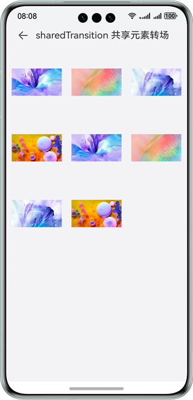

# 实现ArkUI组件功能

### 介绍

本示例集合了ArkUI组件库中组件类、通用类、动画类和全局类模块，帮助开发者掌握多种ArkUI组件和事件的使用方法。

### 效果预览

| 组件                                          | 通用                                            | 动画                                                         | 全局方法                                            |
|---------------------------------------------|-----------------------------------------------|------------------------------------------------------------|-------------------------------------------------|
|  |      |                 |         |
| <center>Button 按钮</center>                  | <center>onClick 点击事件</center>                 | <center>元素共享转场</center>                                    | <center>警告弹窗</center>                           |
|     |  |  |  |

使用说明：

1.点击**组件**、**通用**、**动画**、**全局方法**四个按钮或左右滑动切换不同视图。

2.点击导航（如onClick点击事件、触摸事件等），跳转至详情页面。

### 工程目录

```
├──entry/src/main/ets                                  // 代码区
│  ├──application
│  │  └──MyAbilityStage.ets      
│  ├──common
│  │  ├──AttributeModificationTool.ets                 // 组件
│  │  ├──IntroductionTitle.ets                         // 首页介绍标题组件
│  │  ├──TabContentNavigation.ets                      // 切换组件
│  │  └──TitleBar.ets                                  // 详情页面标题组件
│  ├──data
│  │  ├──CollectionCategory.ets                        // 数据分类
│  │  └──ResourceDataHandle.ets                        // 源数据
│  ├──entryability
│  │  └──EntryAbility.ets              
│  ├──model
│  │  └──CategoricalDataType.ets                       // 数据类型                   
│  ├──pages
│  │  ├──animations                                    // 动画
│  │  │  ├──animateToSample    
│  │  │  │  └──AnimateToSample.ets 
│  │  │  ├──animationSample    
│  │  │  │  └──AnimationSample.ets 
│  │  │  ├──interpolationCalculationSample    
│  │  │  │  └──InterpolationCalculationSample.ets      // 插值计算
│  │  │  ├──motionPathSample    
│  │  │  │  └──MotionPathSample.ets                    // 路径动画
│  │  │  ├──TransitionAnimations                       // 转场动画
│  │  │  │  ├──componentTransitionSample               // 组件内转场
│  │  │  │  │  └──ComponentTransitionSample.ets        
│  │  │  │  ├──floatingSample                          // 悬浮窗
│  │  │  │  │  ├──FloatingWindowComponent.ets          
│  │  │  │  │  └──FloatingWindowSample.ets                 
│  │  │  │  ├──folderSample                            // 文件夹展开
│  │  │  │  │  ├──Folder.ets                         
│  │  │  │  │  ├──FolderItem.ets                         
│  │  │  │  │  └──FolderSample.ets                         
│  │  │  │  ├──gallerySample                           // 图库卡片展开
│  │  │  │  │  └──GalleryCardSample.ets                    
│  │  │  │  ├──layoutAnimationSample                   // 布局动效
│  │  │  │  │  └──LayoutAnimationSample.ets                
│  │  │  │  ├──multiplexSample                         // 多任务
│  │  │  │  │  ├──MultiplexModel.ets                      
│  │  │  │  │  ├──MultiplexSample.ets                      
│  │  │  │  │  └──ScrollItem.ets                       
│  │  │  │  ├──pageTransitionSample                    // 页面间转场
│  │  │  │  │  ├──PageTransitionSample.ets                      
│  │  │  │  │  └──PageTransitionSampleTo.ets                      
│  │  │  │  ├──shareElementTransitionSample            // 共享元素转场
│  │  │  │  │  ├──ShareElementTransitionSample.ets                     
│  │  │  │  │  └──ShareElementTransitionSampleTo.ets                     
│  │  │  │  ├──shopSample                              // 商店卡片展开
│  │  │  │  │  └──ShopCardSample.ets                      
│  │  │  │  ├──sideBarTransitionSample                 // 侧边栏动效
│  │  │  │  │  ├──ChangePanel.ets               
│  │  │  │  │  └──SideBarTransitionSample.ets              
│  │  │  │  ├──sizeTransitionSample                    // 尺寸变换动效
│  │  │  │  │  └──SizeTransitionSample.ets                 
│  │  │  │  ├──systemIcon                              // 系统图标
│  │  │  │  │  └──SystemIcon.ets         
│  │  │  │  └──AnimationData.ets                  
│  │  ├──components                                    // 组件   
│  │  │  ├──auxiliary                                  // 辅助
│  │  │  │  ├──alphabetIndexerSample
│  │  │  │  │  └──AlphabetIndexerSample.ets            // 字母索引条
│  │  │  │  ├──badgeSample
│  │  │  │  │  └──BadgeSample.ets                      // 标记
│  │  │  │  ├──refreshSample
│  │  │  │  │  └──RefreshSample.ets                    // 下拉刷新
│  │  │  │  ├──scrollbarSample 
│  │  │  │  │  └──ScrollBarSample.ets                  // 滚动条
│  │  │  ├──blankAndDivider                            // 空白与分分隔
│  │  │  │  └──dividerSample
│  │  │  │     ├──ChangePanel.ets
│  │  │  │     └──DividerSample.ets
│  │  │  ├──buttonAndSelection                         // 按钮与选择
│  │  │  │  ├──buttonSample
│  │  │  │  │  └──ButtonSample.ets                     // 按钮
│  │  │  │  ├──checkboxSample
│  │  │  │  │  └──CheckboxSample.ets                   // 勾选框
│  │  │  │  ├──counterSample
│  │  │  │  │  └──CounterSample.ets                    // 计数器
│  │  │  │  ├──datePickerSample
│  │  │  │  │  └──DatePickerSample.ets                 // 日期选择器
│  │  │  │  ├──radioSample
│  │  │  │  │  └──RadioSample.ets                      // 单选按钮
│  │  │  │  ├──ratingSample
│  │  │  │  │  └──RatingSample.ets                     // 评分条
│  │  │  │  ├──selectSample
│  │  │  │  │  └──SelectSample.ets                     // 选择菜单
│  │  │  │  ├──sliderSample
│  │  │  │  │  ├──ChangePanel.ets
│  │  │  │  │  └──SliderSample.ets                     // 滑动条
│  │  │  │  ├──textPickerSample 
│  │  │  │  │  └──TextPickerSample.ets                 // 文本选择器
│  │  │  │  ├──timePickerSample
│  │  │  │  │  └──TimePickerSample.ets                 // 时间选择器
│  │  │  │  └──toggleSample
│  │  │  │     └──ToggleSample.ets                     // 切换按钮
│  │  │  ├──canvas
│  │  │  │  ├──attributesSample
│  │  │  │  │  └──AttributesSample.ets                 // 属性
│  │  │  │  ├──gradientSample
│  │  │  │  │  └──GradientSample.ets                   // 渐变对象
│  │  │  │  ├──imageBitmapSample
│  │  │  │  │  └──ImageBitmapSample.ets                // 位图对象
│  │  │  │  ├──methodsSample
│  │  │  │  │  └──MethodsSample.ets                    // 方法
│  │  │  │  ├──path2dSample
│  │  │  │  │  └──Path2dSample.ets                     // 路径对象
│  │  │  │  ├──sampleResources
│  │  │  │  │  ├──icon.png                     
│  │  │  │  │  └──smoothoff.png                  
│  │  │  │  ├──shadowsSample
│  │  │  │  │  └──ShadowsSample.ets                    // 阴影
│  │  │  │  └──transformSample
│  │  │  │     └──TransformSample.ets                  // 转换
│  │  │  ├──canvasAndGraphicDrawing                    // 画布与图形绘制
│  │  │  │  ├──canvasSample
│  │  │  │  │  └──CanvasSample.ets                     // 画布
│  │  │  │  ├──circleSample
│  │  │  │  │  ├──ChangePanel.ets
│  │  │  │  │  └──CircleSample.ets                     // 圆形
│  │  │  │  ├──ellipseSample
│  │  │  │  │  ├──ChangePanel.ets
│  │  │  │  │  └──EllipseSample.ets                    // 椭圆
│  │  │  │  ├──lineSample
│  │  │  │  │  ├──ChangePanel.ets
│  │  │  │  │  └──LineSample.ets                       // 直线
│  │  │  │  ├──pathSample
│  │  │  │  │  ├──ChangePanel.ets
│  │  │  │  │  └──PathSample.ets                       // 路径
│  │  │  │  ├──polygonSample
│  │  │  │  │  ├──ChangePanel.ets
│  │  │  │  │  └──PolygonSample.ets                    // 多边形
│  │  │  │  ├──polylineSample
│  │  │  │  │  ├──ChangePanel.ets
│  │  │  │  │  └──PolylineSample.ets                   // 折线
│  │  │  │  ├──rectSample
│  │  │  │  │  ├──ChangePanel.ets
│  │  │  │  │  └──RectSample.ets                       // 矩形
│  │  │  │  └──shapeSample
│  │  │  │     ├──ChangePanel.ets
│  │  │  │     └──ShapeSample.ets                      // 指定图形
│  │  │  ├──imageVideoAndMedia
│  │  │  │  ├──imageAnimatorSample
│  │  │  │  │  └──ImageAnimatorSample.ets              // 逐帧播放图片
│  │  │  │  ├──imageSample
│  │  │  │  │  ├──ImageControlPanel.ets
│  │  │  │  │  └──ImageSample.ets                      // 图片
│  │  │  │  ├──pluginComponentSample
│  │  │  │  │  └──PluginComponentSample.ets            // 嵌入式显示
│  │  │  │  ├──videoSample
│  │  │  │  │  ├──VideoControlPanel.ets
│  │  │  │  │  └──VideoSample.ets                      // 视频
│  │  │  │  └──xcomponentSample
│  │  │  │     └──XComponentSample.ets                 // 绘制组件
│  │  │  ├──informationPresentationAndDynamicEffects     
│  │  │  │  ├──dataPanelSample
│  │  │  │  │  └──DataPanelSample.ets                  // 数据面板
│  │  │  │  ├──gaugeSample
│  │  │  │  │  └──GaugeSample.ets                      // 仪表盘
│  │  │  │  ├──imageFitFullSample
│  │  │  │  │  └──ImageFitFullSample.ets               // 动效
│  │  │  │  ├──listSample                              // 列表
│  │  │  │  │  └──ListSample.ets
│  │  │  │  ├──loadingProgressSample
│  │  │  │  │  └──LoadingProgressSample.ets
│  │  │  │  ├──marqueeSample
│  │  │  │  │  └──MarqueeSample.ets                    // 跑马灯
│  │  │  │  ├──particleSample
│  │  │  │  │  └──ParticleSample.ets                   // 粒子效果
│  │  │  │  ├──progressSample
│  │  │  │  │  └──ProgressSample.ets                   // 进度条
│  │  │  │  ├──qrCodeSample
│  │  │  │  │  └──QRCodeSample.ets                     // 二维码
│  │  │  │  ├──scrollToSample
│  │  │  │  │  └──ScrollToSample.ets                   // 动效
│  │  │  │  ├──tapsSwitchSample
│  │  │  │  │  └──TapsSwitchSample.ets                 // 模糊切换
│  │  │  │  ├──textclockSample
│  │  │  │  │  └──TextClockSample.ets                  // 文字时钟
│  │  │  │  └──textTimerSample
│  │  │  │     └──TextTimerSample.ets                  // 文字计时器
│  │  │  ├──listAndGrid
│  │  │  │  ├──gridItemSample
│  │  │  │  │  │──GridItemControlPanel.ets
│  │  │  │  │  └──GridItemSample.ets                   // 网格容器子组件
│  │  │  │  ├──gridSample
│  │  │  │  │  │──GridControlPanel.ets
│  │  │  │  │  └──GridSample.ets                       // 网格容器
│  │  │  │  ├──listItemSample
│  │  │  │  │  └──ListItemSample.ets                   // 列表容器子组件
│  │  │  │  └──listSample
│  │  │  │     │──ListControlPanel.ets
│  │  │  │     └──ListSample.ets                       // 列表容器
│  │  │  ├──navigation
│  │  │  │  ├──navigationSample
│  │  │  │  │  └──NavigationSample.ets                 // 导航根容器
│  │  │  │  ├──navigatorSample
│  │  │  │  │  ├──NavigatorSample.ets                  // 路由
│  │  │  │  │  ├──NavigatorSecondPage.ets
│  │  │  │  │  └──NavigatorThirdPage.ets
│  │  │  │  ├──navRouterSample
│  │  │  │  │  └──NavRouterSample.ets                  // 导航
│  │  │  │  ├──stepperAndStepperItemSample
│  │  │  │  │  └──StepperAndStepperItemSample.ets      // 步骤导航器
│  │  │  │  ├──tabContentSample
│  │  │  │  │  └──TabContentSample.ets                 // 页签子组件
│  │  │  │  └──tabSample
│  │  │  │     ├──TabControlPanel.ets
│  │  │  │     └──TabSample.ets                        // 页签
│  │  │  ├──rowsAndColumns
│  │  │  │  ├──columnSample
│  │  │  │  │  ├──ColumnControlPanel.ets
│  │  │  │  │  └──ColumnSample.ets                     // 列容器
│  │  │  │  ├──columnSplitSample
│  │  │  │  │  └──ColumnSplitSample.ets                // 列分割容器
│  │  │  │  ├──rowSample
│  │  │  │  │  ├──RowControlPanel.ets
│  │  │  │  │  └──RowSample.ets                        // 行容器
│  │  │  │  ├──rowSplitSample
│  │  │  │  │  └──RowSplitSample.ets                   // 行分割容器
│  │  │  │  └──sideBarContainerSample
│  │  │  │     ├──SideBarContainerControlPanel.ets
│  │  │  │     └──SideBarContainerSample.ets           // 侧边栏
│  │  │  ├──scrollAndSwipe
│  │  │  │  ├──scrollSample
│  │  │  │  │  └──ScrollSample.ets                     // 滚动
│  │  │  │  └──swiperSample
│  │  │  │     ├──SwiperControlPanel.ets
│  │  │  │     └──SwiperSample.ets                     // 轮播
│  │  │  ├──stackFlexAndGrid
│  │  │  │  ├──flexSample                               
│  │  │  │  │  ├──FlexControlPanel.ets
│  │  │  │  │  └──FlexSample.ets                       // 弹性布局
│  │  │  │  ├──gridRowSample
│  │  │  │  │  ├──GridRowControlPanel.ets
│  │  │  │  │  └──GridRowSample.ets                    // 栅格系统
│  │  │  │  └──stackSample
│  │  │  │     ├──StackControlPanel.ets
│  │  │  │     └──StackSample.ets                      // 层叠布局
│  │  │  ├──stackFlexAndGrid
│  │  │  │  ├──imageSpanSample
│  │  │  │  │  ├──ChangePanel.ets
│  │  │  │  │  └──ImageSpanSample.ets                  // 行内图像
│  │  │  │  ├──patternLockSample
│  │  │  │  │  ├──ChangePanel.ets
│  │  │  │  │  └──PattternLockSample.ets               // 密码锁
│  │  │  │  ├──richTextSample
│  │  │  │  │  └──RichTextSample.ets                   // 富文本
│  │  │  │  ├──searchSample
│  │  │  │  │  ├──ChangePanel.ets
│  │  │  │  │  └──SearchSample.ets                     // 搜索栏
│  │  │  │  ├──spanSample
│  │  │  │  │  ├──ChangePanel.ets
│  │  │  │  │  └──SpanSample.ets                       // 行内文本
│  │  │  │  ├──textAreaSample
│  │  │  │  │  ├──ChangePanel.ets
│  │  │  │  │  └──TextAreaSample.ets                   // 文本域
│  │  │  │  ├──textInputSample
│  │  │  │  │  └──TextInputSample.ets                  // 文本输入
│  │  │  │  └──textSample
│  │  │  │     ├──ChangePanel.ets
│  │  │  │     └──TextSample.ets                       // 文本
│  │  │  ├────web
│  │  │  │  └────webSample
│  │  │  │     └──WebSample.ets                        // 网页
│  │  │  └──ComponentData.ets
│  │  ├──globalMethods                                 // 全局方法
│  │  │  ├──dialogs
│  │  │  │  ├──actionSheetDialogSample
│  │  │  │  │  └──ActionSheetDialogSample.ets          // 列表选择弹窗
│  │  │  │  ├──alertDialogSample
│  │  │  │  │  └──AlertDialogSample.ets                // 警告弹窗
│  │  │  │  ├──customDialogSample
│  │  │  │  │  │──CustomDialog.ets
│  │  │  │  │  └──CustomDialogSample.ets               // 自定义弹窗
│  │  │  │  ├──dateDialogSample
│  │  │  │  │  └──DateDialogSample.ets                 // 日期选择弹窗
│  │  │  │  ├──menuSample
│  │  │  │  │  └──MenuSample.ets                       // 菜单
│  │  │  │  ├──textPickerDialogSample
│  │  │  │  │  └──TextPickerDialogSample.ets           // 文本滑动选择器弹窗
│  │  │  │  └──timeDialogSample
│  │  │  │     └──TimeDialogSample.ets                 // 时间选择弹窗
│  │  │  └──GlobalMethodData.ets
│  │  ├──universal                                     // 通用
│  │  │  ├──events
│  │  │  │  ├──areaChangeEventSample
│  │  │  │  │  └──AreaChangeEventSample.ets            // 组件区域变化事件
│  │  │  │  ├──clickEventSample
│  │  │  │  │  └──ClickEventSample.ets                 // 点击事件
│  │  │  │  ├──dragEventSample
│  │  │  │  │  ├──component                            // 组件拖拽
│  │  │  │  │  │  ├──GridItemDrag.ets
│  │  │  │  │  │  ├──HyperlinkDrag.ets
│  │  │  │  │  │  ├──ImageDrag.ets
│  │  │  │  │  │  ├──ListItemDrag.ets
│  │  │  │  │  │  ├──TextDrag.ets
│  │  │  │  │  │  └──VideoDrag.ets
│  │  │  │  │  └──DragEventSample.ets                  // 拖拽事件
│  │  │  │  ├──focusEventSample
│  │  │  │  │  └──FocusEventSample.ets                 // 焦点事件
│  │  │  │  ├──keyPressEventSample
│  │  │  │  │  └──KeyPressEventSample.ets              // 按压事件
│  │  │  │  ├──mountUnmountEventSample
│  │  │  │  │  └──MountUnmountEventSample.ets          // 挂载卸载事件
│  │  │  │  ├──mouseEventSample
│  │  │  │  │  └──MouseEventSample.ets                 // 鼠标事件
│  │  │  │  ├──scrollEventSample
│  │  │  │  │  └──ScrollEventSample.ets                // 滚动事件
│  │  │  │  └──touchEventSample
│  │  │  │     └──TouchEventSample.ets                 // 触摸事件
│  │  │  ├──gesture
│  │  │  │  ├──bindGestureSample 
│  │  │  │  │  └──BindGestureSample.ets                // 绑定手势方法
│  │  │  │  ├──combinedSample
│  │  │  │  │  └──CombinedSample.ets                   // 组合手势
│  │  │  │  ├──longPressSample
│  │  │  │  │  └──LongPressSample.ets                  // 长按手势
│  │  │  │  ├──panSample
│  │  │  │  │  └──PanSample.ets                        // 拖动手势
│  │  │  │  ├──pinchSample
│  │  │  │  │  └──PinchSample.ets                      // 捏合手势
│  │  │  │  ├──rotationSample
│  │  │  │  │  └──RotationSample.ets                   // 旋转手势
│  │  │  │  ├──swipeSample
│  │  │  │  │  └──SwipeSample.ets                      // 滑动手势
│  │  │  │  └──tapGestureSample
│  │  │  │     └──TapGestureSample.ets                 // Tap手势
│  │  │  ├──properties
│  │  │  │  ├──backgroundSample
│  │  │  │  │  ├──BackgroundSample.ets                 // 背景
│  │  │  │  │  └──ChangePanel.ets                 
│  │  │  │  ├──borderSample
│  │  │  │  │  └──BorderSample.ets                     // 边框
│  │  │  │  ├──componentBlurredSample
│  │  │  │  │  └──ComponentBlurredSample.ets           // 分布式迁移标识
│  │  │  │  ├──componentIDSample
│  │  │  │  │  └──ComponentIDSample.ets                // 组件标识
│  │  │  │  ├──displaySample
│  │  │  │  │  └──DisplaySample.ets                    // 显示
│  │  │  │  ├──effectsSample
│  │  │  │  │  ├──ChangePanel.ets
│  │  │  │  │  └──EffectsSample.ets                    // 互动
│  │  │  │  ├──flexSample
│  │  │  │  │  └──FlexSample.ets                       // flex布局
│  │  │  │  ├──focusControlSample
│  │  │  │  │  └──FocusControlSample.ets               // 焦点控制
│  │  │  │  ├──fontSample
│  │  │  │  │  └──FontSample.ets                       // 字体
│  │  │  │  ├──foregroundSample
│  │  │  │  │  └──ForegroundSample.ets                 // 前景
│  │  │  │  ├──gridSettingsSample
│  │  │  │  │  └──GridSettingsSample.ets               // 栅格设置
│  │  │  │  ├──interactionSample
│  │  │  │  │  └──InteractionSample.ets                // 图像效果
│  │  │  │  ├──layoutConstraintSample
│  │  │  │  │  └──LayoutConstraintSample.ets           // 布局约束
│  │  │  │  ├──locationSample
│  │  │  │  │  └──LocationSample.ets                   // 位置设置
│  │  │  │  ├──pictureBorderSample
│  │  │  │  │  └──PictureBorderSample.ets              // 图片边框设置
│  │  │  │  ├──restoreIdSample
│  │  │  │  │  └──RestoreIdSample.ets                  // 分布式迁移标识
│  │  │  │  ├──rotateSample
│  │  │  │  │  └──RotateSample.ets                     // 旋转
│  │  │  │  ├──safeAreaSample
│  │  │  │  │  ├──ChangePanel.ets
│  │  │  │  │  └──SafeAreaSample.ets                   // 安全区域
│  │  │  │  ├──scaleSample
│  │  │  │  │  └──ScaleSample.ets                      // 缩放
│  │  │  │  ├──shapeCropSample
│  │  │  │  │  └──ShapeCropSample.ets                  // 形状裁剪
│  │  │  │  ├──sizeSample
│  │  │  │  │  └──SizeSample.ets                       // 尺寸
│  │  │  │  ├──transformSample
│  │  │  │  │  └──TransformSample.ets                  // 变换矩阵
│  │  │  │  └──translateSample
│  │  │  │     └──TranslateSample.ets                  // 图像变换
│  │  │  └──UniversialData.ets
│  │  └──Index.ets                                     // 首页
│  └──util
│     ├──Logger.ts                                     // 打印
│     └──ShowToast.ets                                 // 弹窗   
└──entry/src/main/resources                            // 资源文件夹
``` 

### 具体实现

本示例使用Tabs容器组件搭建整体应用框架，每个TabContent内容视图使用List容器组件布局，在每个ListItem中使用循环渲染加载此分类下分类导航数据，底部导航菜单使用TabContent中tabBar属性设置自定义样式 。

* 将组件库分成四大类，切换查看

    * 组件模块：
        * 空白与分隔
            * 封装自定义组件：CommonItemSlider，CommonItemSelect，CommonItemColorSelect
            * 接口参考：@ohos.app.ability.common

        * 按钮与选择
            * 实现按钮，时间选择器，单选按钮，选择菜单，滑动条，切换按钮，勾选框，文本选择器，时间选择器，计数器，评分条组件功能

        * 滚动与滑动
            * 实现滚动，翻页组件功能

        * 信息展示与功效
            * 实现二维码，进度条，跑马灯，文字计时器，文字时钟，仪表盘，数据面板组件功能

        * 文本与输入
            * 实现行内文本，行内图像，文本输入，文本，富文本组件功能

        * 辅助
            * 实现标记，滚动条，下拉刷新，弹出面板，字母索引条组件功能

        * 画布
            * 实现图形绘制属性，图形绘制方法，渐变对象绘制，路径对象绘制，位图的绘制，阴影绘制，变换绘制

        * 行列与分栏
            * 实现页面水平布局，垂直布局，水平分割布局，垂直分割布局

        * 堆叠、Flex与栅格
            * 实现堆叠，Flex，栅格容器组件功能

        * 列表与宫格
            * 实现列表容器，网格容器组件功能

        * 导航
            * 实现列表Navigation，路由容器，页签，步骤导航器，导航组件功能

        * 画布与图形绘制
            * 实现画布组件，圆形，椭圆，直线等绘制组件功能

        * 图片视频与媒体
            * 实现图片，帧动画，视频，XComponent，外部应用组件功能

        * 网页
            * 实现web组件功能

    * 通用模块：
        * 通用事件
            * 用到全局组件TitleBar，IntroductionTitle实现页面
            * resetBallMotion，isSideReached，calculateReachedSide，decideMoveDirection方法计算区域坐标，moveBall方法移动球体

        * 通用属性
            * 使用全局组件TitleBar，AttributeModificationTool实现组件页面
            * 接口参考：@ohos.promptAction

        * 手势处理
            * 使用全局组件TitleBar，AttributeModificationTool实现组件页面

    * 动画模块：
        * 转场动画
            * 用到全局组件TitleBar，IntroductionTitle实现页面
            * 接口参考：@ohos.promptAction

        * 插值计算
            * 用到全局组件TitleBar，IntroductionTitle实现页面
            * 接口参考：@ohos.curves， @ohos.router

        * 显式动画
            * 用到全局组件TitleBar，IntroductionTitle实现页面
            * 接口参考：animateTo

        * 属性动画
            * 用到全局组件TitleBar，IntroductionTitle实现页面
            * 接口参考：animation

        * 路径动画
            * 用到全局组件TitleBar，IntroductionTitle实现页面
            * 接口参考：path

    * 全局方法模块：
        * 弹窗
            * 使用全局组件ShowToast，TitleBar，IntroductionTitle实现弹窗组件页面

        * 菜单
            * 使用全局组件ShowToast，TitleBar，IntroductionTitle实现菜单组件页面

### 相关权限

ohos.permission.GET_BUNDLE_INFO

### 依赖

不涉及。

### 约束与限制

1.本示例仅支持标准系统上运行，支持设备：华为手机。

2.HarmonyOS系统：HarmonyOS NEXT Developer Beta1及以上。

3.DevEco Studio版本：DevEco Studio NEXT Developer Beta1及以上。

4.HarmonyOS SDK版本：HarmonyOS NEXT Developer Beta1 SDK及以上。