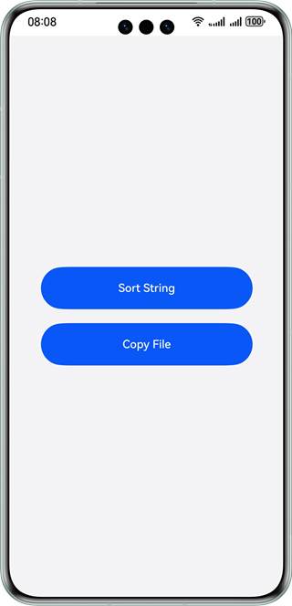
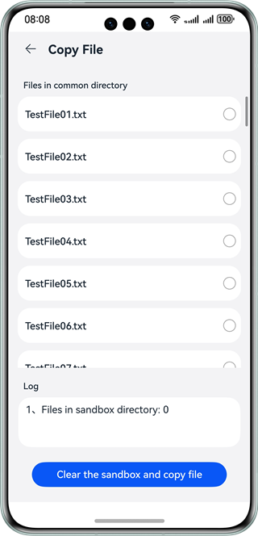
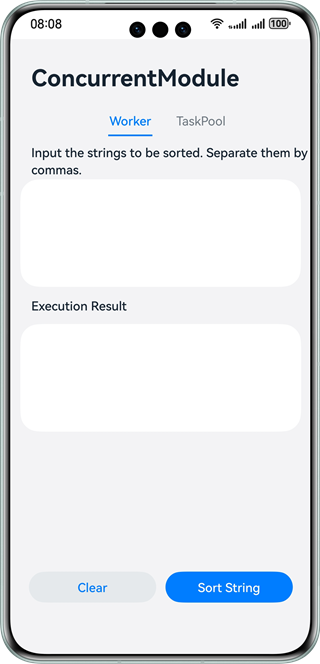
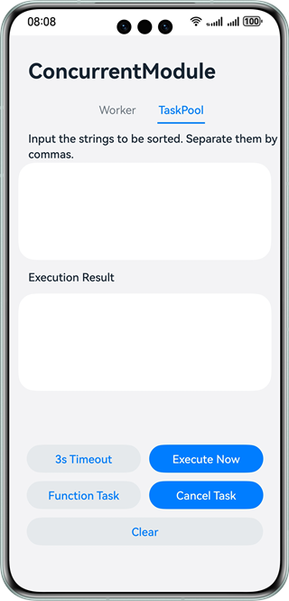

# Multi-Thread Task

### Overview

This sample uses the **@ohos.taskpool** and **@ohos.worker** APIs to show how to start the worker and taskpool threads.

### Preview

| Home Page                            | File Copy                               | String Sorting                        | Task Pool Page                          |
|--------------------------------------|-----------------------------------------|---------------------------------------|-----------------------------------------|
|  |  |  |  |

How to Use

1. On the home page, you can tap **Sort String** and **Copy File** to enter the corresponding pages.

2. Tap **Sort String** to enter the multi-thread page.

   Worker:

    1. Tap the **Worker** tab, input the character strings to be sorted, and separate them with commas (,).

    2. After you tap **Sort String**, the strings before sorting are sent to the worker thread for sorting. The sorted character strings will be sent to and displayed in the main thread.

    3. Tap **Clear** to clear the strings.

   TaskPool:

    1. Tap the **TaskPool** tab, input the character strings to be sorted, and separate them with commas (,).

    2. Tap **Execute Now**. After the task is executed, the sorted character strings are displayed.

    3. If you tap **3s Timeout**, the task is executed 3s later. After the execution is complete, the sorted character strings are displayed.

    4. Tap **Function Task** to directly call the execution. After the execution is complete, the sorted character strings are displayed. Note that tasks created using functions cannot be canceled.

    5. If you tap **Cancel Task**, the last task that is not executed will be canceled. Note that cancellation is successful only when the number of tasks is greater than the maximum number of threads and the tasks have not been started.

    6. Tap **Clear** to clear the strings.

3. Tap **Copy File** to go to the file copy page.

   Select the file to be copied and tap **Copy File**. A successful copy will trigger the display of the number of files in the sandbox and the names of the files copied in the event log.

### Project Directory

```
├──entry/src/main/ets                        // Code area
│  ├──common
│  │  ├──Common.ets                           // Common tools
│  │  └──Logger.ets                           // Logger
│  ├──component
│  │  ├──TaskPoolTab.ets                      // TaskPool tab
│  │  └──WorkerTab.ets                        // Worker tab
│  ├──entryability
│  │  └──EntryAbility.ets  
│  ├──model
│  │  ├──MyWorker.ets                         // Method class for copying files in batches
│  │  ├──TaskPoolTab.ts                       // TaskPool tab
│  │  └──WorkerTab.ts                         // Worker tab
│  └──pages
│     ├──CopyFile.ets                         // Page for copying files
│     ├──TaskPoolTab.ets                      // TaskPool tab
│     └──WorkerTab.ets                        // Worker tab
└──entry/src/main/resources                   // App resource directory
```

### How to Implement

* The implementation of the Worker tab is called on the string sorting page. For details about the source code, see [StrSort.ets](entry/src/main/ets/pages/StrSort.ets).
    * String sorting: Call **executeWorkerFunc()** to create a Worker thread and send the strings to be sorted to the Worker thread. It returns the result after sorting.
    * Clear: Clear the string text box and result.

* The implementation of the TaskPool tab is called on the string sorting page. For details about the source code, see [StrSort.ets](entry/src/main/ets/pages/StrSort.ets).
    * Immediate execution: Call **executeImmediately()** to create a task to sort character strings immediately.
    * Execution upon 3s timeout: Call **executeDelay()** to create a task to sort character strings after 3s.
    * Function task: Call the **executeFunc()** API instead of creating a task. **taskpool.execute()** is called directly to sort character strings.
    * Canceling a task: Call the **cancelTask()** API to cancel the last task that is not executed.
    * Clear: Clear the string text box and result.

* The function of copying files in batches is encapsulated in MyWorker. For details about the source code, see [MyWorker.ets](entry/src/main/ets/model/MyWorker.ets).

    * File copying: Call **MyWorker.WorkToCopyFiles()** in [CopyFile.ets](entry/src/main/ets/pages/CopyFile.ets). Send a message to the worker03 thread in the **WorkToCopyFiles** method, and copy the data in batches in the worker03 thread. After the copy is complete, the result is returned.

### Required Permissions

N/A

### Dependencies

N/A

### Constraints

1. The sample app is supported only on Huawei phones running the standard system.

2. The HarmonyOS version must be HarmonyOS 5.0.5 Release or later.

3. The DevEco Studio version must be DevEco Studio 5.0.5 Release or later.

4. The HarmonyOS SDK version must be HarmonyOS 5.0.5 Release SDK or later.
