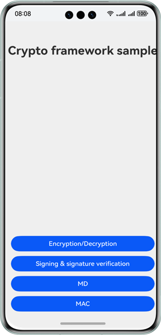
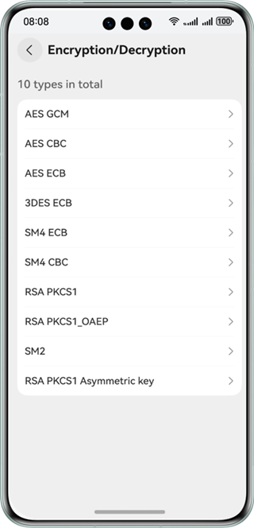
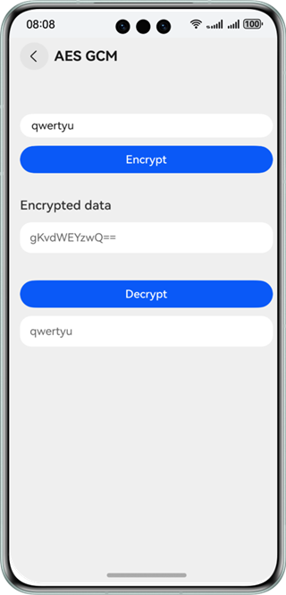
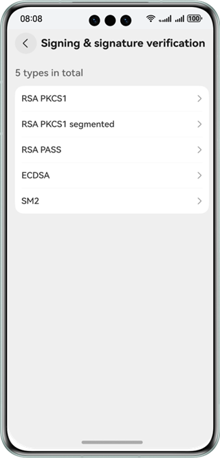
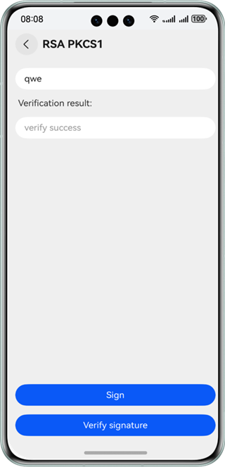
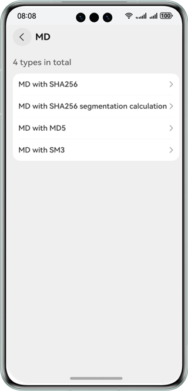
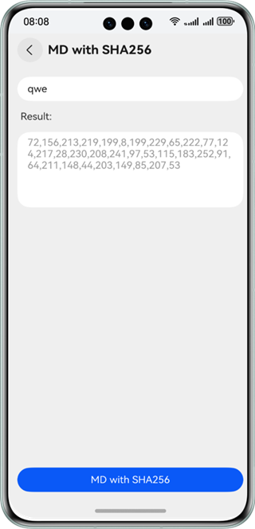
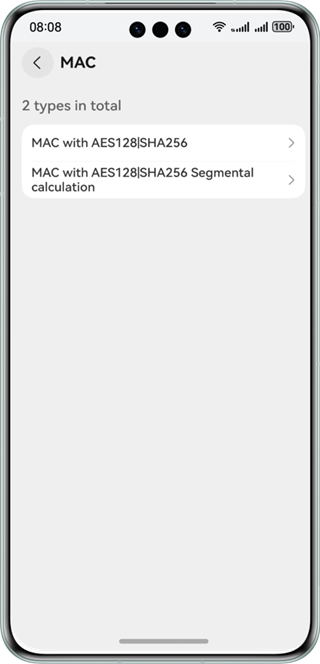
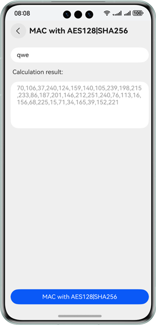

# Crypto Collection (ArkTS)

### Overview

This sample shows how to use the APIs provided by **cryptoFramework** to encrypt/decrypt text, generate and verify a
digital signature, and generate a message digest (MD) and message authentication code (MAC). Algorithms such as AES,
3DES, SM4, RSA, SM2, ECDSA, SHA-256, MD5, SM3, and HMAC are used.

### Preview

| Home Page                                    | Encryption/Decryption Page                         | Encryption/Decryption Details Page                | Signing & Signature Verification Page           | Signing & Signature Verification Details Page        |
|----------------------------------------------|----------------------------------------------------|---------------------------------------------------|-------------------------------------------------|------------------------------------------------------|
|    |         |  |   |  |
| <center>MD Page</center>                     | <center>MD Details Page</center>                   | <center>MAC Page</center>                         | <center>MAC Details Page</center>               |                                                      |
|  |  |          |  |                                                      |

### How to Use

1. Tap the button on the home page to go to the functional page, and tap the list items on the function page to go to
   the related details page.

2. Encrypt and decrypte data.

   On the encryption/decryption details page, enter the string to be encrypted and tap the **Encrypt with *algorithm***
   button to encrypt the string. A Base64-encoded string is generated.

   Tap the **Decrypt with *algorithm*** button to decrypt the Base64-encoded string.

3. Generate and verify a digital signature.

   On the signing & signature verification details page, enter the data to be signed and tap the **Sign** button to
   generate a signature.

   Tap the **Verify** button to verify the signature.

4. Generate a MD.

   On the MD details page, enter the raw data, and tap the **MD with *algorithm*** button. The MD generated is displayed
   in the **MD** text box.

5. Generate a MAC.

   On the MAC details page, enter the raw data and tap **MAC with *algorithm*** to generate a MAC.

### Project Directory

```

├──entry/src/main/ets/         
│  ├──constants
│  │  └──CommonConstants.ets                        // Common constants                    
│  ├──entryability
│  │  └──EntryAbility.ets                           // Entry ability
│  ├──pages
│  │  ├──EncryptionAndDecryption.ets                // Encryption and decryption page
│  │  ├──Index.ets                                  // Home page entry
│  │  ├──MessageAuthenticationCode.ets              // MAC page
│  │  ├──MessageSummary.ets                         // MD page
│  │  └──SignatureVerification.ets                  // Signing and signature verification page
│  ├──utils
│  │  ├──CryptoUtil.ets                             // Encryption and decryption utility
│  │  └──Logger.ets                                 // Logging utility
│  │  └──SignatureUtil.ets                          // Signing and signature verification utility
│  ├──view
│  │  ├──AuthCodeDetail.ets                         // MAC details page
│  │  ├──CryptoDetail.ets                           // Encryption and decryption details page
│  │  ├──SignatureDetail.ets                        // Signing and signature verification details page
│  │  └──SummaryDetail.ets                          // MD details page
│  └──viewmodel
│     ├──AuthCodeItem.ets                           // Entity for MAC items
│     ├──AuthCodeViewModel.ets                      // Data and logic for obtaining the MAC list
│     ├──CryptoItem.ets                             // Entity for encryption/decryption items
│     ├──CryptoViewModel.ets                        // Data and logic for obtaining the encryption/decryption list
│     ├──SignatureItem.ets                          // Entity for signing & signature verification items
│     ├──SignatureViewModel.ets                     // Data and logic for obtaining the signing & signature verification list
│     ├──SummaryItem.ets                            // Entity for MD items
│     └──SummaryViewModel.ets                       // Data and logic for obtaining the MD list
└──entry/src/main/resources                         // Static resources of the app

```

### Required Permissions

N/A

### Dependencies

N/A

### Constraints

1. The sample app is supported only on Huawei phones running the standard system.

2. The HarmonyOS version must be HarmonyOS NEXT Developer Beta1 or later.

3. The DevEco Studio version must be DevEco Studio NEXT Developer Beta1 or later.

4. The HarmonyOS SDK version must be HarmonyOS NEXT Developer Beta1 or later.
