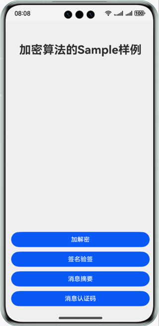
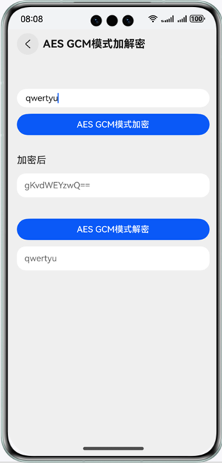
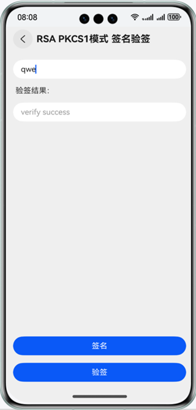
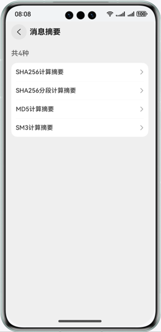
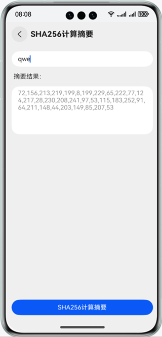
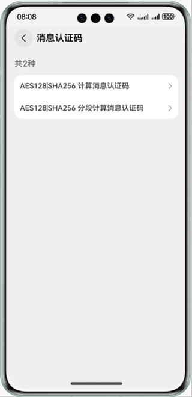
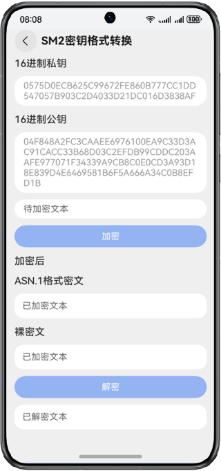

# 基于cryptoFramework实现加解密功能

### 介绍

本示例使用cryptoFramework接口的相关方法实现字符串加解密、签名验签、消息摘要、消息认证码等功能，使用了AES、3DES、SM4、RSA、SM2、ECDSA、SHA256、MD5、SM3、HMAC等算法。

### 效果预览

| 首页                                        | 加解密页面                                           | 加解密详情页                                         | 签名验签页面                                       | 签名验签详情页                                             |
|-------------------------------------------|-------------------------------------------------|------------------------------------------------|----------------------------------------------|-----------------------------------------------------|
|    |         |  |   |    |
| <center>消息摘要页面</center>                   | <center>消息摘要详情页</center>                        | <center>消息认证码页面</center>                       | <center>消息认证码详情页</center>                    | <center>SM2密钥格式转换</center>                          |
|  |  |          |  |  |

### 使用说明

1. 点击按钮跳转到各个算法页面，点击列表项跳转到各个详情页面。
2. 加解密详情页：输入待加密字符串后点击加密即可加密字符串，输出加密后的Base64编码的字符串，点击解密将加密后的Base64编码的字符串解密。
3. SM2密钥格式转换：展示不可修改的16进制公私钥。输入待加密字符串后点击加密即可加密字符串，输出加密后的ASN.1格式Base64编码的字符串和16进制的裸密文，点击解密将加密后的Base64编码的字符串解密。
4. 签名验签详情页：输入待签名的数据，点击签名按钮生成签名，再点击验签按钮进行验签。
5. 消息摘要详情页：输入待摘要的数据，点击按钮计算摘要结果。
6. 消息认证码详情页：输入需要HMAC的数据，点击按钮计算结果。

### 工程目录

```

├──entry/src/main/ets/         
│  ├──constants
│  │  └──CommonConstants.ets                        // 常量类                     
│  ├──entryability
│  │  └──EntryAbility.ets                           // 程序入口类
│  ├──pages
│  │  ├──EncryptionAndDecryption.ets                // 加解密算法页面
│  │  ├──Index.ets                                  // 主页入口
│  │  ├──MessageAuthenticationCode.ets              // 消息认证码页面
│  │  ├──MessageSummary.ets                         // 消息摘要页面
│  │  └──SignatureVerification.ets                  // 签名验签页面
│  ├──utils
│  │  ├──CryptoUtil.ets                             // 加解密算法工具类
│  │  ├──DataConversion.ets                         // SM2数据格式转换工具类
│  │  ├──Logger.ets                                 // 日志类
│  │  ├──ResourceString.ets                         // 资源文件转字符串
│  │  ├──SignatureUtil.ets                          // 签名验签工具类
│  │  └──SM2Sequence.ets                            // SM2Sequence类
│  ├──view
│  │  ├──AuthCodeDetail.ets                         // 消息认证码详情页面
│  │  ├──CryptoDetail.ets                           // 加解密详情页面
│  │  ├──SignatureDetail.ets                        // 签名验签详情页面
│  │  └──SummaryDetail.ets                          // 消息摘要详情页面
│  └──viewmodel
│     ├──AuthCodeItem.ets                           // 消息认证码列表项实体类
│     ├──AuthCodeViewModel.ets                      // 消息认证码列表项获取类
│     ├──CryptoItem.ets                             // 加解密列表项实体类
│     ├──CryptoViewModel.ets                        // 加解密数据获取类
│     ├──SignatureItem.ets                          // 签名验签列表项实体类
│     ├──SignatureViewModel.ets                     // 签名验签列表项获取类
│     ├──SummaryItem.ets                            // 消息摘要列表项实体类
│     └──SummaryViewModel.ets                       // 消息摘要列表项获取类
└──entry/src/main/resources                         // 应用静态资源目录

```

### 相关权限

不涉及。

### 依赖

不涉及。

### 约束与限制

1.本示例仅支持标准系统上运行，支持设备：华为手机。

2.HarmonyOS系统：HarmonyOS 5.0.5 Release及以上。

3.DevEco Studio版本：DevEco Studio 5.0.5 Release及以上。

4.HarmonyOS SDK版本：HarmonyOS 5.0.5 Release SDK及以上。
