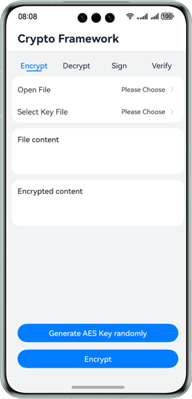
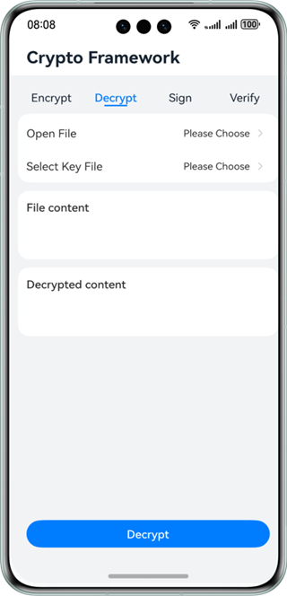
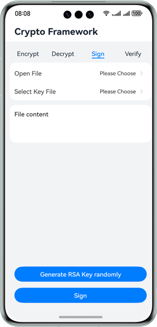
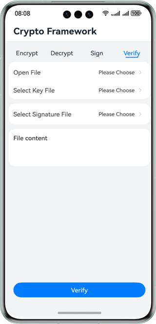

# Crypto Framework

### Overview

This sample uses the APIs provided by @ohos.security.cryptoFramework to encrypt/decrypt and sign a text file, and verify the signature.

The scenarios are as follows:

1) The app needs to encrypt and store a local text file. The app calls the crypto framework to select the key text file and encrypt the local text file. The key text file can be generated by the crypto library.

2) The app needs to decrypt a local text file. The app calls the crypto framework to select the key text file and decrypt the local text file. The key text file can be generated by the crypto library.

3) The app needs to sign a local text file. The app calls the crypto framework to select the key text file and sign the local text file. The key text file can be generated by the crypto library.

4) The app needs to verify the digital signature of a local text file. The app calls the crypto framework to select the key text file and the signature file and verify the signature. The key text file can be generated by the crypto library.

### Preview

| Encryption                              | Decryption                              | Signing                             | Signature Verification                |
|-----------------------------------------|-----------------------------------------|-------------------------------------|---------------------------------------|
|  |  |  |  |

### How to Use

1. Tap the **Encrypt** tab on the home page. On the page displayed, tap **Open file** and select a text file. After the file is selected, the content of the text file selected is displayed in the **File content** text box on the encryption page.

  Tap **Select key** and select a key file. If no key file is available, tap **Generate AES key randomly** on the encryption page to generate a key file and use filePicker to save it.

  Tap the **Encrypt** buttonto to complete cryption, and save the ciphertext file using filePicker.

  The ciphertext is displayed in the **Encrypted content** text box.

2. Tap the **Decrypt** tab on the home page. On the page displayed, tap **Open file** and select a text file. After the file is selected, the content of the file selected is displayed in the **File content** text box on the decryption page.

  Tap **Select key** and select the same key file that is used in encryption.

  Tap the **Decrypt** button to complete decryption and save the plaintext file using filePicker.

  The plaintext is displayed in the **Decrypted content** text box.

3. Tap the **Sign** tab on the home page. On the page displayed, tap **Open file** and select a text file. After the file is selected, the file content is displayed in the **File content** text box on the page displayed.

  Tap **Select key** and select a key file. If no key file is available, tap **Generate RSA key randomly** to generate a key file and save it using filePicker. Note that it takes time to generate an RSA key file.

  Tap the **Sign** button to sign the text file and save the signature file using filePicker.

4. Tap the **Verify signature** tab on the home page. On the page displayed, tap **Open file** and select a text file using filePicker. After the file is selected, the content of the file selected is displayed in the **File Content** text box on the page displayed.

  Tap **Select key** and select the same key file that is used in signing. Tap **Select signature file** and select the signature file generated in signing using filePicker.

  Tap the **Verify** button to complete the verification.

### Project Directory

```
├──entry/src/main/ets                             // Code
│  ├──cryptoframework
│  │  └──CryptoOperation.ts                       // APIs of the crypto framework
│  ├──entryability
│  │  └──EntryAbility.ets       
│  ├──pages
│  │  └──Index.ets                                // Home page
│  ├──tab
│  │  ├──Decrypt.ets                              // Decryption tab page
│  │  ├──Encrpyt.ets                              // Encryption tab page
│  │  ├──Sign.ets                                 // Signing tab page
│  │  └──Verify.ets                               // Signature verification tab page
│  ├──textfilemanager
│  │  └──TextFileManager.ts                       // APIs for reading and writing files.
│  └──util
│     └──Logger.ts                                // Logging utility
└──entry/src/main/resources                       // App resources
```

### How to Implement

* The APIs for encrypting, decrypting, and signing a text file and verifying the signature are encapsulated in **CryptoOperation**. For details about the source code, see [CryptoOperation.ts](entry/src/main/ets/cryptoframework/CryptoOperation.ts).

* Encrypt a text file. 

  Use [Encrypt.ets ](entry/src/main/ets/tab/Encrypt.ets) APIs to open the file, select the key, and use filePicker to select the plaintext text file and key file. After the **Encrypt** button is tapped, **cryptoFramework.Cipher** is called to encrypt the text file. The ciphertext file is saved by filePicker.

  When **Generate AES key randomly** is tapped to generate a key file, **cryptoFramework.symKeyGenerator** is called to generate an AES key, and the key file is saved by filePicker.

* Decrypt a text file. 

  Use [Decrypt.ets ](entry/src/main/ets/tab/Decrypt.ets) APIs to open the file, select the key, and use filePicker to select the ciphertext file and key file. After the **Decrypt** button is tapped, **cryptoFramework.Cipher** is called to decrypt the text file. The plaintext file is saved by filePicker.

* Sign a text file. 

  Use [Sign.ets ](entry/src/main/ets/tab/Sign.ets) APIs to open the file, select the key, and use filePicker to select the file to be signed and the key file. After the **Sign** button is tapped, **cryptoFramework.Sign** is called to sign the text file. The signed file is saved by filePicker.
  When **Generate RSA key randomly** is tapped to generate a key file, **cryptoFramework.asyKeyGenerator** is called to generate an RSA key, and the key file is saved by filePicker.

* Verify the signature of a text file. 

  Use [Verify.ets ](entry/src/main/ets/tab/Verify.ets) APIs to open the file, select the key, select the signature file, and use filePicker to select the ciphertext file, key file, and signature file. After the **Verify** button is tapped, **cryptoFramework.Verify** is called to verify the signature. Then, the verification result is displayed.
  

### Required Permissions

N/A

### Dependencies

* @ohos.file.picker

* @ohos.file.fs

### Constraints

1. The sample app is supported only on Huawei phones running the standard system.

2. The HarmonyOS version must be HarmonyOS NEXT Developer Beta1 or later.

3. The DevEco Studio version must be DevEco Studio NEXT Developer Beta1 or later.

4. The HarmonyOS SDK version must be HarmonyOS NEXT Developer Beta1 or later.

5. In this sample, the files selected and saved by filePicker, such as the new key, can be refreshed in real time. If the files are directly pushed to a folder, you need to restart the system to refresh the display.

6. Only English characters are allowed in text files. To ensure successful demonstration, the text length cannot exceed 8000 bytes.
