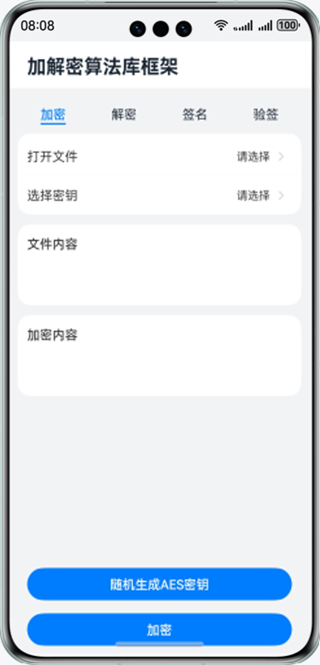
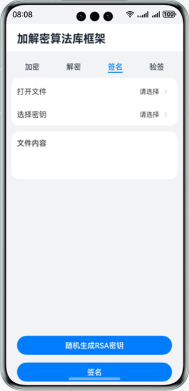
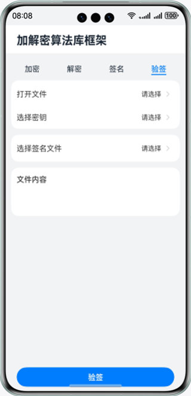

# 基于cryptoFramework实现文本文件加解密

### 介绍
本示例通过cryptoFramework接口实现文本加解密，主要用到2种加密算法，RSA加解密、AES加解密。帮助开发者掌握应用侧使用Cipher处理加解密，处理自己业务需要文本加解密的场景，对文件签名验签（本质也是加解密）的场景。

实现场景如下：

1）软件需要加密存储本地文本文件，需要调用加解密算法库框架选择密钥文本文件，对本地文本文件进行加密，其中密钥文本文件可由加解密算法库生成。

2）软件需要解密存储本地文本文件，需要调用加解密算法库框架选择密钥文本文件，对本地文本文件进行解密，其中密钥文本文件可由加解密算法库生成。

3）软件需要对存储本地文本文件签名，调用加解密算法库框架选择密钥文本文件，对本地文本文件进行完整性签名，其中密钥文本文件可由加解密算法库生成。

4）软件需要验证存储本地文本文件的签名完整性，需要调用加解密算法库框架选择密钥文本文件与签名文件，对文件进行验签，其中密钥文本文件可由加解密算法库生成。

### 效果预览

| 加密页面                                | 解密页面                                 | 签名页面                              | 验签界面                                |
|-------------------------------------|--------------------------------------|-----------------------------------|-------------------------------------|
|  |  |  |  |

使用说明

1.点击主页面tab栏的**加密**，在加密界面点击**打开文件**，通过文件选择器选择文本文件，选择完毕自动返回加密界面，
其内容显示在**文件内容**文本框中，
点击**选择密钥**，选择密钥文件，如果没有密钥文件，可以通过在加密界面点击**随机生成AES密钥**，生成并通过文件选择器保存密钥文件。
选择完文本文件和密钥文件后，点击**加密**按钮，完成加密，并通过文件选择器保存密文文件。
下方**加密内容**文本框中显示加密后的消息内容。

2.点击主页面tab栏的**解密**，在解密界面点击**打开文件**，通过文件选择器选择文本文件，选择完毕自动返回解密界面，
其内容显示在**文件内容**文本框中，
点击**选择密钥**，选择和**加密相同**的密钥文件。
选择完文本文件和密钥文件后，点击**解密**按钮，完成解密，并通过文件选择器保存明文文件。
下方**解密内容**文本框中显示解密后的消息内容。

3.点击主页面tab栏的**签名**，在签名界面点击**打开文件**，通过文件选择器选择文本文件，选择完毕自动返回签名界面，
其内容显示在**文件内容**文本框中，
点击**选择密钥**，选择密钥文件，如果没有密钥文件，可以通过在签名界面点击**随机生成RSA密钥**，生成并通过文件选择器保存密钥文件，注意RSA密钥生成耗时较长。
选择完文本文件和密钥文件后，点击**签名**按钮，完成完整性签名，并通过文件选择器保存签名文件。

4.点击主页面tab栏的**验签**，在验签界面点击**打开文件**，通过文件选择器选择文本文件，选择完毕自动返回验签界面，
其内容显示在**文件内容**文本框中，
点击**选择密钥**，选择和签名一致的密钥文件。点击**选择签名文件**，通过文件选择器选择签名时保存的签名文件，
选择完文本文件、密钥文件和签名文件后，点击**验签**按钮，完成验签。

### 工程目录

```
├──entry/src/main/ets                             // 代码区
│  ├──cryptoframework
│  │  └──CryptoOperation.ts                       // 封装加解密算法库相关算法能力
│  ├──entryability
│  │  └──EntryAbility.ets       
│  ├──pages
│  │  └──Index.ets                                // 主页界面
│  ├──tab
│  │  ├──Decrypt.ets                              // 解密tab界面
│  │  ├──Encrpyt.ets                              // 加密tab界面
│  │  ├──Sign.ets                                 // 签名tab界面
│  │  └──Verify.ets                               // 验签tab界面
│  ├──textfilemanager
│  │  └──TextFileManager.ts                       // 封装文件读写相关能力
│  └──util
│     └──Logger.ts                                // 日志文件
└──entry/src/main/resources                       // 应用资源目录
```

### 具体实现

* 进行对文本文件进行加解密、签名验签的功能接口封装在CryptoOperation中，源码参考：[CryptoOperation.ts](entry/src/main/ets/cryptoframework/CryptoOperation.ts)

* 对文本文件加密：在[Encrypt.ets](entry/src/main/ets/tab/Encrypt.ets)
  文件中依次点击打开文件、选择密钥，通过filePicker选择明文文本文件和密钥文件，点击加密按钮，调用加密函数实现对文本内容进行加密，并将密文文件通过filePicker保存。
  需要生成密钥文本文件时，可以点击随机生成AES密钥，通过调用cryptoFramework.symKeyGenerator生成用于加密的AES密钥，并通过filePicker保存密钥文本文件。
  对消息加密的过程中采用cryptoFramework.Cipher完成加密操作。
* 对文本文件解密：在[Decrypt.ets](entry/src/main/ets/tab/Decrypt.ets)
  文件中依次点击打开文件、选择密钥，通过filePicker选择密文文本文件和密钥文件，点击解密按钮，调用解密函数实现对文本内容进行解密，并将明文文件通过filePicker保存。
  对消息解密的过程中采用cryptoFramework.Cipher完成解密操作。
* 对文本文件签名：在[Sign.ets](entry/src/main/ets/tab/Sign.ets)
  文件中依次点击打开文件、选择密钥，通过filePicker选择待签名文本文件和密钥文件，点击签名按钮，调用签名函数实现对文本内容进行加密，并将签名文件通过filePicker保存。
  需要生成密钥文本文件时，可以点击随机生成RSA密钥，通过调用cryptoFramework.asyKeyGenerator生成用于签名的RSA密钥，并通过filePicker保存密钥文本文件。
  对消息签名的过程中采用cryptoFramework.Sign完成加密操作。
* 对文本文件验签：在[Verify.ets](entry/src/main/ets/tab/Verify.ets)
  文件中依次点击打开文件、选择密钥、选择签名文件，通过filePicker选择密文文本文件、密钥文件和签名文件，点击验签按钮，调用验签函数实现对文本内容进行验签，并显示验签结果。
  对消息验签的过程中采用cryptoFramework.Verify完成验签操作。

### 相关权限

不涉及。

### 依赖

* filePicker文件选择器@ohos.file.picker

* 文件管理@ohos.file.fs

### 约束与限制

1.本示例仅支持标准系统上运行，支持设备：华为手机。

2.HarmonyOS系统：HarmonyOS 5.0.5 Release及以上。

3.DevEco Studio版本：DevEco Studio 5.0.5 Release及以上。

4.HarmonyOS SDK版本：HarmonyOS 5.0.5 Release SDK及以上。

5.本示例所选择文件，用filePicker文件选择器保存的文件，比如新增的密钥，能够实时更新，如直接推送至文件夹，需要重启后刷新显示。

6.本示例所选择文本文件内容当前只支持英文字符，作为演示，能成功使用的文本长度不超过8000字节。