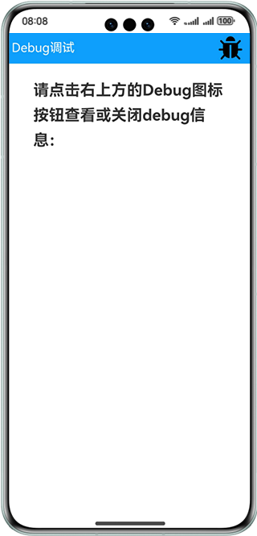
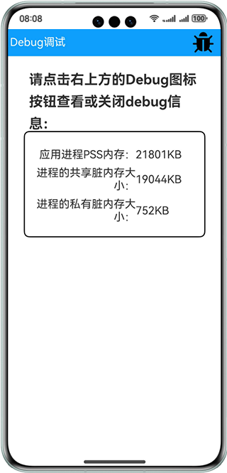

# 基于hidebug接口获取应用内存使用情况

### 介绍

本示例通过使用@ohos.hidebug接口，来获取当前应用内存使用情况，并以数字的形式展示出当前内存的使用情况，包括私有内存、共享内存以及PSS内存等指标。

### 效果预览

| 主页                                |Debug数据|
|-----------------------------------|--------------------------------|
|  ||


使用说明

1.点击界面右上方Debug图标，弹出Debug信息界面，显示当前应用内存使用情况；

2.再次点击右上方Debug图标，Debug信息界面消失。

### 工程目录

```
├──entry/src/main/ets/
│  ├─application
│  │  └─MyAbilityStage.ets     
│  ├──component
│  │  └──DebugInfo.ets                  // Debug信息页面
│  ├──data
│  │  └──Logger.ts                      // 日志工具
│  ├─entryability
│  │  └─EntryAbility.ets
│  └──pages
│     └──Index.ets                      // 首页
└──entry/src/main/resources             // 应用静态资源目录
```
### 具体实现

* 本实例获取Debug信息的功能结主要封装在Index，源码参考:[Index.ets](entry/src/main/ets/pages/Index.ets) 。
    * 获取Debug信息：在Index页面中通过点击事件调用hidebug.getPss()、hidebug.getSharedDirty()、hidebug.getPrivateDirty()等方法能够获取应用进程实际使用的物理内存大小、进程的共享脏内存大小、进程的私有脏内存大小。
  
### 相关权限

不涉及。

### 依赖

不涉及。

### 约束与限制

1.本示例仅支持标准系统上运行，支持设备：华为手机。

2.HarmonyOS系统：HarmonyOS 5.0.5 Release及以上。

3.DevEco Studio版本：DevEco Studio 5.0.5 Release及以上。

4.HarmonyOS SDK版本：HarmonyOS 5.0.5 Release SDK及以上。