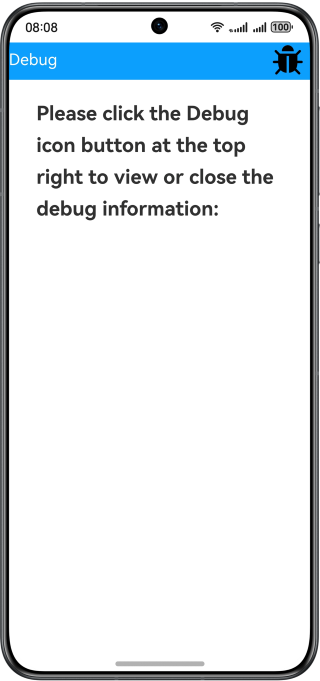
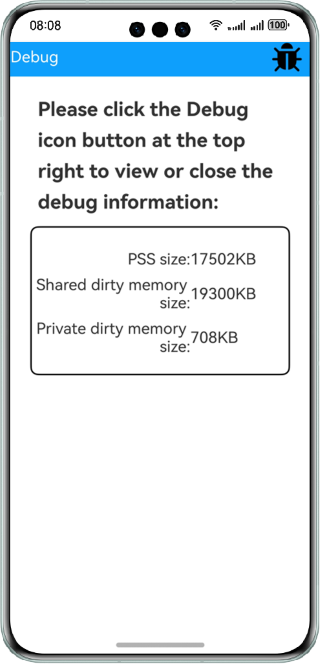

# Debug

### Overview

This sample shows how to use the @ohos.hidebug API to obtain the memory usage of an application.

### Preview

| Home page                               |Debugging data|
|-----------------------------------|--------------------------------|
|  ||


How to Use

1. Touch the **Debug** icon in the upper right corner of the page. The debugging information page is displayed, showing the memory usage of the application.

2. Touch the **Debug** icon again. The debugging information page disappears.

### Project Directory

```
├──entry/src/main/ets/
│  ├─application
│  │  └─MyAbilityStage.ets     
│  ├──component
│  │  └──DebugInfo.ets                  // Debug information page
│  ├──data
│  │  └──Logger.ts                      // Log utility
│  ├─entryability
│  │  └─EntryAbility.ets
│  └──pages
│     └──Index.ets                      // Home page
└──entry/src/main/resources             // Static resources of the app
```
### How to Implement

* In this sample, the function of obtaining debugging information is encapsulated in the index. For details about the source code, see [Index.ets](entry/src/main/ets/pages/Index.ets).
    * To obtain the debugging information, you can call methods such as **hidebug.getPss()**, **hidebug.getSharedDirty()** and **hidebug.getPrivateDirty()** through the tap event on the index page to obtain the size of the physical memory used by the application process, the size of the shared dirty memory of the process, and the size of the private dirty memory of the process, respectively.
  
### Required Permissions

N/A

### Dependencies

N/A

### Constraints

1. The sample app is supported only on Huawei phones running the standard system.

2. The HarmonyOS version must be HarmonyOS NEXT Developer Beta1 or later.

3. The DevEco Studio version must be DevEco Studio NEXT Developer Beta1 or later.

4. The HarmonyOS SDK version must be HarmonyOS NEXT Developer Beta1 or later.
