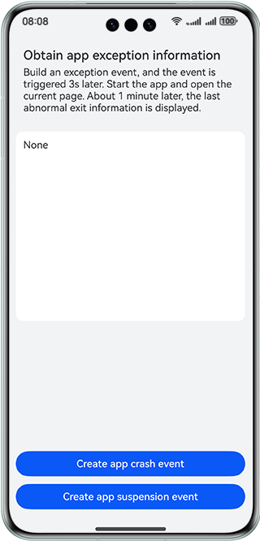
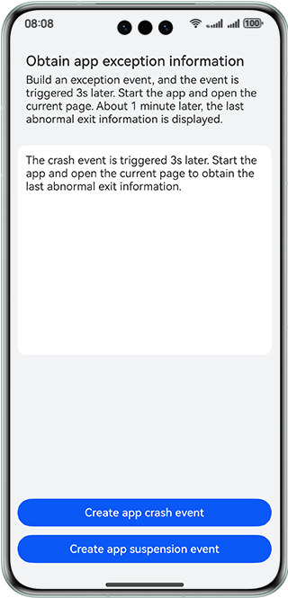
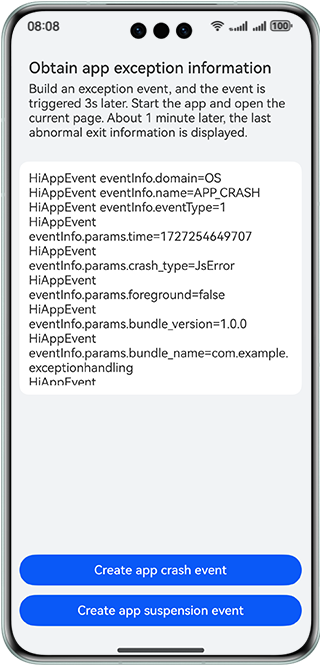

# App Exception Handling

### Overview

This sample shows how to use **hiAppEvent** to obtain the last app exception information, which can be app crash or suspension.

### Preview
| Default page                                 | Build exception events                               | Capture abnormal events                               |
|---------------------------------------|---------------------------------------|---------------------------------------|
|  |  |  |

### How to Use

1. Touch **Create app crash event**. After 3 seconds, the app exits. Start the app, and open the app exception page. About 1 minute later, the last abnormal exit information is displayed.
2. Touch **Create app suspension event**. Manually exit the app. Then, start the app, and open the app exception page. About 1 minute later, the last abnormal exit information is displayed.

### How to Implement

1. Build application exceptions. For details about the source code, see [Index.ets](./entry/src/main/ets/pages/Index.ets).
2. After the app exits, open the current page and wait for a subscription message notification. After a subscription message is received, use the **onReceive** method in **EventSubscription.ets** to receive the exception information and use **AppStorage.setOrCreate('appEventGroups', exception information data)** to bind the exception information bidirectionally. For details about the source code, see [EventSubscription.ets](./entry/src/main/ets/model/EventSubscription.ets).
3. Use @StorageLink ('appEventGroups') to receive the event group information transferred by the subscription event function, call the **getFaultMessage** method to process the information, and add the processed information to the lazy loading data sources through **this.faultDataSource.pushData(message)**. Use **this.faultDataSource.persistenceStorage()** to perform persistent storage, and use **LazyForEach** to load data to the page. For details about the source code, see [Index.ets](./entry/src/main/ets/pages/Index.ets).
4. The preceding code references the lazy loading data class and persistent storage class. For details about the source code, see [DataSource.ets](./entry/src/main/ets/model/DataSource.ets) and [PreferencesManager.ets](./entry/src/main/ets/model/PreferencesManager.ets).

### Project Directory

   ```
    ├───entry/src/main/ets                             
    │   ├───entryability
    │   │   └──EntryAbility.ets                         // Entry ability lifecycle callbacks
    │   ├───log
    │   │   └──Logger.ets                               // Log utility
    │   ├───model
    │   │   ├───DataSource.ets                          // Model layer - lazy loading data sources
    │   │   ├───EventSubscription.ets                   // Data model layer - app event subscription
    │   │   ├───MockData.ets                            // Data model layer - simulation data
    │   │   └──PreferencesManager.ets                   // Data model layer - persistent storage
    │   └───pages
    │       └──Index.ets                                // View layer - app exception page
    └───entry/src/main/resources                        // Static resources
   ```

### Dependencies

N/A

### Constraints

1. The sample app is supported only on Huawei phones running the standard system.

2. The HarmonyOS version must be HarmonyOS 5.0.5 Release or later.

3. The DevEco Studio version must be DevEco Studio 5.0.5 Release or later.

4. The HarmonyOS SDK version must be HarmonyOS 5.0.5 Release SDK or later.
