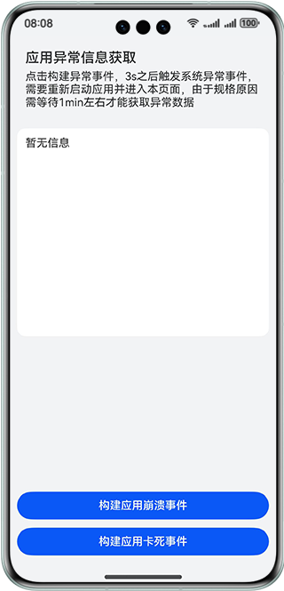
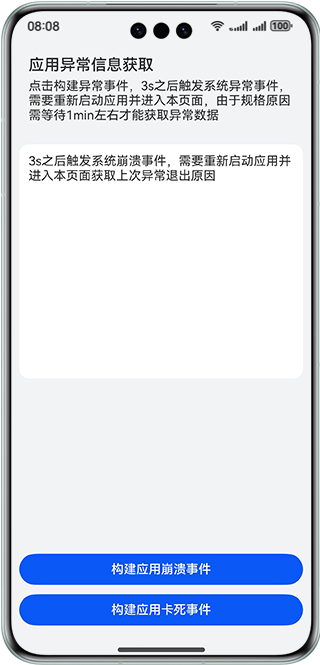
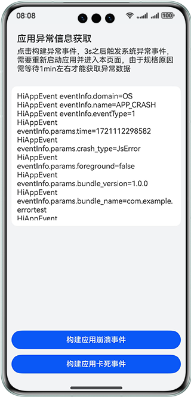

# 实现应用异常处理功能

### 介绍

本示例通过应用事件打点hiAppEvent获取上一次应用崩溃或应用卡死的异常信息，并将异常数据信息加载到页面上。帮助开发者掌握应用异常信息的获取方法，实现应用异常的快速定位和及时处理。

### 效果图预览
| 默认页面                                  | 构建异常事件                                | 捕获异常事件                                |
|---------------------------------------|---------------------------------------|---------------------------------------|
|  |  |  |

**使用说明**

1. 点击构建应用崩溃事件，3s之后应用退出，然后打开应用进入应用异常页面，隔1min左右后，显示上次异常退出信息。 
2. 点击构建应用卡死事件，需手动退出，然后打开应用进入应用异常页面，隔1min左右后，显示上次异常退出信息。

### 实现思路

1. 构建应用异常。源码参考[Index.ets](./entry/src/main/ets/pages/Index.ets)。
2. 应用退出后，进入本页面，等待订阅消息通知，待收到订阅消息后，通过EventSubscription.ets中的onReceive函数，接收到异常信息数据，并通过AppStorage.setOrCreate('appEventGroups',异常信息数据)双向绑定异常信息，源码参考代码可参考[EventSubscription.ets](./entry/src/main/ets/model/EventSubscription.ets)。
3. @StorageLink('appEventGroups')接收订阅事件函数传递的事件组信息，调用getFaultMessage函数对信息进行处理，将处理后的信息通过 this.faultDataSource.pushData(message) 添加到懒加载数据源中，并通过this.faultDataSource.persistenceStorage()执行持久化存储，最后通过使用LazyForEach将数据信息加载到页面上。具体源码参考[Index.ets](./entry/src/main/ets/pages/Index.ets)。
4. 以上代码中有引用懒加载数据类和持久化存储类，源码可参考[DataSource.ets](./entry/src/main/ets/model/DataSource.ets)和[PreferencesManager.ets](./entry/src/main/ets/model/PreferencesManager.ets)。

### 工程结构&模块类型

   ```
    ├───entry/src/main/ets                             
    │   ├───entryability
    │   │   └──EntryAbility.ets                         // Ability的生命周期回调内容
    │   ├───log
    │   │   └──Logger.ets                               // 日志工具
    │   ├───model
    │   │   ├───DataSource.ets                          // 模型层-懒加载数据源
    │   │   ├───EventSubscription.ets                   // 数据模型层-订阅应用事件
    │   │   ├───MockData.ets                            // 数据模型层-模拟数据
    │   │   └──PreferencesManager.ets                   // 数据模型层-持久化存储
    │   └───pages
    │       └──Index.ets                                // 视图层-应用异常页面
    └───entry/src/main/resources                        // 应用静态资源目录
   ```

### 模块依赖

**不涉及**

### 约束与限制

1.本示例仅支持标准系统上运行，支持设备：华为手机。

2.HarmonyOS系统：HarmonyOS 5.0.5 Release及以上。

3.DevEco Studio版本：DevEco Studio 5.0.5 Release及以上。

4.HarmonyOS SDK版本：HarmonyOS 5.0.5 Release SDK 及以上。