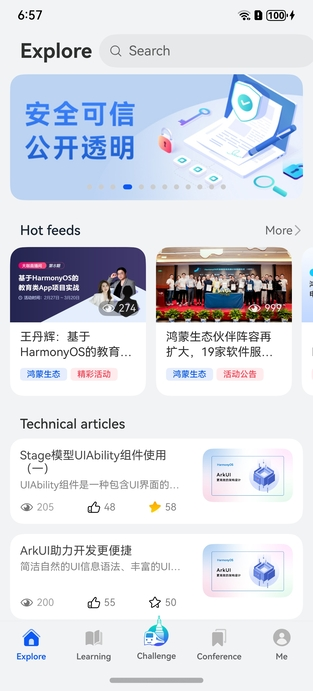
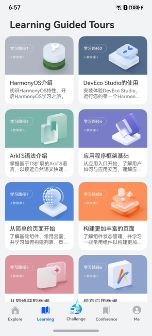
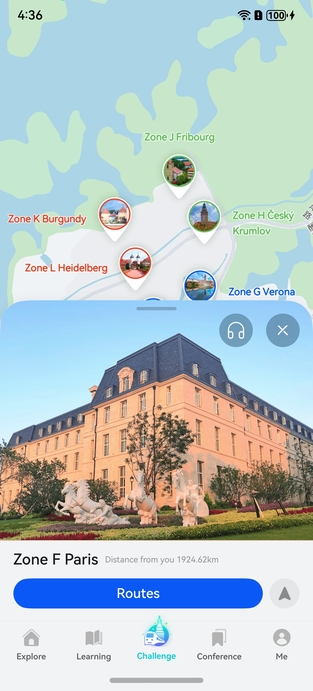
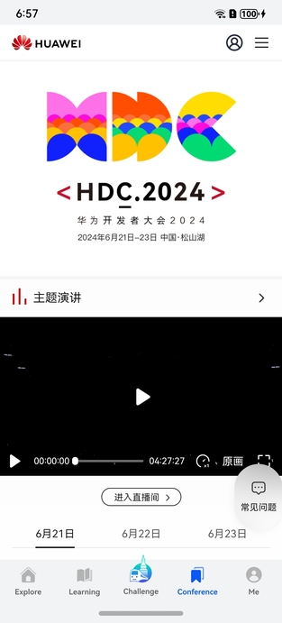
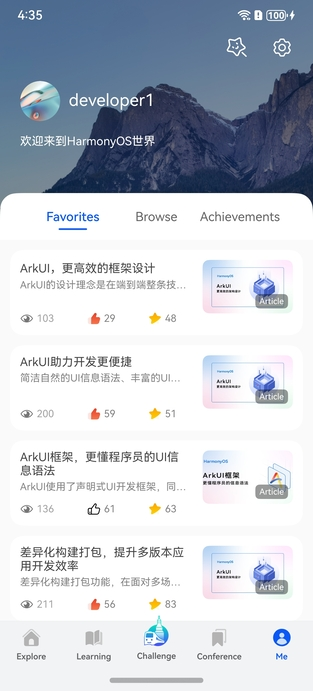

# HMOS World

### Overview

Leveraging the best practices of layered architecture and modular design, along with HarmonyOS's distinctive capability of one-time development for multi-device deployment, this sample showcases an app that embodies the latest technical features of HarmonyOS, empowering developers in the HarmonyOS ecosystem.

| Explore                                   | Learning                                      | Xiliubeipo Village Challenge                   | Conference                                      | Me                                        |
|-------------------------------------------|-----------------------------------------------|------------------------------------------------|-------------------------------------------------|-------------------------------------------|
|  |  |  |  |  |

### Architecture

#### Layered Architecture Design

HarmonyOS's layered architecture consists of three levels: product customization layer, basic feature layer, and common capability layer.

This sample meets the personalized needs of different device types at the product customization layer. The basic feature layer provides core function modules such as Login, Me, Learning, and Explore, providing common functionality support for devices. The common capability layer provides a set of basic components and services, including common UI components, data storage, networking, and utility libraries, to provide infrastructure support for app development.
For details, see [Best Practices - Layered Architecture Design](https://developer.huawei.com/consumer/en/doc/harmonyos-guides-V5/bpta-layered-architecture-design-V5?catalogVersion=V5).

#### Modular Design

In HarmonyOS, modularity is not only a design principle, but also a development practice. It aims to break down an app into multiple functional modules, each responsible for a specific function or feature. Functional modules can be developed, built, and deployed independently, and can also be flexibly combined and invoked on different devices, thereby implementing multi-device collaboration.

This sample demonstrates the advantages and practical methods of HarmonyOS modular design. For details, see [Best Practices - Modular Design](https://developer.huawei.com/consumer/en/doc/harmonyos-guides-V5/bpta-modular-design-V5?catalogVersion=V5).

### One-Time Development for Multi-Device Deployment

This sample uses responsive layouts, such as adaptive layout and grid layout, to implement a set of code that can run on mobile phones, foldable screens, and tablets.

### Performance

- The Model-View-ViewModel (MVVM) pattern is used to achieve better state management and reduce app performance issues. For details, see [Best Practices - State Management](https://developer.huawei.com/consumer/en/doc/harmonyos-guides-V5/bpta-status-management-V5?catalogVersion=V5).
- This sample demonstrates property animations, path animations, particle animations, and lottie animations. For details, see [Best Practices - Animations](https://developer.huawei.com/consumer/en/doc/harmonyos-guides-V5/bpta-fair-use-animation-V5?catalogVersion=V5).
- The **Navigation** component is used for screen transitions, along with various transition animations. For details, see [Properly Using Transition Animations](https://developer.huawei.com/consumer/en/doc/harmonyos-guides-V5/bpta-page-transition-V5?catalogVersion=V5).
- Lazy loading and component reuse are employed to enhance the performance of long list loading. For details, see [Long List Loading Performance Optimization](https://developer.huawei.com/consumer/en/doc/harmonyos-guides-V5/bpta-best-practices-long-list-V5?catalogVersion=V5).
- During the sample development, frame analysis is used to locate and resolve janky frame issues. For details, see [Janky Frame Analysis During Slide](https://developer.huawei.com/consumer/en/doc/harmonyos-guides-V5/bpta-frame-practice-V5?catalogVersion=V5).

### Security

To enhance users' control and awareness of personal data privacy protection, this app includes a privacy statement pop-up. The app can be used only after obtaining user consent upon the first startup. For details, see [Best Practices - Privacy Protection](https://developer.huawei.com/consumer/en/doc/harmonyos-guides-V5/bpta-app-privacy-protection-V5?catalogVersion=V5).

### Required Permissions

1. **ohos.permission.APPROXIMATELY_LOCATION** and **ohos.permission.LOCATION**: allow an app to obtain the device location.
2. **ohos.permission.INTERNET** and **ohos.permission.GET_NETWORK_INFO**: allow an app to use the Internet.
3. **ohos.permission.KEEP_BACKGROUND_RUNNING**: allows an app to run in the background.
4. **ohos.permission.WRITE_IMAGEVIDEO**: allows an app to manage albums.
5. **ohos.permission.DISTRIBUTED_DATASYNC**: allows an app to perform distributed data synchronization.

### Constraints

1. The sample app is supported only on Huawei phones running the standard system.
2. The HarmonyOS version must be HarmonyOS NEXT Developer Beta1 or later.
3. The DevEco Studio version must be DevEco Studio NEXT Developer Beta1 or later.
4. The HarmonyOS SDK version must be HarmonyOS NEXT Developer Beta1 or later.

### How to Use

1. This sample uses AGC Cloud Functions for data requests. The configuration information of the AGC server and client corresponds to the bundle name. Changing the bundle name in this sample during installation may lead to network request failures.
2. This sample also demonstrates the map and quick HUAWEI ID login features. To experience them, you must install and run the app using the signature information configured in the **build-profile.json5** file.