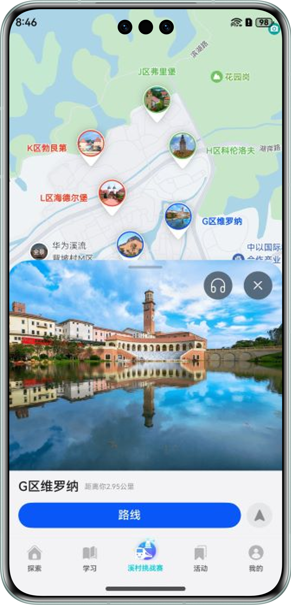

# HMOS世界

### 简介

本示例基于"端云一体化"的开发方式，端侧采用分层架构和模块化的设计方案，使用HarmonyOS"一次开发，多端部署"和多个HarmonyOS特性服务能力；云侧采用AppGallery Connect云开发框架的云函数和云数据库服务。实现了一款承载了多个HarmonyOS技术特性的应用，赋能HarmonyOS开发者。

| 探索                                     | 学习                                         | 溪村挑战赛                                       | 活动                                           | 我的                                     |
|----------------------------------------|--------------------------------------------|---------------------------------------------|----------------------------------------------|----------------------------------------|
|  |  |  |  |  |

### 使用说明

1. 本示例目录结构如下：

```
├──HMOSWorld
│  ├──Application（客户端工程文件）
│  │  ├──AppScope
│  │  ├──feature
│  │  ├──hvigor
│  │  └──products
│  └──CloudProgram（服务端工程文件）
│     ├──clouddb（云数据库数据）
│     └──cloudfunvtions（云函数）
├──README.md（HMOS世界项目介绍）
├──SETUP.md（HMOS世界端云一体化搭建指导文档）
└──screenshots（README.md和SETUP.md图片资源文件）
  
```

2. 本示例使用前，需完成端云一体化配置，要求客户端工程与服务端工程协同配置，具体配置过程请参见第[SETUP.md](SETUP.md)1-5章。本示例用到了地图服务、华为账号登录、推送消息和推送卡片功能，如果想完整体验这四项功能，需要进一步完成手动签名和端云一体化配置，具体配置过程请参见[SETUP.md](SETUP.md)的第6章，如不想体验可忽略此章节。

3. 本示例完成端云一体化配置后，数据请求使用的是[AGC](https://developer.huawei.com/consumer/cn/service/josp/agc/index.html#/)云函数，运行安装时请保证AGC服务端和客户端的配置信息是与bundleName一一对应的，否则会导致网络请求失败。

### 架构

#### 分层架构设计

HarmonyOS的分层架构主要包括三个层次：产品定制层、基础特性层和公共能力层。

本应用在产品定制层满足了不同设备类型的个性化需求。基础特性层提供了登录、我的、学习和发现等核心功能模块，为各设备提供通用的功能支持。公共能力层则提供了一套基础的开发组件和服务，包括公共UI组件、数据存储、网络和工具库，为应用开发提供了基础设施支持，
详见[最佳实践-分层架构设计](https://developer.huawei.com/consumer/cn/doc/best-practices/bpta-layered-architecture-design)。

#### 模块化设计

在HarmonyOS中，模块化不仅是一个设计原则，更是一种开发实践。它旨在将应用程序拆分为多个功能模块，每个功能模块负责特定的功能或特性。功能模块可以独立开发、编译和部署，也可以在不同的设备上灵活组合和调用，实现真正的多端协同。

本应用展现了HarmonyOS模块化设计的优势和实践方法，详见[最佳实践-模块化设计](https://developer.huawei.com/consumer/cn/doc/best-practices/bpta-modular-design)。

### 一次开发多端部署

本应用使用自适应布局和栅格布局等响应式布局方式，实现一套代码同时适配手机、折叠屏、平板等多种设备的能力。

### 性能

- 使用MVVM的设计模式，以实现更好的状态管理，减少应用的性能问题，详见[状态管理最佳实践](https://developer.huawei.com/consumer/cn/doc/best-practices/bpta-status-management)。
- 本应用中采用了属性动画、路径动画、粒子动画、lottie动画等方式实现了多种动画效果，详见[动画使用指导](https://developer.huawei.com/consumer/cn/doc/best-practices/bpta-fair-use-animation)。
- 本应用使用Navigation进行界面跳转，并使用了多种界面转场动画，详见[页面间转场](https://developer.huawei.com/consumer/cn/doc/best-practices/bpta-page-transition)。
- 使用懒加载和组件复用等方式提升长列表加载性能，详见[长列表加载丢帧优化](https://developer.huawei.com/consumer/cn/doc/best-practices/bpta-best-practices-long-list)。
- 本应用开发过程中，使用Frame分析、定位、解决卡顿问题，详见[性能分析简介](https://developer.huawei.com/consumer/cn/doc/best-practices/bpta-optimization-overview)。

### 安全

为增强用户对于个人数据隐私保护的控制和知情权，本应用添加了用户隐私说明弹窗，首次启动获得用户同意后，应用才能开始正常使用，详见[应用隐私保护](https://developer.huawei.com/consumer/cn/doc/best-practices/bpta-app-privacy-protection)。

### 相关权限

1. 获取位置权限：ohos.permission.APPROXIMATELY_LOCATION，ohos.permission.LOCATION。
2. 网络权限：ohos.permission.INTERNET，ohos.permission.GET_NETWORK_INFO。
3. 后台任务权限：ohos.permission.KEEP_BACKGROUND_RUNNING。
4. 相册管理权限：ohos.permission.WRITE_IMAGEVIDEO。
5. 分布式数据同步权限：ohos.permission.DISTRIBUTED_DATASYNC。

### 约束与限制

1. 本示例仅支持标准系统上运行，支持设备：华为手机。
2. HarmonyOS系统：HarmonyOS 5.0.0 Release及以上。
3. DevEco Studio版本：DevEco Studio 5.0.0 Release及以上。
4. HarmonyOS SDK版本：HarmonyOS 5.0.0 Release SDK及以上。