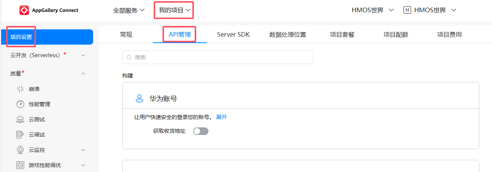
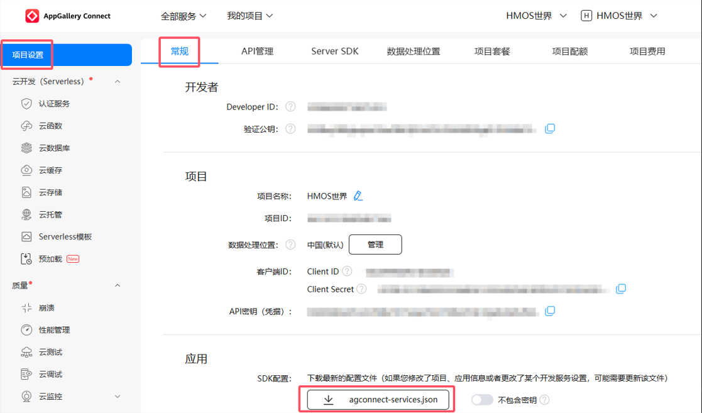
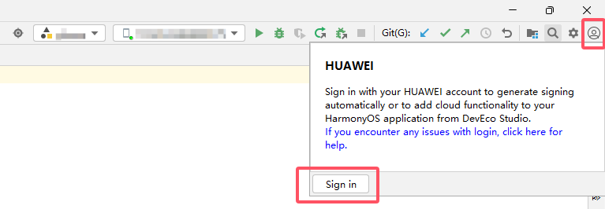

# HMOS世界端云一体化搭建

### 1.简介

HMOS世界涉及端云一体化开发，[开源代码](https://github.com/HMOS-World/HMOSWorldCloud/tree/HMOSWorld)包含客户端工程（Application文件）和服务端工程（CloudProgram文件）两部分，需要进行端云一体化配置从而体验完整的HMOS世界的功能，本文章将讲述HMOS世界端云一体化配置过程。

### 2.项目准备

1. 注册华为账号

   HMOS世界端云一体化搭建依托于[AppGallery Connect（AGC）](https://developer.huawei.com/consumer/cn/service/josp/agc/index.html#/)平台，使用AGC平台需要前往[华为开发者联盟官网](https://developer.huawei.com/consumer/cn/)进行华为账号注册，并完成实名认证，具体请参见[注册账号](https://developer.huawei.com/consumer/cn/doc/start/registration-and-verification-0000001053628148)。如果您已经拥有华为账号，并已完成实名认证，可跳过本步骤。

2. 项目打开

   使用[DevEco Studio](https://developer.huawei.com/consumer/cn/deveco-studio/)，选择File > Open，选择“HMOSWorld”，点击“OK”打开项目。请注意，HMOSWorld目录下客户端工程（Application文件）可以作为单独项目打开，但是会编译失败；服务端工程（CloudProgram文件）仅可以通过打开HMOSWorld整个项目打开。建议您直接选择打开“HMOSWorld”文件，同时打开客户端工程（Application文件）和服务端工程（CloudProgram文件），而不是只打开客户端工程（Application文件）。

   

### 3.AGC基本环境搭建

HMOS世界端云一体化配置，首先需要在[AGC](https://developer.huawei.com/consumer/cn/service/josp/agc/index.html#/)中创建本应用，完成AGC配置，为服务端工程在云端实现提供基础。操作步骤如下：

1. 登录[AGC](https://developer.huawei.com/consumer/cn/service/josp/agc/index.html#/)平台，点击“我的项目”，在项目页面中点击“添加项目”。

   

2. 在“创建项目”页面中输入项目名称后，本文章项目名称以“HMOS世界”为例，点击“创建并继续”。

   

3. 项目创建成功后，会跳转至“开通分析服务”页面。此时，“为此项目启动分析服务”开关处于默认开启状态。由于华为分析服务已于 2024 年 6 月停止运营，因此需将该开关关闭，然后点击“完成”，即可顺利完成项目创建。

4. 完成项目创建后，点击左侧导航栏的“项目设置”中的“添加应用”即可进行后续操作。

   

5. 进入“添加应用”页面后选择“APP（HarmonyOS）”，会提示前往证书、APP ID和Profile的APP ID页面，点击“APP ID”。

   

6. 进入“设置应用开发基础信息”页面，填写应用基础信息：

    - “应用类型”选择“HarmonyOS应用”；

    - “应用名称”以“HMOS世界”为例；

    - “应用包名”以“com.hmosworld.XXX”为例，因为应用包名唯一，创建相同包名应用会创建失败，所以配置时请修改为其他应用包名。此处的应用包名必须与客户端工程中配置的Bundle name一致，在后文客户端工程配置时会详细说明，具体命名规范参照[软件包规范](https://developer.huawei.com/consumer/cn/doc/app/agc-help-createharmonyapp-0000001945392297)；  
   
    - “应用分类”选择“应用”。  

    - 点击“下一步”。
   
      

7. 选择“应用所属项目”为当前项目“HMOS世界”。并点击“确认”。

    

8. 点击“确认”后，页面下会出现多个API的开放能力，将“定位服务”、“位置服务”、“地图服务”和“推送服务”开放能力打开，再点击最下方的“确认”。

    

9. 如果未开启以上开放能力，并已点击“确认”完成应用创建，可前往“我的项目”，在左侧导航栏选择“项目设置”，进入“项目设置”页面，点击“API管理”打开对应开放能力。如果您已在第8步完成“定位服务”、“位置服务”、“地图服务”和“推送服务”开放能力打开，请跳过第9步，进行第10步及以后配置。

    

10. 点击AGC平台“我的项目”，在左侧导航栏选择“云开发（Serverless）”，并开通“云函数”和“云数据库”服务。

    

    在首次开通服务时，需设置“数据处理位置”，选择“中国”并将其设为“默认”。

    

11. 如果想在基础功能之外体验消息推送或卡片推送功能，请点击AGC平台“我的项目”，在左侧导航栏选择“增长”，并开通“推送服务”。如果只想体验HMOS世界基础功能，请忽略此步骤。

    

    HMOS世界暂未涉及自分类消息推送，点击弹窗“不在提醒”。

    

至此，已完成HMOS世界AGC基本环境搭建。

### 4.客户端适配

HMOS世界端云一体化配置，需要修改客户端项目中的部分配置，为端云一体化搭建提供基础。操作步骤如下：

1. 修改客户端Bundle name，打开客户端代码AppScope > app.json5，修改Bundle name为包名，与第3章第6步的包名保持一致，以“com.hmosworld.XXX”为例。

    

2. 修改客户端Bundle name，打开客户端代码Application > features > challenge > src > main > > ets > views > MapView，修改Bundle name为包名，与第3章第6步的包名保持一致，以“com.hmosworld.XXX”为例。

    

3. 修改客户端工程products > phone > src > module.json5的122行代码的“value”为[AGC平台](https://developer.huawei.com/consumer/cn/service/josp/agc/index.html#/)“项目设置”的“应用”的Client ID。

    

4. 登录[AGC平台](https://developer.huawei.com/consumer/cn/service/josp/agc/index.html#/)，选择“我的项目”，选择“项目设置”中的“常规”，并点击下载“agconnect-services.json”，存放在掉客户端工程products > phone > src > main > resources > rawfile下。

    

5. 在DevEco Studio中，依次点击主菜单栏的File > Project Structure > Project > Signing Configs，勾选“Automatically generate signature”选项，随后点击“Sign in”登录华为账号，最后点击“OK”完成自动签名配置。请注意，操作过程中需确保设备已连接。

   

至此，已完成HMOS世界客户端适配。

### 5.服务端项目配置

HMOS世界端云一体化配置，服务端需要配置信息与[AGC平台](https://developer.huawei.com/consumer/cn/service/josp/agc/index.html#/)链接。操作步骤如下：

1. 修改配置文件CloudProgram > cloud-config.json。

    修改cloud-config.json中的appId、projectId和teamId为[AGC平台](https://developer.huawei.com/consumer/cn/service/josp/agc/index.html#/)创建HMOS世界“项目设置”中的对应信息。

    

2. 登录[AGC平台](https://developer.huawei.com/consumer/cn/service/josp/agc/index.html#/)，依次选择“我的项目” > “云数据库” > “存储区”，然后点击“新增”。在设置“存储区名称”时，请填写“HMOSWorld”。由于第3步上传的数据已关联此存储区名称，建议不要更改为其他名称。

    

3. 在项目中选中CloudProgram，右击选择Deploy Cloud Program，即可上传云数据库和云函数，请确保上传完成并成功。

    

    如果上传超时，请检查是否登录DevEco Studio；如果仍然上传超时或显示teamId报错，可重启DevEco Studio后再次上传。

    

至此，已完成HMOS世界服务端适配，可以体验除地图服务、华为账号登录、消息推送和卡片推送之外的所有基本功能。

### 6.特殊功能配置

#### 6.1手动签名

在开启消息推送服务和地图服务后，为确保地图服务、华为账号登录、消息推送和卡片推送功能正常运行，客户端工程需进行手动签名。地图服务和华为账号登录在完成手动签名后重新卸载安装应用即可使用。步骤如下：

1. 生成密钥（.p12文件），详见[手动签名](https://developer.huawei.com/consumer/cn/doc/harmonyos-guides-V5/ide-signing-V5#section297715173233)。

    - 在DevEco Studio主菜单栏点击Build > Generate Key and CSR。单击Choose Existing选择已有的密钥库文件（存储有密钥的.p12文件）；如果没有密钥库文件，单击New进行创建。

    

    - 在Create Key Store窗口中，选择并填入密钥（.p12文件）存储位置，建议在客户端工程（Application文件）下新建signature文件作为存储位置，以“signature\HMOSWorld.p12”为例，设置完Password后单击OK，请记住设置的Password，Password将被用于第5步完成手动签名。

    

2. 生成证书请求文件（.csr文件），详见[手动签名](https://developer.huawei.com/consumer/cn/doc/harmonyos-guides-V5/ide-signing-V5#section297715173233)。

    - 此时，在Generate Key and CSR界面中，继续填写Alias，以“HMOSWorld”为例，单击Next。

    

    - 设置CSR文件存储路径和CSR文件名，建议在客户端工程（Application文件）下新建signature文件作为存储位置，以“signature/HMOSWorld.csr”为例，Key password与Key store password保持一致，无需手动输入。单击Finish，创建CSR文件成功。

    

    - 可以在存储路径下获取生成的密钥库文件（.p12）、证书请求文件（.csr）和material文件夹（存放签名方案相关材料，如密码、证书等），请妥善保存，建议统一存放在客户端工程的signature文件中。

3. 使用密钥（.p12文件）和证书请求文件（.csr文件）申请发布证书（.cer文件），详见[申请发布证书](https://developer.huawei.com/consumer/cn/doc/app/agc-help-add-releasecert-0000001946273961)。

    - 登录[AGC](https://developer.huawei.com/consumer/cn/service/josp/agc/index.html#/)，选择“证书、APP ID和Profile”，在左侧导航栏选择“证书”，点击“新增证书”。
 
    

    - 填写“证书名称”，以“HMOSWorld”为例，选择“证书类型”为“调试证书”，选取在第2步中生成的证书请求文件（.csr文件）。

    

    - 下载生成的发布证书（.cer文件），建议在客户端工程（Application文件）下新建signature文件作为存储位置。

4. 使用发布证书（.cer文件）申请发布Profile（.p7b文件），详见[申请发布Profile](https://developer.huawei.com/consumer/cn/doc/app/agc-help-add-releaseprofile-0000001914714796)。

    申请发布Profile（.p7b文件）前，请确认在左边栏“设备”中存在注册设备，若未拥有设备，需要添加设备，详见[注册调试设备](https://developer.huawei.com/consumer/cn/doc/app/agc-help-add-device-0000001946142249)。

    - 登录[AGC](https://developer.huawei.com/consumer/cn/service/josp/agc/index.html#/)，选择“证书、APP ID和Profile”，在左侧导航栏选择“Profile”，点击“添加”。

    

    - “应用名称”选择“HMOS世界”，填写“Profile名称”，以“HMOS世界”为例，“类型”选择调试，“选择证书”为刚刚生成的发布证书（.cer文件）。

    

    - 下载生成的发布Profile（.p7b文件），建议在客户端工程（Application文件）下新建signature文件作为存储位置。

5. 使用密钥（.p12文件），发布证书（.cer文件）和Profile（.p7b文件）完成手动签名，建议将全部文件放于客户端代码中的signature文件，详见[手动配置签名信息](https://developer.huawei.com/consumer/cn/doc/harmonyos-guides-V5/ide-signing-V5#section112371245115818)。
 
    - 在DevEco Studio主菜单栏File > Project Structure > Project > Signing Configs窗口中，取消勾选“Automatically generate signature”，然后配置工程的签名信息。此处输入的两处密码为第1步和第2步设置的Key password与Key store password，且两密码默认为第1步中设置的Password。  
    
    

6. 登录[AGC平台](https://developer.huawei.com/consumer/cn/service/josp/agc/index.html#/)，选择“项目设置”，并点击“添加公钥指纹 (HarmonyOS API 9及以上)”，选择在第4步申请的调试证书“HMOSWorld”。

     

7. 重新安装客户端应用。

#### 6.2消息推送

1. 请确保先执行第3章第11步，在[AGC](https://developer.huawei.com/consumer/cn/service/josp/agc/index.html#/)开启消息推送服务，再执行第6.1章手动签名。

2. 登录[华为开发者联盟管理中心](https://developer.huawei.com/consumer/cn/console)，点击“凭证”，点击“服务账号秘钥”的“创建凭证”。进入创建服务账号秘钥后，“名称”填写“HMOSWorld”，点击“生成公私钥”，待生成秘钥后点击“创建并下载JSON”，此秘钥尽可下载一次，下载后请妥善保存。
 
    

    

3. 修改服务端代码CloudProgram > cloudfunctions > push-message > DatabaseHelper的25-28行代码，修改对应值为第3步创建的秘钥中的对应值。

    其中替换“SEND_URL”时，请将字段中“project ID”部分替换为秘钥中的“project_id”。

    其中替换“PRIVATE_KEY”时，请注意粘贴完整的“private_key”，并注意粘贴后秘钥中应为“\n”，而不是有两个“\”，或将秘钥值连带前后的双引号复制后替换“private_key”。

    

4. 在项目中选中CloudProgram > cloudfunctions > push-message，右击选择Deploy ‘push-message’，即可上传更改后的push-message云函数。

    
 
5. 登录[AGC平台](https://developer.huawei.com/consumer/cn/service/josp/agc/index.html#/)，选择“云函数”，选择“push-message”，点击“操作”中的的测试，然后点击“测试函数”中的“测试”，即可推送消息。在完成消息推送后，您可以在手机通知栏中看到HMOS世界的推送消息。

    

6. 至此，已完成HMOS世界消息推送功能实现。

#### 6.3卡片推送

1. 请确保先执行第3章第11步，在[AGC平台](https://developer.huawei.com/consumer/cn/service/josp/agc/index.html#/)开启消息推送服务，再执行第6.1章手动签名。

2. 修改服务端代码CloudProgram > cloudfunctions > push-data > DatabaseHelper的41和42行代码，修改对应值为AGC平台“项目设置”中“应用”中的对应值。  
   
    

3. 在项目中选中CloudProgram > cloudfunctions > push-data，右击选择Deploy ‘push-data’，即可上传更改后的push-data云函数。

    

4. 在手机桌面长按HMOS世界图标创建卡片。

5. 登录[AGC平台](https://developer.huawei.com/consumer/cn/service/josp/agc/index.html#/)，选择“云函数”，选择“push-data”，点击“操作”中的的测试，然后点击“测试函数”中的“测试”，即可推送卡片。在完成卡片推送后，您可以看到手机桌面上HMOS世界卡片内容发生变化。

    

6. 至此，已完成HMOS世界卡片推送功能实现。

### 7.服务端日志查询

1. [AGC](https://developer.huawei.com/consumer/cn/service/josp/agc/index.html#/)平台提供了在线查询服务端日志的功能，您可以登录[AGC平台](https://developer.huawei.com/consumer/cn/service/josp/agc/index.html#/)，选择“我的项目”后，在左侧边栏选择“质量”下的“云监控”中的“日志服务”进行查看。

    

2. 如需查看特定云函数的日志，请点击“增加过滤条件”，依次选择“function_name” > “等于”，并输入目标云函数的名称。例如，若需查看云函数“push-message”的日志，请在输入框中填写“push-message”，如下图所示。

    

### 8.FAQ

#### 8.1完成消息推送所述配置后，仍无法实现消息推送功能？

1. 未开通应用消息推送授权。

    在手机设置 > 通知和状态栏中查找HMOS世界的通知权限是否开启，如果未开启通知权限，选择“允许通知”，开启HMOS世界的通知权限。

    

2. 未成功上传用户的[Push Token](https://developer.huawei.com/consumer/cn/doc/harmonyos-guides-V5/push-get-token-V5)。

    检查用户[Push Token](https://developer.huawei.com/consumer/cn/doc/harmonyos-guides-V5/push-get-token-V5)是否成功上传。登录[AGC平台](https://developer.huawei.com/consumer/cn/service/josp/agc/index.html#/)，依次选择“云数据库” > “数据”，在存储区名称中选择“HMOSWorld”，对象类型选择“user_push_token”，点击“查询”。若表中存在数据，则表明Push Token已成功上传。若未成功上传，请重新安装HMOS世界应用，同意用户协议并开启消息推送授权，随后再次检查Push Token是否成功上传。确认上传成功后，即可进行消息推送。
    
    

3. 云函数“PRIVATE_KEY”粘贴错误

    检查是否正确执行第6.2章第3步，请格外注意替换“PRIVATE_KEY”时，粘贴完整的“private_key”，并注意粘贴后秘钥中所有的“\n”均为“\n”，而不是有两个“\”，或将秘钥值连带前后的双引号复制后替换[‘private_key’]。

#### 8.2完成卡片推送所述配置后，仍无法实现卡片推送功能？

1. 清除“form_info”对象数据

    登录[AGC平台](https://developer.huawei.com/consumer/cn/service/josp/agc/index.html#/)，选择“云数据库”，选择“数据”，存储区名称选择“HMOSWorld”，对象类型选择“form_info”点击“查询”。如果该表中存在数据，可点击“删除”后删除数据，再删除桌面现有卡片后，重新添加卡片进行尝试。

    