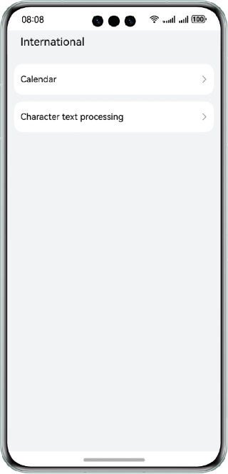
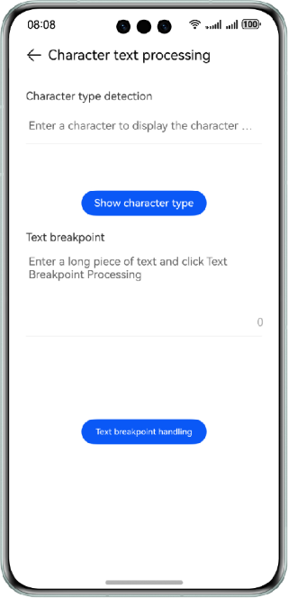
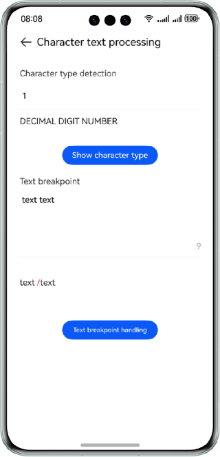

# Internationalization

### Overview

This sample shows how to use the APIs provided by the @ohos.i18n module to implement functions such as calendar display, character type recognition, and text breaking.

### Preview

| Home                            | Calendar                                | Character and text processing                           | Character and text processing effect                    |
|---------------------------------|-----------------------------------------|---------------------------------------------------------|---------------------------------------------------------|
|  |  |  |  |

How to Use
1. On the homepage, tap the **Calendar** or **Text Processing** button to access the corresponding function page.
2. On the calendar page, tap < or > to view the calendar information of the previous or next month.
3. On the character or text processing page, enter a character in the upper text box and tap the **Character Type Recognition** button to view the character type. Enter a long text in the lower text box and tap the **Text Breaking** button to view the text breaking result. The break point is marked with a red slash (/).

### Project Directory

```
├──entry/src/main/ets/
│  ├──component
│  │  ├──OperationView.ets                  // Homepage items
│  │  └──TitleBar.ets                       // Title bar
│  ├──entryability
│  │  └──EntryAbility.ets                   // Entry ability
│  ├──pages
│  │  ├──Calendar.ets                       // Calendar page
│  │  ├──Index.ets                          // Homepage
│  │  └──TextProcessing.ets                 // Character recognition and text breaking
│  └──util
│     └──ResourceUtil.ts                    // Resource management utility
└──entry/src/main/resources                 // Static resources of the app
```

### How to Implement
1. Implement calendar functions by using the Calendar APIs of the @ohos.i18n module. You can access [Calendar.ets](entry/src/main/ets/pages/Calendar.ets) for the complete source code of the service logic.
2. Implement character type recognition functions by using the Unicode APIs of the @ohos.i18n module. You can access [TextProcessing.ets](entry/src/main/ets/pages/TextProcessing.ets) for the complete source code of the service logic.
3. Implement text breaking functions by using the breakIterator APIs of the @ohos.i18n module. You can access [TextProcessing.ets](entry/src/main/ets/pages/TextProcessing.ets) for the complete source code of the service logic.

### Required Permissions

N/A

### Dependencies

N/A

### Constraints

1. The sample app is supported only on Huawei phones running the standard system.

2. The HarmonyOS version must be HarmonyOS NEXT Developer Beta1 or later.

3. The DevEco Studio version must be DevEco Studio NEXT Developer Beta1 or later.

4. The HarmonyOS SDK version must be HarmonyOS NEXT Developer Beta1 or later.
