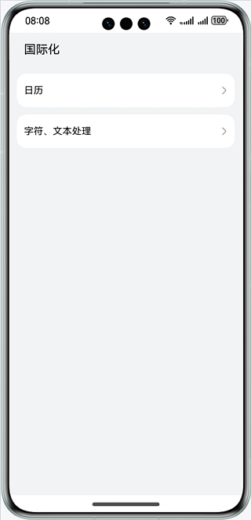
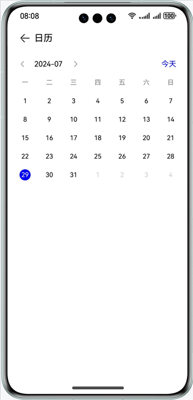
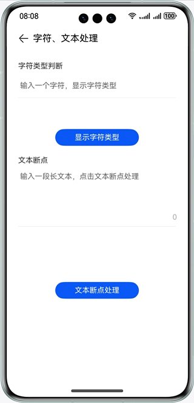
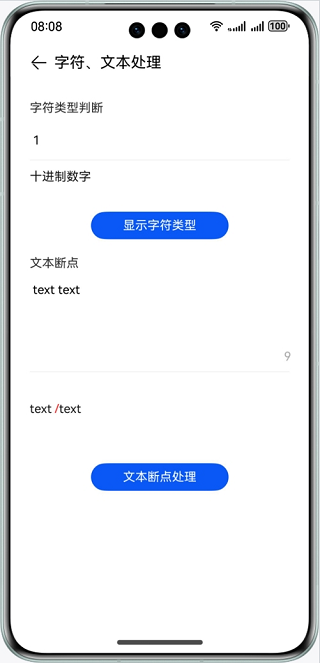

# 国际化

### 介绍

本示例主要展示了国际化模块的相关功能，使用@ohos.i18n接口，实现简单日历展示、字符类型判断、文本断点处理功能;

### 效果预览

| 首页                            | 日历                                   | 字符、文本处理                                               | 字符、文本处理效果                                            |
|-------------------------------|--------------------------------------|-------------------------------------------------------|------------------------------------------------------|
|  |  |  |  |

使用说明
1. 在主界面，可以点击日历、字符文本处理按钮进入对应功能界面；
2. 在日历界面，点击“<” “>”按钮，可以查看上/下月公历信息；
3. 在字符、文本处理界面，上方输入框输入一个字符，点击字符类型判断可以查看当前输入的字符类型，下方输入框输入长文本，点击文本断点可以查看文本断点结果，断点处用红色/标记；

### 工程目录

```
├──entry/src/main/ets/
│  ├──component
│  │  ├──OperationView.ets                  // 主页item组件
│  │  └──TitleBar.ets                       // 标题栏组件
│  ├──entryability
│  │  └──EntryAbility.ets                   // 程序入口类
│  ├──pages
│  │  ├──Calendar.ets                       // 日历页面
│  │  ├──Index.ets                          // 首页
│  │  └──TextProcessing.ets                 // 字符、文本断点处理页面
│  └──util
│     └──ResourceUtil.ts                    // 资源管理工具
└──entry/src/main/resources                 // 应用静态资源目录
```

### 具体实现
1. 日历功能使用@ohos.i18n模块中Calendar实现，全部逻辑处于Calendar，源码参考：[Calendar.ets](entry/src/main/ets/pages/Calendar.ets)。
2. 字符类型判断功能使用@ohos.i18n模块中Unicode实现，全部逻辑处于TextProcessing，源码参考：[TextProcessing.ets](entry/src/main/ets/pages/TextProcessing.ets)。
3. 文本断点功能使用@ohos.i18n模块中breakIterator实现，全部逻辑处于TextProcessing，源码参考：[TextProcessing.ets](entry/src/main/ets/pages/TextProcessing.ets)。

### 相关权限

不涉及

### 依赖

不涉及

### 约束与限制

1.本示例仅支持标准系统上运行，支持设备：华为手机。

2.HarmonyOS系统：HarmonyOS NEXT Developer Beta1及以上。

3.DevEco Studio版本：DevEco Studio NEXT Developer Beta1及以上。

4.HarmonyOS SDK版本：HarmonyOS NEXT Developer Beta1 SDK及以上。
