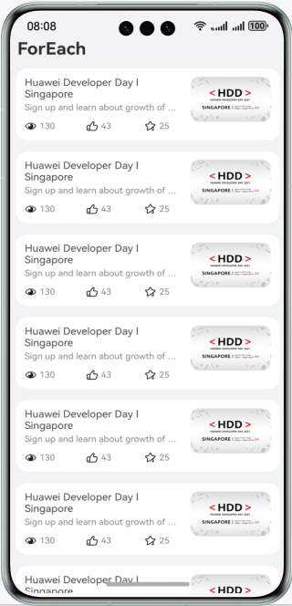
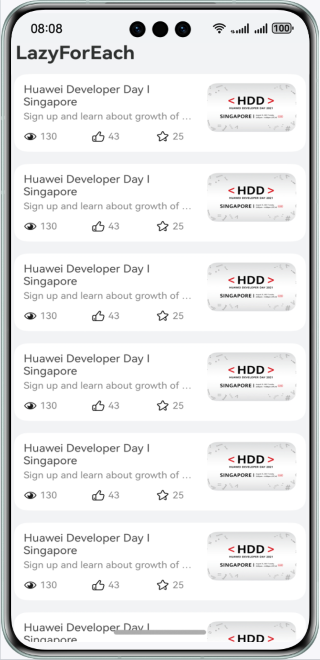

# 基于ForEach和LazyForEach实现长列表

### 介绍
本示例分别使用ForEach与LazyForEach实现了长列表，并在LazyForEach懒加载的基础上实现了缓存列表项与组件复用，旨在不同大小的数据下，对比ForEach与LazyForEach的性能，包括完全显示所用时间、丢帧率等性能指标。

### 效果预览：
| ForEach页面                           | LazyForEach页面                                  | 
|-------------------------------------|-----------------------------------------|
|  |  | 


使用说明：

1.启动应用后，在DevEco Studio启动Profiler中的Frame用来记录应用在ForEach和LazyForEach的丢帧率等数据；

2.分别点击【ForEach】和【LazyForEach】后，分别记录完全显示所用时间。完全显示所用时间可以通过Launch进行录制分析，详情操作可以参考[Launch分析](https://developer.huawei.com/consumer/cn/doc/harmonyos-guides/ide-launch-overview)。

3.分别点击【ForEach】和【LazyForEach】后，分别记录滑动的丢帧率。滑动丢帧可以通过Frame进行录制分析，详情操作可以参考[Frame分析](https://developer.huawei.com/consumer/cn/doc/harmonyos-guides/ide-insight-session-frame)。

4.为方便对比实验，本Sample在src/main/resources/rawfile中提供了不同大小的数据文件。开发者可以在getArticleModelObjFromJSON方法中更换数据文件来对比不同数据量下ForEach和LazyForEach的性能。


### 工程目录
```
├──entry/src/main/ets/
│  ├──components
│  │  ├──ArticleCardView.ets            // 文章列表项组件
│  │  └──ReusableArticleCardView.ets    // 可复用文章列表项组件
│  ├──constants 
│  │  └──Constants.ets                  // 公共常量类
│  ├──entryability
│  │  └──EntryAbility.ets               // 程序入口类
│  ├──model
│  │  ├──ArticleListData.ets            // 列表的DataSource
│  │  └──LearningResource.ets           // 列表数据类
│  ├──pages
│  │  ├──ForEachListPage.ets            // ForEach列表页面
│  │  ├──Index.ets                      // 首页页面
│  │  └──LazyForEachListPage.ets        // LazyForEach列表页面
│  └──utils
│     ├──Logger.ets                     // 日志工具类
│     └──ObservedArray.ets              // 数组工具类
└──entry/src/main/resources                              
```

### 具体实现
ForEach长列表具体实现：

1.本地加载列表数据以模拟数据请求；

2.实现ForEach列表项组件，使用ForEach和列表项组件实现长列表；

LazyForEach长列表具体实现：

1.实现IDataSource接口；

2.本地加载列表数据以模拟数据请求；

3.实现LazyForEach列表项组件。然后，调用LazyForEach的缓存列表项属性cachedCount。最后，使用@Reuseable注解实现组件复用，达到最佳优化。


### 相关权限
允许使用Internet网络：ohos.permission.INTERNET

### 依赖

不涉及。

### 约束与限制

1. 本示例仅支持标准系统上运行，支持设备：华为手机。

2. HarmonyOS系统：HarmonyOS 5.0.5 Release及以上。

3. DevEco Studio版本：DevEco Studio 5.0.5 Release及以上。

4. HarmonyOS SDK版本：HarmonyOS 5.0.5 Release及以上。