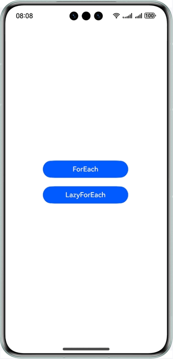

# 长列表性能对比

### 介绍
本示例分别使用ForEach与LazyForEach实现了长列表，并在LazyForEach懒加载的基础上实现了缓存列表项与组件复用，旨在不同大小的数据下，对比ForEach与LazyForEach的性能，包括完全显示所用时间、丢帧率等性能指标。

### 效果预览：



使用说明：

1.启动应用后，在DevEco Studio启动Profiler中的Frame用来记录应用在ForEach和LazyForEach的丢帧率等数据；

2.分别点击【ForEach】和【LazyForEach】后，分别记录完全显示所用时间；

3.分别点击【ForEach】和【LazyForEach】后，分别记录滑动的丢帧率。

4.为方便对比实验，本Sample在src/main/resources/rawfile中提供了不同大小的数据文件。


### 工程目录
```
├──entry/src/main/ets/
│  ├──components
│  │  ├──ArticleCardView.ets  
│  │  └──ReusableArticleCardView.ets  
│  ├──constants 
│  │  └──Constants.ets  
│  ├──entryability
│  │  └──EntryAbility.ets  
│  ├──model
│  │  ├──ArticleListData.ets  
│  │  └──LearningResource.ets         
│  ├──pages
│  │  ├──ForEachListPage.ets  
│  │  ├──Index.ets  
│  │  └──LazyForEachListPage.ets
│  └──utils
│     ├──Logger.ets
│     └──ObservedArray.ets      
└──entry/src/main/resources                              
```

### 具体实现
ForEach长列表具体实现：

1.本地加载列表数据以模拟数据请求；

2.实现ForEach列表项组件，使用ForEach和列表项组件实现长列表；

LazyForEach长列表具体实现：

1.实现IDataSource接口；

2.本地加载列表数据以模拟数据请求；

3.实现LazyForEach列表项组件。然后，调用LazyForEach的缓存列表项属性cachedCount。最后，使用@Reuseable注解实现组件复用，达到最佳优化。


### 相关权限
允许使用Internet网络：ohos.permission.INTERNET

### 依赖

不涉及。

### 约束与限制

1. 本示例仅支持标准系统上运行，支持设备：华为手机。

2. HarmonyOS系统：HarmonyOS NEXT Developer Beta1及以上。

3. DevEco Studio版本：DevEco Studio NEXT Developer Beta1及以上。

4. HarmonyOS SDK版本：HarmonyOS NEXT Developer Beta1 SDK及以上。