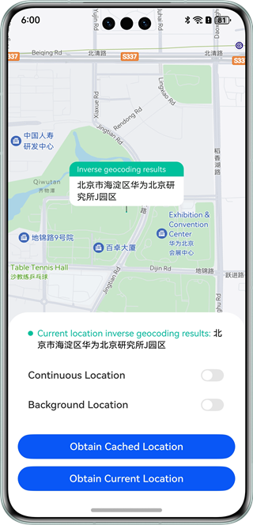

# Location Service

### Overview

This sample shows how to use the APIs provided by the **geoLocationManager** class of **@kit.LocationKit** to implement the following:
- Obtain the cached location, current location, and continuous location.
- Set the longitude and latitude as request parameters and use **map.Marker** to mark the location on the map.
- Perform reverse geocoding to obtain the address information and display the information on the app page.

### Preview
| Home                                             |
|--------------------------------------------------|
|  |

How to Use

Before you get started, configure app information by referring to the section "Configuring App Information in AppGallery Connect" in the *Map Kit Development Guide*, and [enable the MAP Kit](https://developer.huawei.com/consumer/en/doc/harmonyos-guides-V5/map-config-agc-V5). Then, perform the following:
1. Launch the app, and tap the **Obtain Cached Location** button on the homepage. The cached location is displayed and marked on the map.
2. Tap the **Obtain Current Location** button on the homepage. The current location is displayed and marked on the map.
3. Tap the **Obtain Continuous Location** button on the homepage. The most recently updated location is displayed and marked on the map.

### Project Directory
```
├──entry/src/main/ets                    // Core code
│  ├──entryability
│  │  └──EntryAbility.ets                 // Ability class
│  ├──pages
│  │  └──index.ets                        // Homepage
│  └──utils
│     └──Logger.ts                        // Log utility
└──entry/src/main/resource                // Static resources of the app
```

### How to Implement
+ When the user taps the **Obtain Cached Location** button, call the **geoLocationManager.getLastLocation** API to obtain the cached location, call the Marker API to mark the location on the map, and call the **geoLocationManager.getAddressesFromLocation** API to convert coordinates into geographical location information.
+ When the user taps the **Obtain Current Location** button, call the **geoLocationManager.getCurrentLocation** API to obtain the current location, call the Marker API to mark the location on the map, and call the **geoLocationManager.getAddressesFromLocation** API to convert coordinates into geographical location information.
+ When the user taps the **Obtain Continuous Location** button, call the **geoLocationManager.on** API to enable the continuous location function, call the Marker API to mark the most recently updated location on the map, and call the **geoLocationManager.getAddressesFromLocation** API to convert coordinates into geographical location information.
     
### Required Permissions
ohos.permission.LOCATION
ohos.permission.LOCATION_IN_BACKGROUND
ohos.permission.APPROXIMATELY_LOCATION

### Dependencies

N/A

### Constraints

1. The sample app is supported only on Huawei phones running the standard system.

2. The HarmonyOS version must be HarmonyOS NEXT Developer Beta1 or later.

3. The DevEco Studio version must be DevEco Studio NEXT Developer Beta1 or later.

4. The HarmonyOS SDK version must be HarmonyOS NEXT Developer Beta1 or later.
