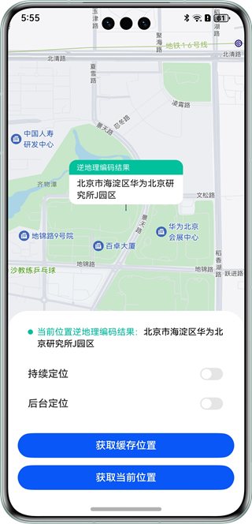

# 基于位置服务获取设备定位信息

### 介绍

本示例通过@kit.LocationKit中的geoLocationManager实现获取缓存位置、获取当前位置和持续定位功能，并结合@kit.BackgroundTasksKit中的backgroundTaskManager开启长时任务，实现后台定位功能，同时运用map.Marker将位置信息标记在地图上。开发者可以在需要用到设备位置信息的开发场景中，如查看所在城市天气、出行打车、旅行导航以及观察运动轨迹等，集成本示例代码实现定位功能。

### 效果预览
| 首页                                            |
|-----------------------------------------------|
|  |

## 使用说明

使用前请先参考[应用开发准备](https://developer.huawei.com/consumer/cn/doc/harmonyos-guides/application-dev-overview)完成基本准备工作及公钥指纹配置后，参考地图服务开发指南 “配置AppGallery Connect” 章节[开通地图服务](https://developer.huawei.com/consumer/cn/doc/harmonyos-guides/map-config-agc)，并参考应用/元服务[手动签名](https://developer.huawei.com/consumer/cn/doc/harmonyos-guides/ide-signing#section297715173233)章节对应用进行签名。

1. 进入主页，点击"获取缓存位置"按钮获取缓存位置信息，并将其标记在地图上。

2. 进入主页，点击"获取当前位置"按钮获取当前位置信息，并将其标记在地图上。

3. 进入主页，点击"持续定位"按钮，地图上会显示相关位置信息，并持续更新位置信息；再次点击"持续定位"按钮，停止持续更新位置信息。

4. 进入主页，点击"后台定位"按钮，地图上会显示相关位置信息，将应用退至后台后仍可持续更新位置信息；应用回到前台，再次点击"后台定位"按钮后将应用退至后台，停止持续更新位置信息。说明：如果手机长时间处于绝对静止，资源管理会冷冻应用。系统针对冷冻的应用会停止定位，解冻之后应用正常恢复定位。解冻措施：将应用返回前台；移动手机退出静止状态（若移动手机没有立即恢复定位功能，可能是移动的距离不够，系统没有判定手机移动或位置发生变化；应用解冻在息屏状态可能会有一段时间的延迟，导致定位功能延迟恢复）。

### 工程目录

```
├──entry/src/main/ets/                    // 代码区
│  ├──common
│  │  └──CommonConstants.ets              // 常量类
│  ├──entryability
│  │  └──EntryAbility.ets                 // 程序入口类
│  ├──model
│  │  └──LocationInter.ets                // 位置经纬度信息
│  └──pages
│     └──Index.ets                        // 主页面
└──entry/src/main/resources               // 应用静态资源目录
```

### 具体实现

+ 本例中，点击"获取缓存位置"按钮，调用geoLocationManager.getLastLocation方法，获取缓存位置信息，使用Marker接口内的方法进行位置标记，使用geoLocationManager.getAddressesFromLocation方法调用逆地理编码服务，将坐标转换为地理位置信息。

+ 本例中，点击"获取当前位置"按钮，调用geoLocationManager.getCurrentLocation方法，获取当前位置信息，使用Marker接口内的方法进行位置标记，使用geoLocationManager.getAddressesFromLocation方法调用逆地理编码服务，将坐标转换为地理位置信息。

+ 本例中，点击"持续定位"按钮，调用geoLocationManager.on方法，通过监听经纬度变化，持续获取位置信息，使用Marker接口内的方法进行位置标记，使用geoLocationManager.getAddressesFromLocation方法调用逆地理编码服务，将坐标转换为地理位置信息。

+ 本例中，点击"后台定位"按钮，调用backgroundTaskManager.startBackgroundRunning方法，开启后台定位服务的长时任务，并调用geoLocationManager.on方法开启经纬度变化监听，当应用退至后台时持续获取位置信息，使用Marker接口内的方法进行位置标记，使用geoLocationManager.getAddressesFromLocation方法调用逆地理编码服务，将坐标转换为地理位置信息。
     
### 相关权限

ohos.permission.LOCATION：允许应用获取设备位置信息。

ohos.permission.APPROXIMATELY_LOCATION：允许应用获取设备模糊位置信息。

ohos.permission.LOCATION_IN_BACKGROUND：允许应用在后台获取设备位置信息。

ohos.permission.KEEP_BACKGROUND_RUNNING：允许应用开启长时任务。

ohos.permission.GET_NETWORK_INFO：允许应用获取设备网络连接信息。说明：获取设备位置信息无需该权限，本示例中申请该权限用于感知设备网络连接状态并在无网状态下做出适当提示。

### 依赖

不涉及。

### 约束与限制

1. 本示例仅支持标准系统上运行，支持设备：华为手机。

2. HarmonyOS系统：HarmonyOS 5.0.5 Release及以上。

3. DevEco Studio版本：DevEco Studio 5.0.5 Release及以上。

4. HarmonyOS SDK版本：HarmonyOS 5.0.5 Release SDK及以上。