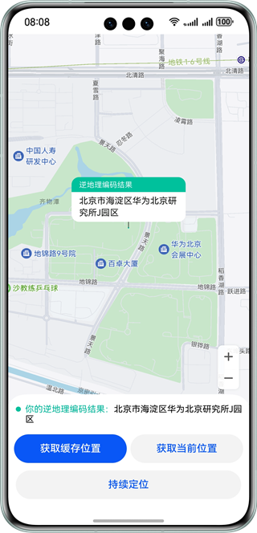

# 位置信息

### 介绍

本示例使用@kit.LocationKit中的geoLocationManager实现获取缓存定位、当前定位、持续定位的经纬度，然后将经纬度作为请求参数，通过map.Marker将位置标记在地图上，通过逆地理编码，获取到地址的详细信息，展示到页面上。

### 效果预览
| 首页                                            |
|-----------------------------------------------|
|  |

使用说明：

使用前请参考地图服务开发指南 “配置AppGallery Connect” 章节，[并开通地图](https://developer.huawei.com/consumer/cn/doc/harmonyos-guides-V5/map-config-agc-V5)。
1. 进入主页，点击"获取缓存位置"按钮，地图上会显示相关位置，并标记出来。
2. 进入主页，点击"获取当前位置"按钮，地图上会显示相关位置，并标记出来。
3. 进入主页，点击"持续定位"按钮，地图上会显示相关位置，并标记出来，会持续更新位置。

### 工程目录
```
├──entry/src/main/ets/                    // 代码区
│  ├──common
│  │  └──CommonConstants.ets              // 常量类
│  ├──entryability
│  │  └──EntryAbility.ets                 // ability类
│  ├──pages
│  │  └──index.ets                        // 主页面
│  └──utils
│     └──Logger.ets                       // 日志工具
└──entry/src/main/resource                // 应用静态资源目录
```

### 具体实现
+ 本例中，点击"获取缓存位置"按钮，调用geoLocationManager.getLastLocation方法，获取位置信息，使用Marker接口内的方法进行位置标记，使用geoLocationManager.getAddressesFromLocation方法调用逆地理编码服务，将坐标转换为地理位置信息。
+ 本例中，点击"获取当前位置"按钮，调用geoLocationManager.getCurrentLocation方法，获取位置信息，使用Marker接口内的方法进行位置标记，使用geoLocationManager.getAddressesFromLocation方法调用逆地理编码服务，将坐标转换为地理位置信息。
+ 本例中，点击"持续定位"按钮，调用geoLocationManager.on方法，获取位置信息，通过监听经纬度变化，使用Marker接口内的方法进行位置标记，使用geoLocationManager.getAddressesFromLocation方法调用逆地理编码服务，将坐标转换为地理位置信息。
     
### 相关权限
ohos.permission.INTERNET：允许使用Internet网络。

ohos.permission.LOCATION：允许应用获取设备位置信息。

ohos.permission.APPROXIMATELY_LOCATION：允许应用获取设备模糊位置信息。

### 依赖

不涉及。

### 约束与限制

1.本示例仅支持标准系统上运行，支持设备：华为手机。

2.HarmonyOS系统：HarmonyOS NEXT Developer Beta1及以上。

3.DevEco Studio版本：DevEco Studio NEXT Developer Beta1及以上。

4.HarmonyOS SDK版本：HarmonyOS NEXT Developer Beta1 SDK 及以上。