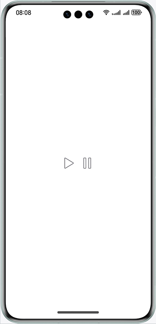
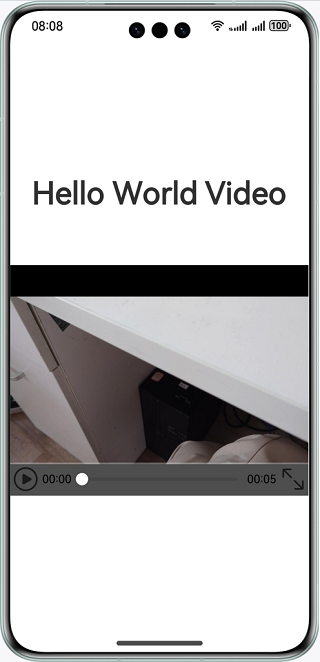
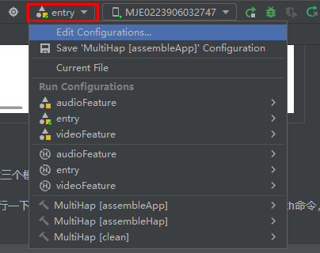
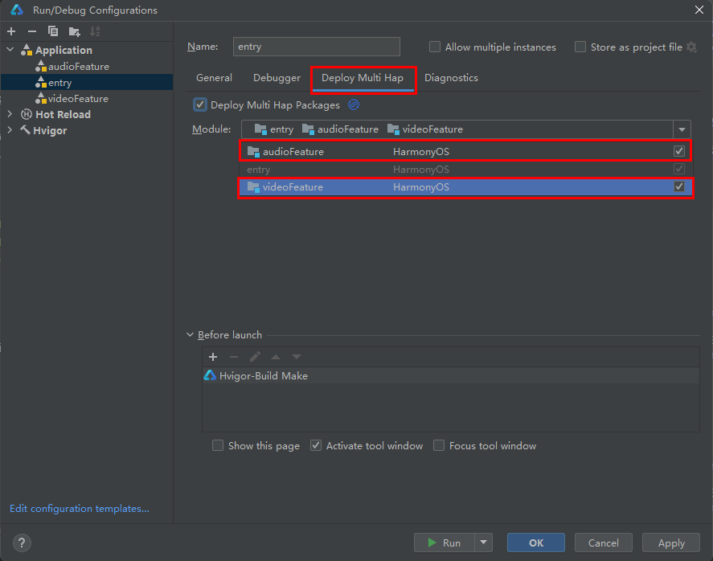

# Multi-HAP Development

### Overview

This sample shows how to develop an app with multiple HAPs. The app in this sample has an entry HAP and two feature HAPs, which provide audio and video playback components. The entry module also uses the audio and video playback components. There are three HAPs for three modules and a main entry HAP to be installed on the device.

In this sample, @ohos.app.ability.common and @ohos.multimedia.media APIs are used.

### Preview

| Home Page                              | Audio HAP                             | Video HAP                             |
|----------------------------------|------------------------------------|------------------------------------|
|  |  |  |

### How to Use

1. Choose **Build** > **Build Hap(s)/APP(s)** > **Build Hap(s)** to build three HAPs for three modules.

2. Install HAPs using DevEco Studio.

   | 1) Choose **entry** > **Edit Configurations**. | 2) Click **Deploy Multi Hap**, select **Deploy Multi Hap Packages**, select **audioFeature** and **videoFeature**, and click **Apply**. |
   | ---------------------------------------------- | ------------------------------------------------------------ |
   |            |                      |
   
3. Click **audio**. On the audio playback page displayed, click **PlayAudio** to play an audio clip.

4. Click **video**. On the video playback page displayed, click the play button to play a video.

### Project Directory

```
├──audioFeature/src/main/ets/
│  ├──application
│  │  └──MyAbilityStage.ets
│  ├──audioAbility
│  │  └──AudioAbility.ets
│  ├──pages
│  │  └──index.ets                            // Implementation of the audio component
│  └──util
│     └──Logger.ts                            // Logging utility
├──audioFeature/src/main/module.json5         // The HAP type of the audio module is feature ("type": "feature").
│
├──entry/src/main/ets/
│  ├──application
│  │  └──MyAbilityStage.ets
│  ├──mainability
│  │  └──MainAbility.ets
│  ├──pages
│  │  └──index.ets                            // App entry, including the components on the home page and logic for initiating HAP redirection
│  └──util
│     └──Logger.ts                            // Logging utility
├──entry/src/main/module.json5                // The HAP type of the entry module is entry ("type": "entry").
│
├──videoFeature/src/main/ets/
│  ├──application
│  │  └──MyAbilityStage.ets
│  ├──videoability
│  │  └──VideoAbility.ets
│  ├──pages
│  │  └──index.ets                            // Implementation of the video component 
│  └──util
│     └──Logger.ts                            // Logging utility
└──videoFeature/src/main/module.json5         // The HAP type of the video module is feature ("type": "feature").
```

#### Concepts

- entry: main module of an app. An app can have only one HAP of the entry type. The entry module implements the entry page and icons and main feature of the app.

- feature: feature module of an app. An app can have none, one, or more HAPs of the feature type.

- Multi-HAP: An app project contains one entry HAP and multiple feature HAPs.


### How to Implement

Create two modules named **videoFeature** and **audioFeature** as the HAPs to be redirected to. Source code: [Index.ets](entry/src/main/ets/pages/Index.ets)
* Configure the type of each HAP. 

  Set **"type": "entry"** in the **module.json5** file in the **entry** directory, and set **"type": "feature"** in the **module.json5** file in the **videoFeature** and **audioFeature** directories.

* Use want to jump to another ability. 

  In the **index.ets** file of the **entry** module, configure want via **common.UIAbilityContext()**. want is a carrier used to pass information between components of different HAPs.

* Configure want. 

  Specify **bundleName** and **abilityName**, which uniquely identify an ability.

* Redirect to another HAP. 

  In **index.ets** of the **entry** module, explicitly start the specified ability through **want** in the **.onclick()** event of the button.

  For example, add the want configured for the **videoFeature** module to the button onclick event.

  * btn.onClick(() => {this.context.startAbility({
      bundleName: BUNDLE_NAME,
      abilityName: AUDIO_ABILITY_NAME
      }}

  In this example:

  - **bundleName** is the value of **bundleName** in the **app.json5** file in the **appscope** folder.
  - **abilitiesName** is the value of **abilities: ["name": "VideoAbility"]** in **src/main/module.json5** of the **videoFeature** module.

### Required Permissions

N/A

### Dependencies

N/A

### Constraints

1. The sample app is supported only on Huawei phones running the standard system.

2. The HarmonyOS version must be HarmonyOS 5.0.0 Release or later.

3. The DevEco Studio version must be DevEco Studio 5.0.0 Release or later.

4. The HarmonyOS SDK version must be HarmonyOS 5.0.0 Release or later.
