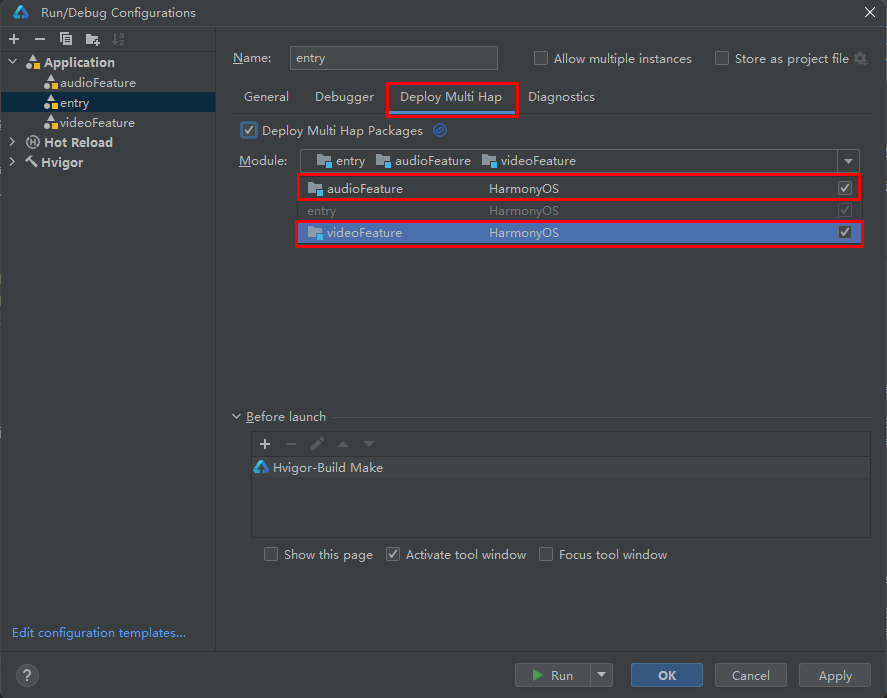

# 实现多Hap构建功能

### 介绍

本示例展示多HAP开发，简单介绍了多HAP的使用场景，应用包含了一个entry HAP和两个feature HAP，两个feature HAP分别提供了音频和视频播放组件，entry中使用了音频和视频播放组件。 三个模块需要安装三个hap包，最终会在设备上安装一个主entry的hap包。

本示例用到了应用上下文Context接口 @ohos.app.ability.common媒体服务接口@ohos.multimedia.media。

### 效果预览

| 主页                               | 音频HAP                              | 视频HAP                              |
|----------------------------------|------------------------------------|------------------------------------|
|  |  |  |

使用说明：

1.第一步：点击Build->Build Hap(s)/APP(s)->Build Hap(s)，构建三个模块的hap包。

2.第二步：使用IDE安装多Hap包。

| 1、点击 entry -> Edit Configurations 打开编辑页 | 2、选择 Deploy Multi Hap 勾选 Deploy Multi Hap Packages 后勾选 audioFeature 和 videoFeature，点击 Apply 后运行项目 |
|-----------------------------------------|---------------------------------------------------------------------------------------------------|
|     |                                                           |

3.第三步：点击audio，进入audio播放页面，可点击PlayAudio按钮，播放音频。

4.第四步：点击video，进入video播放页面，可点击播放按钮播放视频。

### 工程目录

```
├──audioFeature/src/main/ets/
│  ├──application
│  │  └──MyAbilityStage.ets
│  ├──audioAbility
│  │  └──AudioAbility.ets
│  ├──pages
│  │  └──index.ets                            // audio组件的实现页面
│  └──util
│     └──Logger.ts                            // 日志工具
├──audioFeature/src/main/module.json5         // audio模块配置hap类型："type": "feature"
│
├──entry/src/main/ets/
│  ├──application
│  │  └──MyAbilityStage.ets
│  ├──mainability
│  │  └──MainAbility.ets
│  ├──pages
│  │  └──index.ets                            // entry主应用入口，内含首页组件以及发起hap跳转逻辑
│  └──util
│     └──Logger.ts                            // 日志工具
├──entry/src/main/module.json5                // entry模块配置hap类型："type": "entry" 
│
├──videoFeature/src/main/ets/
│  ├──application
│  │  └──MyAbilityStage.ets
│  ├──videoability
│  │  └──VideoAbility.ets
│  ├──pages
│  │  └──index.ets                            // video组件的实现页面 
│  └──util
│     └──Logger.ts                            // 日志工具
└──videoFeature/src/main/module.json5         // video模块配置hap类型："type": "feature"
```

#### 相关概念

entry：应用的主模块，一个应用中，只有一个entry类型的HAP，一般实现应用的入口界面、入口图标、主特性功能等

feature：应用的特性模块，一个应用中可以包含一个或者多个feature类型的HAP，也可以不含

多HAP：一个应用工程中存在一个entry HAP和多个feature HAP

### 具体实现

* 新创建两个Module作为将被跳转的hap，分别命名为videoFeature，audioFeature。源码参考[Index.ets](entry/src/main/ets/pages/Index.ets)
  * 配置每个hap的type：把entry文件夹下的module.json5中"type": "entry",videoFeature和audioFeature文件夹下的module.json5中"type": "feature"；
  * 使用Want跳转到其他的Ability：在entry模块的index.ets中通过common.UIAbilityContext()配置Want，作为多hap间信息传递的载体，用于应用组件间的信息传递；
  * want的配置：通过指定bundleName和abilityName可以唯一确定一个Ability。
  * 新hap的跳转：在entry模块index.ets首页中，在按钮.onclick()事件内，通过Want配置显式拉起一个新的指定的Ability。
    * 例如：以配置videoFeature模块Want配置为例，在触发按钮事件中加入配置的Want：
    * btn.onClick(() => {this.context.startAbility({
        bundleName: BUNDLE_NAME,
        abilityName: AUDIO_ABILITY_NAME
        }}
    * 其中bundleName为appscope文件夹下app.json5中"bundleName": "com.samples.multihap"。
    * abilityName为videoFeature模块src/main/module.json5中abilities：["name": "VideoAbility"],

### 相关权限

不涉及。

### 依赖

不涉及。

### 约束与限制

1.本示例仅支持标准系统上运行，支持设备：华为手机。

2.HarmonyOS系统：HarmonyOS 5.0.5 Release及以上。

3.DevEco Studio版本：DevEco Studio 5.0.5 Release及以上。

4.HarmonyOS SDK版本：HarmonyOS 5.0.5 Release SDK及以上。
