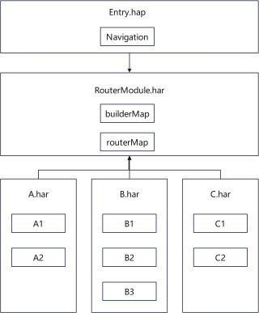

# App Navigation Design

### Overview
This sample uses an independent router module and dynamic loading method to resolve the issue of routing dependency coupling between multiple HARs/HSPs under a **Navigation** component.

### Preview


### Project Directory

```
├──entry                                          // Entry module
│  ├──build-profile.json5                         // Build configuration file, in which arkOptions must be set to the names of the dependency packages required for dynamic import
│  ├──oh-package.json5                            // Dependency configuration, including the dependencies of all service modules and the RouterModule
│  ├──src/main/ets
│  │  ├──entryability
│  │  │  └──EntryAbility.ets
│  │  └──pages
│  │     └──Index.ets                             // Home page
│  └──src/main/resources                          // Resource directory
├──harA                                           // Service module A
│  ├──Index.ets                                   // Entry file, which exposes the module methods
│  ├──oh-package.json5                            // Dependency configuration, including the dependency of the RouterModule
│  ├──src/main/ets/components/mainpage
│  │  ├──A1.ets                                 
│  │  └──A2.ets                                 
│  └──src/main/resources
├──harB                                           // Service module B
│  ├──Index.ets                                   // Entry file, which exposes the module methods
│  ├──oh-package.json5                            // Dependency configuration, including the dependency of the RouterModule
│  ├──src/main/ets/components/mainpage
│  │  ├──B1.ets
│  │  ├──B2.ets
│  │  └──B3.ets
│  └──src/main/resources
├──harC                                           // Service module C
│  ├──Index.ets                                   // Entry file, which exposes the module methods
│  ├──oh-package.json5                            // Dependency configuration, including the dependency of the RouterModule
│  ├──src/main/ets/components/mainpage
│  │  ├──C1.ets
│  │  └──C2.ets
│  └──src/main/resources
└──RouterModule                                   // Router module
   ├──Index.ets                                   // Entry file, which exposes the module methods and constants
   ├──oh-package.json5
   ├──src/main/ets/constants                      // Routing information constants
   │  └──RouterConstants.ets
   ├──src/main/ets/model                          // Routing information model
   │  └──RouterModel.ets
   ├──src/main/ets/utils                          // Routing methods provided for external systems
   │  └──RouterModule.ets
   └──src/main/resources
```

### How to Implement
1. Extract the routing feature as an independent module named RouterModule in the format of a .har package.
2. The RouterModule manages routes internally and exposes a RouterModule object for other modules to use.
3. Use the main entry module as the dependency registration center of service modules. Use the **Navigation** component in the entry module and configure its dependencies on the service modules.
4. The service modules depend only on the RouterModule. Routes in the service modules are managed by the RouterModule in a unified manner, implementing decoupling between service modules.



### Required Permissions
N/A
### Constraints

1. The sample app is supported only on Huawei phones running the standard system.

2. The HarmonyOS version must be HarmonyOS NEXT Developer Beta1 or later.

3. The DevEco Studio version must be DevEco Studio NEXT Developer Beta1 or later.

4. The HarmonyOS SDK version must be HarmonyOS NEXT Developer Beta1 or later.
