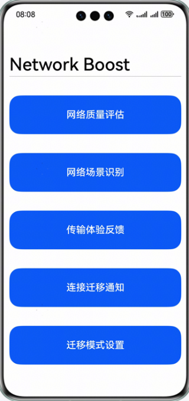

# 基于网络感知和预测能力实现网络加速

## 简介

Network Boost Kit（网络加速服务）提供网络加速能力以及网络感知、网络质量预测等能力，通过软、硬、芯、端、管、云等全方位的协同解决方案实现网络资源的调优和加速，从而构筑更可靠、更流畅、更高速的上网体验。

## 开发前准备

- 在开发HarmonyOS应用前，先进行对应的开发环境安装与调试。
- 了解网络加速服务代码结构。

## 效果预览

| 主页效果图                                | 网络质量评估                               | 网络场景识别                   |
|--------------------------------------|--------------------------------------|----------------------------------------|
|  |  |  |

| 传输体验反馈                                | 连接迁移通知                               | 迁移模式设置                   |
|--------------------------------------|--------------------------------------|----------------------------------------|
|  |  |  |
## 工程目录

```
├──entry/src/main/ets/
│  ├──entryability
│  │  └──EntryAbility.ets             // 程序入口Ability
│  └──pages
│     ├──MainPage.ets                 // 主界面
│     ├──NetworkQos.ets               // 网络质量评估测试页面
│     ├──NetworkScene.ets             // 网络场景识别测试页面
│     ├──ReportQoe.ets                // 传输体验反馈测试页面
│     ├──NetworkHandover.ets          // 连接迁移通知测试页面
│     └──SetHandoverMode.ets          // 迁移模式设置测试页面
└──entry/src/main/resources           // 应用静态资源目录
```

## 具体实现

本示例主要展示的网络质量评估、网络场景识别、应用传输体验反馈功能对应的接口在@hms.networkboost.netquality.d.ts中，连接迁移通知、迁移模式设置功能对应的接口在@hms.networkboost.handover.d.ts中

- 通过调用netQuality.on(type: 'netQosChange', callback: Callback<Array<NetworkQos>>)订阅系统侧网络质量评估信息，系统按照一定的周期或Qos变化后回调给应用。
- 通过调用netQuality.on(type: 'netSceneChange', callback: Callback<Array<NetworkScene>>)订阅系统侧网络场景信息，系统在网络场景实时信息或预测信息发生变化后回调给应用。
- 通过调用netQuality.reportQoe(appQoe: AppQoe)，应用将传输体验和传输的业务类型信息通过实时反馈接口传输给网络业务模块。
- 通过调用netHandover.on(type: 'handoverChange', callback: Callback<HandoverInfo>)，订阅系统侧连接迁移通知信息，系统发起多网迁移（WiFi<->蜂窝，主卡<->副卡等）的过程中，给应用提供连接迁移开始和完成通知。
- 通过调用netHandover.setHandoverMode(mode: HandoverMode)，应用可通过该接口变更连接迁移模式，包括委托模式由系统发起连接迁移，和自主模式由应用发起连接迁移。

以上业务使用时，需先import @kit.NetworkBoostKit，再根据自身需求对接口进行扩展使用，详细情况可以参考本用例中entry/src/main/pages下五个接口的实现。

## 相关权限

本Demo需要使用获取设备网络信息的权限，请在配置文件module.json5中添加以下权限：

1. 允许获取设备网络信息的权限：ohos.permission.GET_NETWORK_INFO
2. 允许使用Internet网络权限：ohos.permission.INTERNET


## 使用说明

如果在运行该示例代码时，出现运行不了的情况，可尝试选择DevEco Studio菜单栏Build里面的Clean Project选项，来清理工程。

## 约束与限制

1. 本示例仅支持标准系统上运行，支持设备：华为手机、华为平板。
2. HarmonyOS系统：HarmonyOS NEXT Beta1及以上。
3. DevEco Studio版本：DevEco Studio NEXT Beta1及以上。
4. HarmonyOS SDK版本：HarmonyOS NEXT Beta1 SDK及以上。