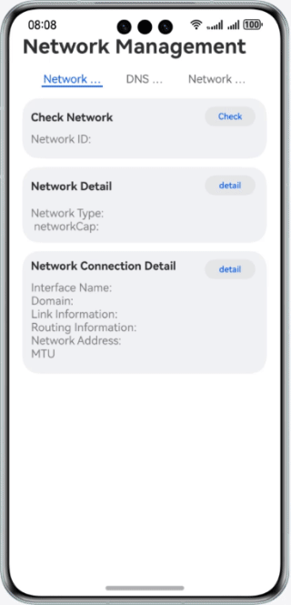

# Network Management

### Overview
This sample shows how to query network details, resolve domain names, and listen for network status.

### Preview



### How to Use

1. Start the app and tap **Check network**, **Network details**, and **Network connection info**.

2. On the domain name resolution page, enter the domain name and tap **Resolve**. The IP address information of the domain name is displayed.

3. On the network listening page, toggle **Network listening** to on to enable network listening and toggle **Network listening** to off to disable network listening


### Project Directory
```
├──entry/src/main/ets/
│  ├──common 
│  │  └──Constant.ets
│  ├──entryability
│  │  └──EntryAbility.ets                      
│  ├──pages
│  │  └──Index.ets 
└──entry/src/main/resources                              
```

### How to Implement
Use the APIs of @ohos.net.connection to obtain network information, resolve domain names, and listening for network status. Source code: **Index.ets**


### Required Permissions
- **ohos.permission.GET_NETWORK_INFO**: allows an app to obtain network information.

- **ohos.permission.INTERNET**: allows an app to access Internet.


### Dependencies

N/A

### Constraints

1. The sample app is supported only on Huawei phones running the standard system.

2. The HarmonyOS version must be HarmonyOS 6.0.0 Beta5 or later.

3. The DevEco Studio version must be DevEco Studio 6.0.0 Beta5 or later.

4. The HarmonyOS SDK version must be HarmonyOS 6.0.0 Beta5 SDK or later.
