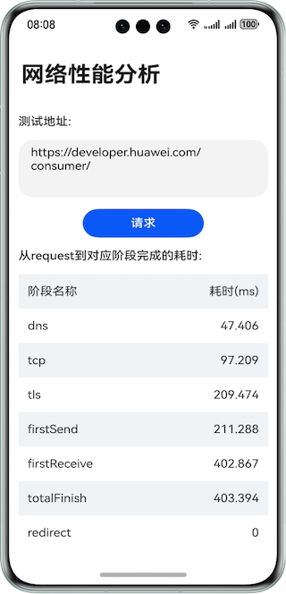

# 实现网络性能分析功能

### 介绍

本示例为开发者展示http数据请求的性能分析API：PerformanceTiming，以表格的形式展示从request到对应阶段完成的耗时，包括DNS、TCP、TLS、FirstSend、FirstReceive、TotalFinish等阶段耗时。

### 效果预览


### 工程目录

```
├──entry/src/main/ets/
│  ├──constants
│  │  └──Constants.ets                  // 公共常量类
│  ├──entryability
│  │  └──EntryAbility.ets               // 程序入口类
│  └──pages                 
│     └──Index.ets                      // 首页
└──entry/src/main/resources             // 应用静态资源目录
```

### 具体实现

1. 创建http，设置监听回调headersReceive。
2. 设置请求参数，包括但不限于method、header等。
3. 发起请求request。
4. 解析结果response，其中performanceTiming是请求过程各阶段的耗时。

### 相关权限

网络连接权限 ohos.permission.INTERNET

获取网络状态权限 ohos.permission.GET_NETWORK_INFO

修改网络状态权限 ohos.permission.SET_NETWORK_INFO

### 依赖
不涉及

### 约束与限制

1.本示例仅支持标准系统上运行，支持设备：华为手机。 

2.HarmonyOS系统：HarmonyOS 5.0.5 Release及以上。

3.DevEco Studio版本：DevEco Studio 5.0.5 Release及以上。

4.HarmonyOS SDK版本：HarmonyOS 5.0.5 Release SDK及以上。