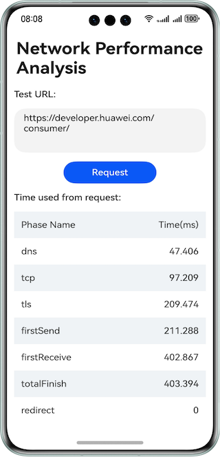

# Network Performance Analysis

### Overview

This sample shows how to use **PerformanceTiming()** to obtain detailed timing information about each phase in an HTTP data request process in a table.

### Preview


### Instructions for Use
Open the Index page, fill in the HTTP or HTTPS test address in the input box, click on the request, and view the network performance time consumption data for each stage in the table.

### Project Directory

```
├──entry/src/main/ets/
│  ├──constants
│  │  └──Constants.ets                  // Common constants
│  ├──entryability
│  │  └──EntryAbility.ets               // Entry ability
│  └──pages                 
│     └──Index.ets                      // Home page
└──entry/src/main/resources             // Static resources
```

### How to Implement

1. Create an HTTP request and set the **headersReceive** callback.
2. Set request parameters, including **method**, **header**, and more.
3. Initiate a request.
4. Parse the response, in which **performanceTiming** provides the time used in each phase of the request process.

### Required Permissions

- **ohos.permission.INTERNET**: allows an app to access Internet.

- **ohos.permission.GET_NETWORK_INFO**: allows an app to obtain network information.

- **ohos.permission.SET_NETWORK_INFO**: allows an app to set network information.


### Dependencies
N/A

### Constraints

1. The sample is only supported on Huawei phones with standard systems.

2. The HarmonyOS version must be HarmonyOS 5.0.5 Release or later.

3. The DevEco Studio version must be DevEco Studio 5.0.5 Release or later.

4. The HarmonyOS SDK version must be HarmonyOS 5.0.5 Release SDK or later.
