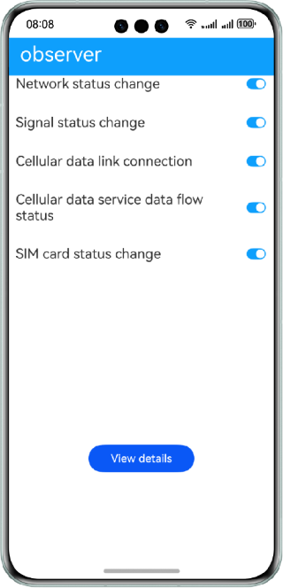

 # Event Subscription

### Overview

This sample shows how to use the APIs provided by @ohos.telephony.observer to subscribe to events such as the network status, signal status, cellular data, and SIM card status and obtain the status change result.

### Preview

| Home page                               |
|-----------------------------------------|
|  |

### How to Use

1. Start the application and toggle all the event subscription options on.

2. Disable and then enable the mobile network to trigger a network status change.

3. Remove and insert the SIM card to trigger the change of the SIM card status and signal status.

4. Tap **View**. The details page is displayed, showing the data observed.

### Project Directory
```
├──entry/src/main/ets/
│  ├──application
│  │  └──AbilityStage.ets
│  ├──mainability
│  │  └──MainAbility.ets
│  ├──model
│  │  ├──DetailData.ts                  // Details.
│  │  └──Logger.ts                      // Logging utility
│  └──pages
│     ├──Deatil.ets                     // Details page
│     └──Index.ets                      // Home page
└──entry/src/main/resources             // Static resources of the app
```
### How to Implement

* Use **NetworkState()** to obtain the network status, use **SignalInformation()** to obtain the network signal strength information, use **RadioTechnology()** to obtain the radio access technology, use **DataConnectState()** to represent the cellular data link connection status, use **DataFlowType** to define the cellular data flow type, and use **SimStateData** to obtain the SIM card type and status.
* Source code: [DetailData.ts](entry/src/main/ets/modle/DetailData.ts), [Index.ets](entry/src/main/ets/pages/Index.ets)
* APIs: @ohos.telephony.radio, @ohos.telephony.data, and @ohos.telephony.observer

#### Concepts

observer: Listen for the mobile network, signal, call, or SIM card status by registering a callback for an event. When the event is triggered, the callback will be invoked to return the result.

### Required Permissions

**ohos.permission.GET_NETWORK_INFO**: allows an app to obtain the network status.

### Dependencies

N/A

### Constraints

1. The sample app is supported only on Huawei phones running the standard system.

2. The HarmonyOS version must be HarmonyOS 5.0.5 Release or later.

3. The DevEco Studio version must be DevEco Studio 5.0.5 Release or later.

4. The HarmonyOS SDK version must be HarmonyOS 5.0.5 Release or later.
