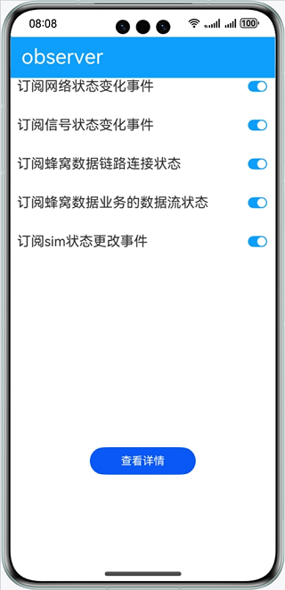

# 基于Observer实现事件订阅功能

### 介绍

本示例通过@ohos.telephony.observer等接口订阅网络状态、信号状态、蜂窝数据、sim状态等事件，并获取状态变化返回的结果。帮助开发者实现监听手机网络、信号、通话、sim卡等状态的场景。

### 效果预览

|主页|
|--------------------------------|
||

使用说明

1.打开应用，开启所有订阅事件开关。

2.开关一次移动网络，触发网络状态变化。

3.插拔一次sim卡，触发sim卡状态变化和信号状态变化。

4.点击**查看详情**按钮，跳转详情页，显示监听到的数据结果。

### 工程目录
```
├──entry/src/main/ets/
│  ├──application
│  │  └──AbilityStage.ets
│  ├──mainability
│  │  └──MainAbility.ets
│  ├──model
│  │  ├──DetailData.ts                  // 详情数据
│  │  └──Logger.ts                      // 日志工具
│  └──pages
│     ├──Deatil.ets                     // 详情页面
│     └──Index.ets                      // 首页
└──entry/src/main/resources             // 应用静态资源目录
```
### 具体实现

* 该示例使用NetworkState方法获取网络注册状态，SignalInformation方法获取网络信号强度信息，RadioTechnology方法获取无线接入技术，DataConnectState方法描述蜂窝数据链路连接状态，DataFlowType方法描述蜂窝数据流类型，SimStateData方法获取SIM卡类型和状态等方法提供订阅管理功能。
* 源码链接：[DetailData.ts](entry/src/main/ets/modle/DetailData.ts)，[Index.ets](entry/src/main/ets/pages/Index.ets)
* 接口参考：@ohos.telephony.radio，@ohos.telephony.data，@ohos.telephony.observer

#### 相关概念

observer: 通过注册相关监听事件，来监听手机网络、信号、通话、sim卡等状态，并返回相应的结果。

### 相关权限

1.获取网络状态权限：ohos.permission.GET_NETWORK_INFO

### 依赖

不涉及。

### 约束与限制

1.本示例仅支持标准系统上运行，支持设备：华为手机。

2.HarmonyOS系统：HarmonyOS NEXT Developer Beta1及以上。

3.DevEco Studio版本：DevEco Studio NEXT Developer Beta1及以上。

4.HarmonyOS SDK版本：HarmonyOS NEXT Developer Beta1 SDK及以上。
