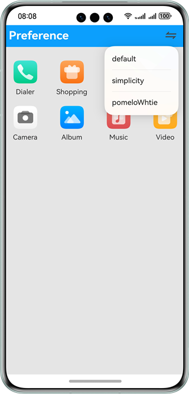
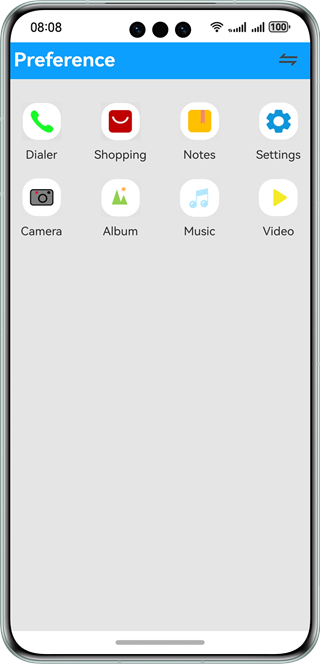
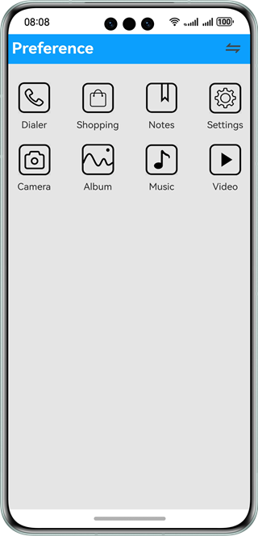

#  Preferences

### Overview

This sample shows how to use the APIs provided by the @ohos.data.preferences module to persistent preferences data.

### Preview

| Default                                 | Pomelo                                 | Simplicity                                 |
|-----------------------------------------|----------------------------------------|--------------------------------------------|
|  |  |  |

### How to Use

1. Touch the switch button on the upper right corner of the title bar, and select the theme to switch to from the screen displayed.

2. Exit the app and then access it again. The theme before the last exit is displayed.

### Project Directory
```
├──entry/src/main/ets/
│  ├──application
│  │  └──AbilityStage.ets
│  ├──common
│  │  └──ThemeDesktop.ets             // Content of the home page
│  ├──mainability
│  │  └──MainAbility.ets
│  ├──model
│  │  └──Logger.ets                   // Log file
│  ├──pages
│  │  └──Index.ets                    // Home page, which contains all the APIs and data.
│  └──util
│     └──DataSource.ets               // Data to be loaded in lazy loading mode
└──entry/src/main/resources           // Static resources of the app
```

### How to Implement

* Switch the theme: 

  Set several sets of main data on the home page, use **preferences.getPreferences** to obtain the **Preferences** object, and use **Preferences.get()** to obtain the data to be displayed. Each time the switch button is clicked, **Preferences.put()** is called to modify the parameters. Use **Preferences.flush()** to save and refresh the file content.

  Source code reference: [Index.ets](entry/src/main/ets/pages/Index.ets)

### Required Permissions

N/A

### Dependencies

N/A

### Constraints

1. The sample app is supported only on Huawei phones running the standard system.

2. The HarmonyOS version must be HarmonyOS NEXT Developer Beta1 or later.

3. The DevEco Studio version must be DevEco Studio NEXT Developer Beta1 or later.

4. The HarmonyOS SDK version must be HarmonyOS NEXT Developer Beta1 or later.
