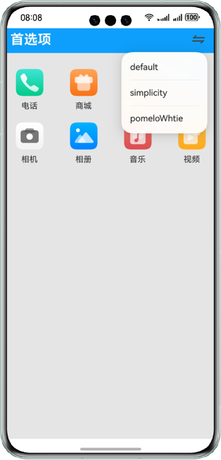

# 实现首选项数据持久化功能

### 简介

本示例使用@ohos.data.preferences接口，展示了使用首选项持久化存储数据的功能。帮助开发者实现主题切换且主题数据缓存读取的场景。

### 效果预览 

|default主题|pomelo主题|simplicity主题|
|---|---|---|
||||

使用说明

1.点击顶部titleBar的右侧**切换**按钮，弹出主题菜单，选择任意主题则切换相应的主题界面；

2.退出应用再重新进入，显示上一次退出前的主题界面。

### 工程目录
```
├──entry/src/main/ets/
│  ├──application
│  │  └──AbilityStage.ets
│  ├──common
│  │  └──ThemeDesktop.ets             // 首页主体内容
│  ├──mainability
│  │  └──MainAbility.ets
│  ├──model
│  │  └──Logger.ets                   // 日志文件
│  ├──pages
│  │  └──Index.ets                    // 首页，所有的接口和数据都封装在这里
│  └──util
│     └──DataSource.ets               // 数据懒加载
└──entry/src/main/resources           // 应用静态资源目录
```

### 具体实现

* 切换主题：在首页预先设置好几套主体数据，使用preferences.getPreferences获取使用Preferences对象，调用Preferences.get()
读取缓存中的参数，得到当前应该展示哪一套主体。每次点击切换按钮都会调用Preferences.put()来重新修改参数，然后使用
Preferences.flush()保存并刷新文件内容。
源码参考:[Index.ets](entry/src/main/ets/pages/Index.ets) 。

### 相关权限

不涉及。

### 依赖

不涉及。

### 约束与限制

1.本示例仅支持标准系统上运行，支持设备：华为手机。

2.HarmonyOS系统：HarmonyOS 5.0.0 Release及以上。

3.DevEco Studio版本：DevEco Studio 5.0.0 Release及以上。

4.HarmonyOS SDK版本：HarmonyOS 5.0.0 Release SDK及以上。


