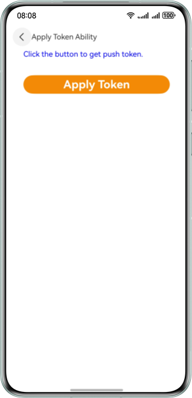
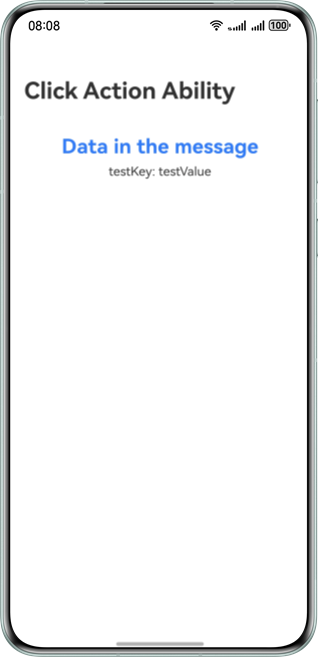

# Push Kit Codelab

## Overview
This demo illustrates how to implement the function of obtaining a push token based on HarmonyOS and pushing scenario-specific messages.


## Concepts
- Push Kit: A messaging service provided for you to establish a cloud-to-device messaging channel. With Push Kit integrated, any HarmonyOS app can send real-time, eye-catching messages to the right users at the right time, boosting user engagement and stickiness.
- Push token: A token that identifies each app on a user device. You can call the scenario-specific message API to push messages using a push token.
- Component: Components such as **Text**, **Button**, and **Image** are used in the demo project.
- pushService: This module provides basic capabilities of Push Kit, including obtaining and deleting push tokens, binding and unbinding accounts, and receiving scenario-specific messages.

## Effect Preview
| Token Application Page                      | Token Application Success                     | In-app Page Displayed upon Notification Tapping                             | Extended Notification Message Display When App Is Running in Foreground                      |
|---------------------------------|--------------------------------|-----------------------------------------|--------------------------------------|
|  |  |  |  |

## Project Directory

```
├─entry/src/main/ets               // Code area. 
│ ├─abilities
│ │ ├─ClickActionAbility.ets       // Notification bar click event capability class.
│ │ ├─FormAbility.ets              // Widget capability class.
│ │ ├─MainAbility.ets              // Entry point class.
│ │ ├─model.ets                    // Common API definition.
│ │ └─RemoteNotificationExtAbility.ets // Entry point class of the extended notification process.
│ ├─pages                          // Directory for storing app UI files.               
│ │ ├─ClickActionInnerPage.ets     // Landing page displayed upon a tap.           
│ │ ├─GetTokenPage.ets             // Page for applying for a token.
│ │ └─MainPage.ets                 // App home page.
│ ├─utils                          // Directory for storing tools.
│ │ └─Logger.ets                   // Log class, which is used to manage system logs.
│ ├─widget/pages                   // Directory for storing widget pages.
│ │ └─WidgetCard.ets               // Widget page.
└─entry/src/main/resources         // Directory of resource files.
```

## Preparations
1. Replace the package name in the **app.json5** file with the package name of your app.
2. Enable Push Kit. For details, please refer to the [guide](https://developer.huawei.com/consumer/en/doc/harmonyos-guides-V5/push-config-setting-V5#section13206419341).
3. Manually configure the signature. For details, please refer to the [guide](https://developer.huawei.com/consumer/en/doc/harmonyos-guides-V5/ide-signing-0000001587684945-V5#section297715173233).
4. To achieve the functionality of clicking on a message to jump to an application page, this sample project has already configured the skills tag in the module.json5 file. If needed, you can refer to the [guide](https://developer.huawei.com/consumer/en/doc/harmonyos-guides-V5/push-send-alert-V5#section697519219136) and modify it yourself.

## How to Use
### Applying for a Token
1. On the push function page, tap the button for applying for a token to go to the token application page.
2. Tap the token application button and check the application result. You need to store the obtained push token properly.

### Pushing a Notification Message
1. Apply for the [notification self-classification permission](https://developer.huawei.com/consumer/en/doc/harmonyos-guides-V5/push-apply-right-V5#section16708911111611) first if you need to push service and communication messages. If you only need to send news and marketing news messages, skip this step.
2. Push a notification message using the [notification - Push Kit - server-side demo](https://gitee.com/harmonyos_samples/push-kit_-sample-code_-server-demo_-java) or using other debugging tools such as Postman by referring to the [guide](https://developer.huawei.com/consumer/en/doc/harmonyos-guides-V5/push-send-alert-V5).
3. Swipe down from the status bar and check the received message on the notification panel.
4. Tap the message to go to the specified landing page in the app.

### Recalling a Message
1. Push a notification message using the [notification - Push Kit - server-side demo](https://gitee.com/harmonyos_samples/push-kit_-sample-code_-server-demo_-java) or using other debugging tools such as Postman by referring to the [guide](https://developer.huawei.com/consumer/en/doc/harmonyos-guides-V5/push-send-alert-V5). You need to specify the [notifyId](https://developer.huawei.com/consumer/en/doc/harmonyos-references-V5/push-scenariozed-api-request-param-V5#section17371529101117) for the notification.
2. Swipe down from the status bar and check the received message on the notification panel.
3. Recall the notification message using the [notification - Push Kit - server-side demo](https://gitee.com/harmonyos_samples/push-kit_-sample-code_-server-demo_-java) or using other debugging tools such as Postman by referring to the [guide](https://developer.huawei.com/consumer/en/doc/harmonyos-guides-V5/push-revoke-alert-V5). When recalling a message, you need to use the [notifyId](https://developer.huawei.com/consumer/en/doc/harmonyos-references-V5/push-msg-revoke-V5#section166472121113) specified when the message is sent.
4. Swipe down from the status bar and check whether the message has been recalled on the notification panel.

### Pushing a Widget Update Message
1. Press and hold the app icon on the home screen and choose to add the service widget to the home screen. You need to store the widget ID properly.
2. Push a widget update message using the [notification - Push Kit - server-side demo](https://gitee.com/harmonyos_samples/push-kit_-sample-code_-server-demo_-java) or using other debugging tools such as Postman by referring to the [guide](https://developer.huawei.com/consumer/en/doc/harmonyos-guides-V5/push-form-update-V5).
3. Swipe on the home screen to view the widget and check the widget update status.

### Pushing an Extended Notification Message
1. Apply for the [extended notification message permission](https://developer.huawei.com/consumer/en/doc/harmonyos-guides-V5/push-apply-right-V5#section159981112245) first.
2. Keep the app running in the foreground. Then push an extended notification message using the [notification - Push Kit - server-side demo](https://gitee.com/harmonyos_samples/push-kit_-sample-code_-server-demo_-java) or using other debugging tools such as Postman by referring to the [guide](https://developer.huawei.com/consumer/en/doc/harmonyos-guides-V5/push-send-extend-noti-V5).
3. Check the display effect of the extended notification message when the app is running in the foreground.
4. Switch the app to the background. Then push an extended notification message again using the [notification - Push Kit - server-side demo](https://gitee.com/harmonyos_samples/push-kit_-sample-code_-server-demo_-java) or using other debugging tools such as Postman by referring to the [guide](https://developer.huawei.com/consumer/en/doc/harmonyos-guides-V5/push-send-extend-noti-V5).
5. Swipe down from the status bar and check the received message on the notification panel.
6. Tap the message to go to the specified landing page in the app.

## Required Permissions
N/A

## Constraints
1. The sample app is only supported on Huawei phones, 2-in-1 devices, and tablets with standard systems. 
2. The HarmonyOS version must be HarmonyOS NEXT Developer Beta5 or later.
3. The DevEco Studio version must be DevEco Studio NEXT Developer Beta5 or later.
4. The HarmonyOS SDK version must be HarmonyOS NEXT Developer Beta5 or later.
