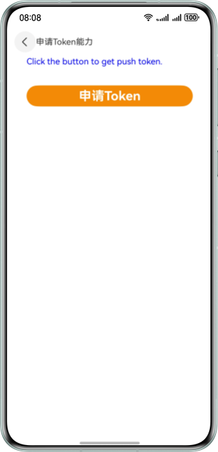
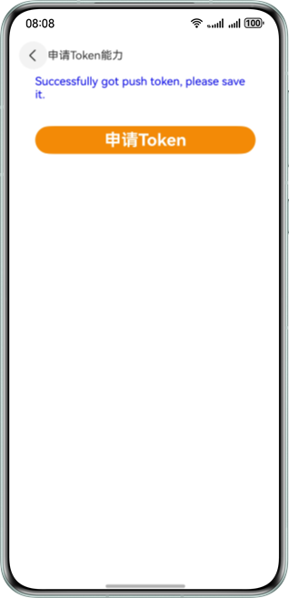
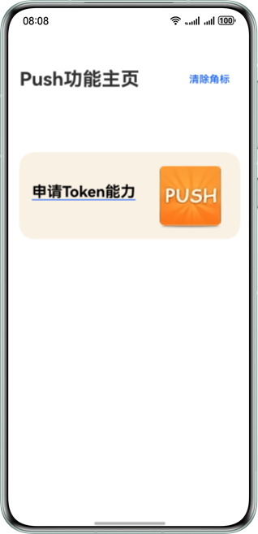
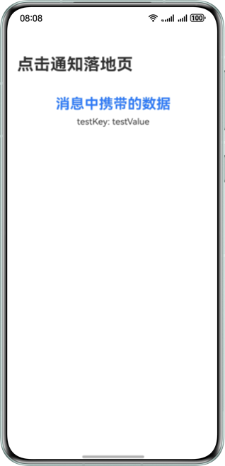

# Push Kit体验

## 简介
本示例基于HarmonyOS实现了申请Push Token和推送场景化消息功能。


## 相关概念
- Push Kit：Push Kit（推送服务）是华为提供的消息推送平台，建立了从云端到终端的消息推送通道。所有HarmonyOS应用可通过集成Push Kit，实现向应用实时推送消息，使消息易见，构筑良好的用户关系，提升用户的感知度和活跃度。
- Push Token：Push Token标识了每台设备上每个应用，开发者可以调用场景化消息接口，根据Token来推送消息。
- 组件：Demo中主要使用了Text、Button、Image等组件。
- pushService：本模块提供Push Kit的基础能力，包括获取和删除Push Token、绑定和解绑账号和接收场景化消息的功能。

## 效果预览
| 申请Token页面                       | 成功申请Token                      | 点击通知进入应用内页                              | 展示通知扩展消息                       |
|---------------------------------|--------------------------------|-----------------------------------------|--------------------------------------|
|  |  |  |  |

## 工程目录

```
├─entry/src/main/ets               // 代码区  
│ ├─abilities
│ │ ├─ClickActionAbility.ets       // 通知栏点击事件能力类
│ │ ├─FormAbility.ets              // 卡片能力类
│ │ ├─MainAbility.ets              // 主程序入口类
│ │ ├─Model.ets                    // 公共接口定义
│ │ └─RemoteNotificationExtAbility.ets // 通知扩展进程入口类
│ ├─pages                          // 存放页面文件目录                
│ │ ├─ClickActionInnerPage.ets     // 点击跳转落地页面            
│ │ ├─GetTokenPage.ets             // 申请Token页面
│ │ └─MainPage.ets                 // 应用主页面
│ ├─utils                          // 存放工具类文件目录
│ │ └─Logger.ets                   // 日志类，管理系统日志
│ ├─widget/pages                   // 存放卡片页面目录
│ │ └─WidgetCard.ets               // 卡片页面
└─entry/src/main/resources         // 资源文件目录
```

## 开发准备
1. 将app.json5文件中的包名替换为您自己应用的包名。
2. 开通推送服务，详情请参考[指导](https://developer.huawei.com/consumer/cn/doc/harmonyos-guides/push-config-setting#section13206419341)。
3. 完成手动签名，详情请参考[指导](https://developer.huawei.com/consumer/cn/doc/harmonyos-guides/ide-signing#section297715173233)。
4. 为实现消息展示后可以点击跳转到应用页面，本示例工程已经在module.json5文件中配置好skills标签，如有需要可以参考[指导](https://developer.huawei.com/consumer/cn/doc/harmonyos-guides/push-send-alert#section697519219136)自行修改。

## 使用说明
### 申请Token
1. 在“Push功能主页”页面点击**申请Token能力**，跳转到“申请Token能力”页面。
2. 点击**申请Token**按钮，申请结果将展示在页面上，请自行保存获取的Push Token。

### 推送通知消息
1. 若需要推送服务与通讯类消息，请先完成[申请通知消息自分类权益](https://developer.huawei.com/consumer/cn/doc/harmonyos-guides/push-apply-right#section16708911111611)；若仅需发送资讯营销类消息，则无需申请。
2. 使用[消息通知-推送服务-服务端DEMO](https://gitee.com/harmonyos_samples/push-kit_-sample-code_-server-demo_-java)，或根据[指导](https://developer.huawei.com/consumer/cn/doc/harmonyos-guides/push-send-alert)使用Postman等其它调试工具，推送通知消息。
3. 下拉状态栏，在通知中心查看消息。
4. 点击通知栏消息，跳转应用的落地页。

### 消息撤回
1. 使用[消息通知-推送服务-服务端DEMO](https://gitee.com/harmonyos_samples/push-kit_-sample-code_-server-demo_-java)，或根据[指导](https://developer.huawei.com/consumer/cn/doc/harmonyos-guides/push-send-alert)使用Postman等其它调试工具，发送通知消息，发送时请指定[notifyId](https://developer.huawei.com/consumer/cn/doc/harmonyos-references/push-scenariozed-api-request-param#section17371529101117)。
2. 下拉状态栏，在通知中心查看消息。
3. 使用[消息通知-推送服务-服务端DEMO](https://gitee.com/harmonyos_samples/push-kit_-sample-code_-server-demo_-java)，或根据[指导](https://developer.huawei.com/consumer/cn/doc/harmonyos-guides/push-revoke-alert)使用Postman等其它调试工具，撤回通知消息，撤回时需要使用消息下发时的[notifyId](https://developer.huawei.com/consumer/cn/doc/harmonyos-references/push-msg-revoke#section166472121113)。
4. 下拉状态栏，在通知中心查看消息已消失。

### 推送卡片刷新消息
1. 长按桌面应用图标，点击服务卡片，将卡片添加到桌面，请自行保存卡片ID。
2. 使用[消息通知-推送服务-服务端DEMO](https://gitee.com/harmonyos_samples/push-kit_-sample-code_-server-demo_-java)，或根据[指导](https://developer.huawei.com/consumer/cn/doc/harmonyos-guides/push-form-update)使用Postman等其它调试工具，推送卡片刷新消息。
3. 滑动桌面至卡片可见后，查看卡片刷新结果。

### 推送通知扩展消息
1. 推送通知扩展消息前，请先完成[申请推送通知扩展消息权益](https://developer.huawei.com/consumer/cn/doc/harmonyos-guides/push-apply-right#section159981112245)。
2. 保持应用在前台，使用[消息通知-推送服务-服务端DEMO](https://gitee.com/harmonyos_samples/push-kit_-sample-code_-server-demo_-java)，或根据[指导](https://developer.huawei.com/consumer/cn/doc/harmonyos-guides/push-send-extend-noti)使用Postman等其它调试工具，推送通知扩展消息。
3. 查看应用在前台时，通知扩展消息的展示效果。
4. 将应用切换至后台，使用[消息通知-推送服务-服务端DEMO](https://gitee.com/harmonyos_samples/push-kit_-sample-code_-server-demo_-java)，或根据[指导](https://developer.huawei.com/consumer/cn/doc/harmonyos-guides/push-send-extend-noti)使用Postman等其它调试工具，再次推送通知扩展消息。
5. 下拉状态栏，在通知中心查看消息。
6. 点击通知栏消息，跳转应用的落地页。

## 相关权限
不涉及

## 约束与限制
1. 本示例仅支持标准系统上运行，支持设备：华为手机、2in1、平板。
2. HarmonyOS系统：HarmonyOS NEXT Developer Beta5及以上。
3. DevEco Studio版本：DevEco Studio NEXT Developer Beta5及以上。
4. HarmonyOS SDK版本：HarmonyOS NEXT Developer Beta5 SDK及以上。