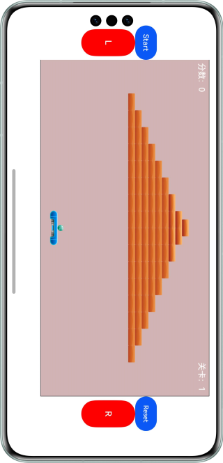

# 基于WebView实现Native与H5通信的能力

### 介绍

本示例基于H5游戏，通过ArkUI的Button实现对游戏实现基本控制，展示Webview的JS注入与执行能力，及Native应用与H5的通信能力，主要用在有H5页面交互的场景。帮助开发者掌握应用与H5页面内容交互处理。

### 效果预览

| 主页                               |
|----------------------------------|
|  |

使用说明

1.设备连接热点，可访问互联网。

2.打开应用，通过界面中按钮进行游戏控制。

### 工程目录
```
├──entry/src/main/ets
│  ├──entryability
│  │  └──EntryAbility.ets                // 弹窗组件
│  ├──model
│  │  └──Logger.ets                      // 日志工具
│  └──pages
│     └──Index.ets                       // 首页
└──entry/src/main/resources              // 资源文件夹
```

### 具体实现

* 本示例分成一个模块
  * 通过button实现对游戏的基本控制，WebviewController方法控制Web组件各种行为，使用webview注入JS与执行能力。
  * 源码链接：[EntryAbility.ets](entry/src/main/ets/entryability/EntryAbility.ets)，[Index.ets](entry/src/main/ets/pages/Index.ets)
  * 接口参考：@ohos.window，@ohos.web.webview

### 相关权限

网络访问权限: ohos.permission.INTERNET

### 依赖

不涉及。

### 约束与限制

1.本示例仅支持标准系统上运行，支持设备：华为手机。

2.HarmonyOS系统：HarmonyOS 5.0.5 Release及以上。

3.DevEco Studio版本：DevEco Studio 5.0.5 Release及以上。

4.HarmonyOS SDK版本：HarmonyOS NEXT 5.0.5 Release SDK及以上。

