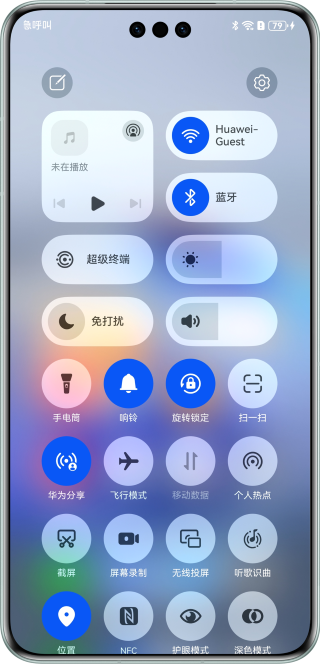
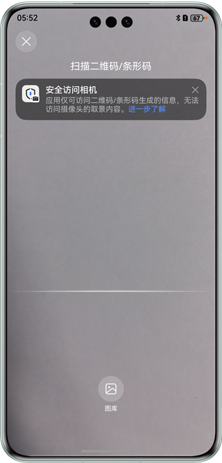
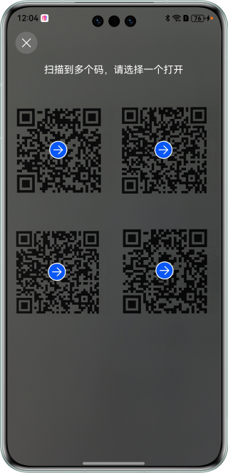
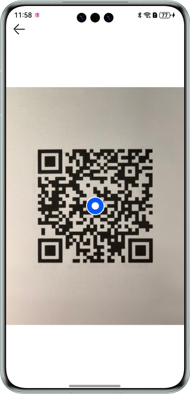
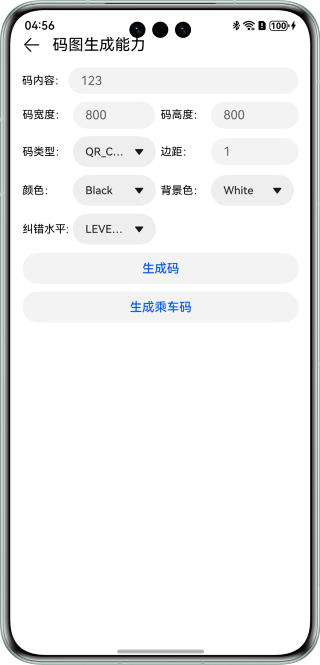

# 统一扫码

## 介绍

本示例展示了使用统一扫码提供的“扫码直达”服务、默认界面扫码能力、自定义界面扫码能力、图像识码能力、码图生成能力。

需要使用统一扫码服务接口 import { scanCore, scanBarcode, customScan, detectBarcode, generateBarcode } from '@kit.ScanKit';

## 效果预览

|               **控制中心**               |             **扫一扫扫码**             |          **直达服务页**           |
| :--------------------------------------: | :------------------------------------: | :-------------------------------: |
|  |  |  |

|          **应用首页**           | **默认界面扫码**                       |               **扫码结果单码**               |              **扫码结果多码**              |           **默认界面扫码结果**           |
| :-----------------------------: | -------------------------------------- | :------------------------------------------: | :----------------------------------------: | :--------------------------------------: |
|  |  |  |  |  |

|          **应用首页**           | **自定义界面扫码**                       |              **扫码结果单码**               |             **扫码结果多码**              |          **自定义界面扫码结果**          |
| :-----------------------------: | ---------------------------------------- | :-----------------------------------------: | :---------------------------------------: | :--------------------------------------: |
|  |  |  |  |  |

|          **应用首页**           |                   **识别本地图片**                   |            **识别本地图片结果单码**            |           **识别本地图片结果多码**            |                  **识别本地图片结果**                  |            **识别图像数据**            |
| :-----------------------------: |:----------------------------------------------:| :--------------------------------------------: | :-------------------------------------------: | :----------------------------------------------------: | :------------------------------------: |
|  |  |  |  |  |  |

|          **应用首页**           |          **码图生成界面**           |             **码图生成结果**              |
| :-----------------------------: | :---------------------------------: | :---------------------------------------: |
|  |  |  |

使用说明：

1. 本Demo接入“扫码直达服务”仅作示例参考和效果展示。

* 安装本Demo, 打开HarmonyOS扫码入口（控制中心扫码入口），扫描下面二维码，扫码成功后会拉起本Demo的直达服务页。

* 若您要替换自己的包名和域名接入“扫码直达服务”，请参考[接入“扫码直达”服务](https://developer.huawei.com/consumer/cn/doc/harmonyos-guides/scan-directservice)。

2. 在手机的主屏幕，点击“统一扫码示例”，启动应用，在主界面可见“默认界面扫码能力”、“自定义界面扫码能力”、“图像识码能力”、“码图生成能力”按钮。
3. 点击“默认界面扫码能力”按钮，进入二级界面，点击“默认界面扫码能力”按钮，拉起默认扫码页面，扫描码图，返回结果。
4. 点击“自定义界面扫码能力”按钮，进入二级界面，点击“自定义界面扫码能力”按钮，使用状态管理V1，通过推荐方式构建自定义扫码界面，扫描码图，返回结果；点击“自定义界面扫码能力V2”按钮，使用状态管理V2，通过推荐方式构建自定义扫码界面，扫描码图，返回结果。
5. 点击“图像识码能力”按钮，进入二级界面，点击“识别本地图片”按钮，拉起picker从图库中选择图片，进行图像识码，选择码图，返回结果。
6. 点击“图像识码能力”按钮，进入二级界面，点击“识别图像数据”按钮，扫描码图，显示结果。相机实现参考[双路预览](https://developer.huawei.com/consumer/cn/doc/harmonyos-guides/camera-dual-channel-preview)
7. 点击“码图生成能力”按钮，进入二级界面，点击“生成码”按钮，将字符串转换为自定义格式的码图；点击“生成乘车码”按钮，将字节数组转换为自定义格式的码图。通过字节数组生成码图，目前Scan Kit不支持识别出来内容。

## 工程目录

├─entry/src/main/ets // 代码区  
│ ├─common  
│ │ ├─CommonComponents.ets // 公共组件  
│ │ ├─CommonTipsDialog.ets // 公共提示弹窗  
│ │ ├─Logger.ts // 日志打印方法  
│ │ ├─PermissionsUtil.ets // 相机授权类  
│ │ ├─StatusBar.ets // 状态栏组件  
│ │ └─Utils.ets // 公共方法  
│ ├─entryability                
│ │ └─EntryAbility.ets // 程序入口类  
│ ├─pages      
│ │ ├─access // 扫码直达服务页  
│ │ │ ├─ScanAccess.ets // 扫码直达页连接成功页面  
│ │ │ └─ScanDetail.ets // 扫码直达详情页面   
│ │ ├─customScan // 自定义界面扫码能力  
│ │ │ ├─constants // 常量  
│ │ │ │ ├─BreakpointConstants.ets // 断点常量  
│ │ │ │ └─CommonConstants.ts // 公共常量  
│ │ │ ├─model        
│ │ │ │ ├─BreakpointType.ets // 断点  
│ │ │ │ ├─CommonEventManager.ts // 公共事件管理  
│ │ │ │ ├─DeviceService.ets // 设备管理类  
│ │ │ │ ├─OpenPhoto.ets // 图库  
│ │ │ │ ├─PromptTone.ts // 提示音  
│ │ │ │ ├─ScanLayout.ets // 扫码界面布局管理类  
│ │ │ │ ├─ScanService.ets // 自定义扫码  
│ │ │ │ ├─UIContextSelf.ets // UIContext管理类  
│ │ │ │ ├─WindowService.ets // 窗口管理类  
│ │ │ │ └─XComponentService.ets // XComponent管理类  
│ │ │ ├─pages // 页面  
│ │ │ │ └─ScanPage.ets // 扫码页面  
│ │ │ ├─view // 组件  
│ │ │ │ ├─CommonCodeLayout.ets // 蓝点组件  
│ │ │ │ ├─IconPress.ets // 图片按压效果组件  
│ │ │ │ ├─MaskLayer.ets // 遮罩  
│ │ │ │ ├─PickerDialog.ets // 模态框组件  
│ │ │ │ ├─ScanBottom.ets // 底部组件  
│ │ │ │ ├─ScanLine.ets // 扫描线组件  
│ │ │ │ ├─ScanLoading.ets // 加载组件  
│ │ │ │ ├─ScanTitle.ets // 标题组件  
│ │ │ │ └─ScanXComponent.ets // XComponent组件  
│ │ │ └─CustomPage.ets // 自定义扫码按钮入口页面  
│ │ ├─customScanV2 // 使用状态管理V2的开发自定义界面扫码能力  
│ │ │ ├─model        
│ │ │ │ ├─ConfigStorage.ets // 配置共享类  
│ │ │ │ ├─OpenPhoto.ets // 图库  
│ │ │ │ ├─ScanLayout.ets // 扫码界面布局管理类  
│ │ │ │ ├─ScanService.ets // 自定义扫码  
│ │ │ │ ├─WindowService.ets // 窗口管理类  
│ │ │ │ └─XComponentService.ets // XComponent管理类  
│ │ │ ├─pages // 页面  
│ │ │ │ └─ScanPage.ets // 扫码页面  
│ │ │ ├─view // 组件  
│ │ │ │ ├─CommonCodeLayout.ets // 蓝点组件  
│ │ │ │ ├─IconPress.ets // 图片按压效果组件  
│ │ │ │ ├─MaskLayer.ets // 遮罩  
│ │ │ │ ├─PickerDialog.ets // 模态框组件  
│ │ │ │ ├─ScanBottom.ets // 底部组件  
│ │ │ │ ├─ScanLine.ets // 扫描线组件  
│ │ │ │ ├─ScanLoading.ets // 加载组件  
│ │ │ │ ├─ScanTitle.ets // 标题组件  
│ │ │ │ └─ScanXComponent.ets // XComponent组件  
│ │ ├─defaultScan //默认界面扫码  
│ │ │ └─DefaultScan.ets //默认界面扫码  
│ │ ├─detectBarcode // 图像识码  
│ │ │ ├─CommonCodeLayout.ets // 蓝点组件   
│ │ │ ├─DecodeBarcode.ets // 图像识码按钮入口页面  
│ │ │ └─DecodeCameraYuv.ets // 识别图像数据页面                
│ │ ├─generateBarcode // 码图生成  
│ │ │ └─CreateBarcode.ets // 码图生成页面  
│ │ ├─resultPage // 扫码结果  
│ │ │ └─ResultPage.ets // 扫码结果页面   
│ │ └─Index.ets // 统一扫码入口页面  
└─entry/src/main/resources // 资源文件目录

## 具体实现

1. 接入“扫码直达服务”：开发者将域名注册到“扫码直达”服务后，用户可通过控制中心等系统级的常驻入口，扫应用的二维码、条形码并跳转到应用对应服务页，实现一步直达服务的体验。

* 本Demo接入“扫码直达服务”仅作示例参考，具体接入流程请参考[接入“扫码直达”服务](https://developer.huawei.com/consumer/cn/doc/harmonyos-guides/scan-directservice)。

2. 默认界面扫码：提供系统级体验一致的扫码界面，包含相机预览流，相册扫码入口，暗光环境闪光灯开启提示，具备相机预授权，集成简单，适用于通用扫码场景。
   在import { scanCore, scanBarcode } from '@kit.ScanKit';定义了默认扫码服务接口API：

* startScanForResult(context: common.Context, options?: ScanOptions): Promise&lt;ScanResult&gt;
* startScanForResult(context: common.Context, options: ScanOptions, callback: AsyncCallback&lt;ScanResult&gt;): void
* startScanForResult(context: common.Context, callback: AsyncCallback&lt;ScanResult&gt;): void

3. 自定义界面扫码：提供扫码能力并支持在指定控件上渲染相机预览流，需要开发者实现扫码界面，申请相机权限，适用于对扫码界面有个性化定制的场景。
   在import { customScan } from '@kit.ScanKit';定义了自定义扫码API：

* init(options?: scanBarcode.ScanOptions): void
* start(viewControl: ViewControl): Promise&lt;Array&lt;scanBarcode.ScanResult&gt;&gt;
* stop(): Promise&lt;void&gt;
* release(): Promise&lt;void&gt;
* start(viewControl: ViewControl, callback: AsyncCallback&lt;Array&lt;scanBarcode.ScanResult&gt;&gt;, frameCallback?:
  AsyncCallback&lt;ScanFrame&gt;): void
* getFlashLightStatus(): boolean
* openFlashLight(): void
* closeFlashLight(): void
* setZoom(zoomValue : number): void
* getZoom(): number
* setFocusPoint(point: scanBarcode.Point): void
* resetFocus(): void
* rescan(): void
* stop(callback: AsyncCallback&lt;void&gt;): void
* release(callback: AsyncCallback&lt;void&gt;): void
* on(type: 'lightingFlash', callback: AsyncCallback&lt;boolean&gt;): void
* off(type: 'lightingFlash', callback?: AsyncCallback&lt;boolean&gt;): void

4. 图像识码：对图库中的码图或图像数据进行扫描识别。
   在import { detectBarcode } from '@kit.ScanKit';定义了图像识码API：

* decode(inputImage: InputImage, options?: scanBarcode.ScanOptions): Promise&lt;Array&lt;scanBarcode.ScanResult&gt;&gt;
* decode(inputImage: InputImage, options: scanBarcode.ScanOptions, callback: AsyncCallback&lt;Array&lt;
  scanBarcode.ScanResult&gt;&gt;): void
* decode(inputImage: InputImage, callback: AsyncCallback&lt;Array&lt;scanBarcode.ScanResult&gt;&gt;): void
* decodeImage(image: ByteImage, options?: scanBarcode.ScanOptions): Promise&lt;DetectResult&gt;

5. 码图生成：将字符串或字节数组转换为自定义格式的码图。
   在import { generateBarcode } from '@kit.ScanKit';定义了码图生成API：

* createBarcode(content: string, options: CreateOptions): Promise&lt;image.PixelMap&gt;
* createBarcode(content: string, options: CreateOptions, callback: AsyncCallback&lt;image.PixelMap&gt;): void
* createBarcode(content: ArrayBuffer, options: CreateOptions): Promise&lt;image.PixelMap&gt;

## 相关权限

自定义扫码功能获取相机权限: ohos.permission.CAMERA。   
自定义扫码功能获取震动权限: ohos.permission.VIBRATE。

## 依赖

依赖设备具备相机能力。

## 约束与限制

1. 本实例仅支持标准系统上运行，支持设备：华为手机、华为平板。
2. HarmonyOS系统：HarmonyOS 5.0.3 Release及以上。
3. DevEco Studio版本：DevEco Studio 5.0.3 Release及以上。
4. HarmonyOS SDK版本：HarmonyOS 5.0.3 Release SDK及以上。