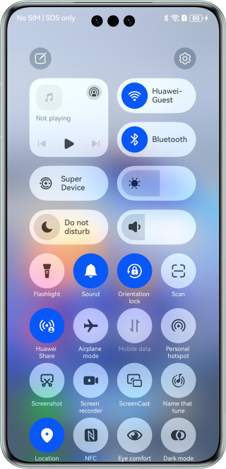
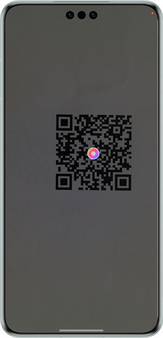
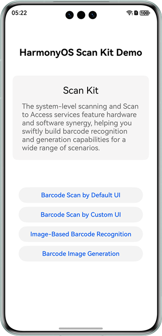
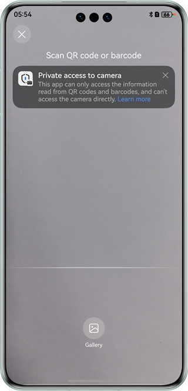
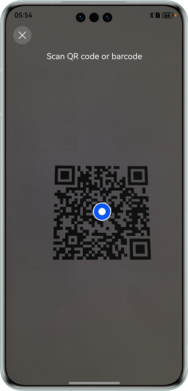
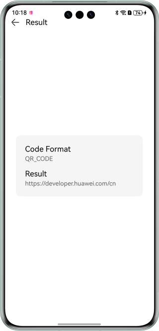
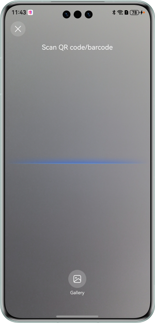
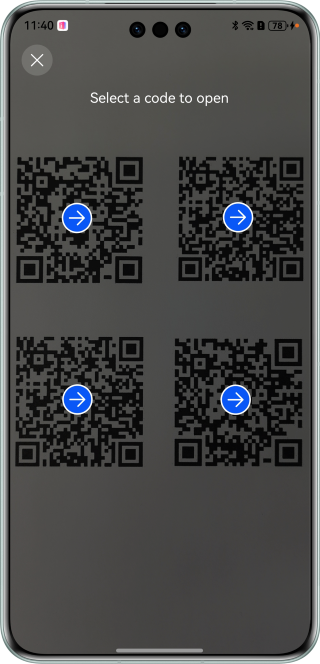
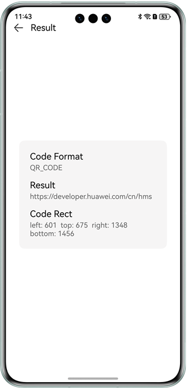

# Scan Kit

## Overview

This sample code illustrates how to use the capabilities provided by Scan Kit, including directly accessing content through scanning, scanning barcodes using the default UI, scanning barcodes using a custom UI, recognizing barcodes from images, and generating barcode images.

The APIs of Scan Kit need to be used: import { scanCore, scanBarcode, customScan, detectBarcode, generateBarcode } from '@kit.ScanKit';

## Preview

<table>
  <tr>
    <th width=33.3%>Control Panel</th>
    <th width=33.3%>Scan Code</th>
    <th width=33.3%>Direct Access to Service Page</th>
  </tr>
  <tr>
    <td></td>
    <td></td>
    <td></td>
  </tr>
</table>
<table>
  <tr>
    <th width=20%>App Home Page</th>
    <th width=20%>Barcode Scan by Default UI</th>
    <th width=20%>Scan Result (Single Barcode)</th>
    <th width=20%>Scan Result (Multiple Barcodes)</th>
    <th width=20%>Barcode Scan Result (Default UI)</th>
  </tr>
  <tr>
    <td></td>
    <td></td>
    <td></td>
    <td></td>
    <td></td>
  </tr>
</table>
<table>
  <tr>
    <th width=20%>App Home Page</th>
    <th width=20%>Barcode Scan by Custom UI</th>
    <th width=20%>Scan Result (Single Barcode)</th>
    <th width=20%>Scan Result (Multiple Barcodes)</th>
    <th width=20%>Barcode Scan Result (Custom UI)</th>
  </tr>
  <tr>
    <td></td>
    <td></td>
    <td></td>
    <td></td>
    <td></td>
  </tr>
</table>
<table>
  <tr>
    <th width=16.5%>App Home Page</th>
    <th width=16.5%>Recognize Saved Image</th>
    <th width=16.5%>Recognize Single Barcode in Saved Image</th>
    <th width=16.5%>Recognize Multiple Barcodes in Saved Image</th>
    <th width=16.5%>Saved Image Recognition Result</th>
    <th width=16.5%>Recognize Image Data</th>
  </tr>
  <tr>
    <td></td>
    <td></td>
    <td></td>
    <td></td>
    <td></td>
    <td></td>
  </tr>
</table>
<table>
  <tr>
    <th width=33.3%>App Home Page</th>
    <th width=33.3%>Barcode Image Generation UI</th>
    <th width=33.3%>Barcode Image Generation Result</th>
  </tr>
  <tr>
    <td></td>
    <td></td>
    <td></td>
  </tr>
</table>

How to Use

1. This demo illustrates integration with the scan-to-access service, which is only used as a reference.

* Install the demo app, open the HarmonyOS scan entry from the control panel, and scan the following QR code. After the scanning is successful, the target service page of the demo app is displayed.

* If you want to replace your package name and domain name for integrating the scan-to-access service, please refer to the [scan-to-access document](https://developer.huawei.com/consumer/en/doc/harmonyos-guides/scan-directservice).

2. Tap **Scan Kit Demo** on the home screen of your device to start the demo app. The following buttons will be displayed on the demo app home screen: **Scan code on default UI**, **Scan code on custom UI**, **Recognize barcode in image**, and **Generate barcode image**.
3. Tap **Scan code on default UI** to go to the level-2 UI. Tap **Scan code on default UI** again to launch the default barcode scan UI, scan a barcode image, and check the scan result.
4. Tap **Scan code on custom UI** to go to the level-2 UI. Tap **Scan code on custom UI** again to launch the custom barcode scan UI, scan a barcode image, and check the scan result.
5. Tap **Recognize barcode in image** to go to the level-2 UI. Tap **Saved image** to start the picker, select a barcode image from the gallery for recognition, and check the scan result.
6. Tap **Recognize barcode in image** to go to the level-2 UI. Tap **Image data** to start recognition and check the recognition result. For details about the camera implementation, please refer to the [Camera Kit document](https://developer.huawei.com/consumer/en/doc/harmonyos-guides/camera-dual-channel-preview).
7. Tap **Generate barcode image** to go to the level-2 UI. Tap **Generate code** to convert a string into a barcode image of a custom format, or tap **Generate ride code** to convert a byte array into a barcode image of a custom format. Currently, Scan Kit does not support recognition based on barcode images generated from byte arrays.

## Project Directory

├─entry/src/main/ets // Code area   
│ ├─common    
│ │ ├─CommonComponents.ets // Common components   
│ │ ├─CommonTipsDialog.ets // Common pop-up   
│ │ ├─Logger.ts // Log output method   
│ │ ├─PermissionsUtil.ets // Camera authorization class   
│ │ ├─StatusBar.ets // Status bar component   
│ │ └─Utils.ets // Common methods   
│ ├─entryability                  
│ │ └─EntryAbility.ets // Entry point class   
│ ├─pages        
│ │ ├─access // Scan-to-access  
│ │ │ ├─ScanAccess.ets // Connection success page   
│ │ │ └─ScanDetail.ets // Details page    
│ │ ├─customScan // The custom barcode scanning UI   
│ │ │ ├─constants // Constants   
│ │ │ │ ├─BreakpointConstants.ets // Breakpoint constants   
│ │ │ │ └─CommonConstants.ts // Common constants   
│ │ │ ├─model          
│ │ │ │ ├─BreakpointType.ets // Breakpoint type   
│ │ │ │ ├─CommonEventManager.ts // Common event manager  
│ │ │ │ ├─DeviceService.ets // Device management class  
│ │ │ │ ├─OpenPhoto.ets // Gallery   
│ │ │ │ ├─PromptTone.ts // Prompt tone   
│ │ │ │ ├─ScanLayout.ets // Barcode scanning UI layout management class   
│ │ │ │ ├─ScanService.ets // Barcode scanning customization   
│ │ │ │ ├─UIContextSelf.ets // UIContext management class   
│ │ │ │ ├─WindowService.ets // Window management class   
│ │ │ │ └─XComponentService.ets // XComponent management class   
│ │ │ ├─pages // Pages   
│ │ │ │ └─ScanPage.ets // Barcode scanning page   
│ │ │ ├─view // Components   
│ │ │ │ ├─CommonCodeLayout.ets // Radio button component   
│ │ │ │ ├─IconPress.ets // Image pressed state component   
│ │ │ │ ├─MaskLayer.ets // Mask layer   
│ │ │ │ ├─PickerDialog.ets // Modal box component   
│ │ │ │ ├─ScanBottom.ets // Bottom component   
│ │ │ │ ├─ScanLine.ets // Scanning line component   
│ │ │ │ ├─ScanLoading.ets // Loading component   
│ │ │ │ ├─ScanTitle.ets // Title component   
│ │ │ │ └─ScanXComponent.ets // XComponent   
│ │ │ └─CustomPage.ets // Page where the button for accessing the custom barcode scanning UI is located   
│ │ ├─defaultScan // Default code scan UI   
│ │ │ └─DefaultScan.ets // Default code scan UI   
│ │ ├─detectBarcode // Image-based barcode recognition   
│ │ │ ├─CommonCodeLayout.ets // Radio button component    
│ │ │ ├─DecodeBarcode.ets //Page where the image recognition button is located   
│ │ │ └─DecodeCameraYuv.ets // Page for image data recognition                 
│ │ ├─generateBarcode // Barcode image generation   
│ │ │ └─CreateBarcode.ets // Barcode image generation UI   
│ │ ├─resultPage // Scanning result   
│ │ │ └─ResultPage.ets // Scanning result page    
│ │ └─Index.ets // Page for accessing various scanning UIs   
└─entry/src/main/resources // Directory for storing resource files  

## How to Implement

1. Integration with the scan-to-access capability: Once you have registered your domain names with the scan-to-access service, users can use system-level, always-available entry points like the control panel to scan a 1D barcode or QR code. This takes them directly to the corresponding service page of an app, providing a seamless, one-step experience.

* This demo only illustrates integration with the scan-to-access service as a reference. For details, please refer to the [scan-to-access document](https://developer.huawei.com/consumer/en/doc/harmonyos-guides/scan-directservice).

2. Barcode scanning by default UI: offers a consistent scanning UI at the system level, which includes a camera preview stream, a scanning entry for the photo gallery, a prompt to turn on the flash light in dim light conditions, and pre-authorization for the camera. This function is easy to be integrated and is suitable for general scanning scenarios.
   Define the default barcode scan API in **import { scanCore, scanBarcode } from '@kit.ScanKit';**.

* startScanForResult(context: common.Context, options?: ScanOptions): Promise&lt;ScanResult&gt;
* startScanForResult(context: common.Context, options: ScanOptions, callback: AsyncCallback&lt;ScanResult&gt;): void
* startScanForResult(context: common.Context, callback: AsyncCallback&lt;ScanResult&gt;): void

3. Barcode scanning by custom UI: provides scanning capabilities and supports rendering the camera preview stream on the specified control. You need to implement the scanning UI and apply for camera permissions. This is suitable for scenarios that require a personalized scanning UI.
   Define the custom barcode scan API in **import { customScan } from '@kit.ScanKit';**.

* init(options?: scanBarcode.ScanOptions): void
* start(viewControl: ViewControl): Promise&lt;Array&lt;scanBarcode.ScanResult&gt;&gt;
* stop(): Promise&lt;void&gt;
* release(): Promise&lt;void&gt;
* start(viewControl: ViewControl, callback: AsyncCallback&lt;Array&lt;scanBarcode.ScanResult&gt;&gt;, frameCallback?:
  AsyncCallback&lt;ScanFrame&gt;): void
* getFlashLightStatus(): boolean
* openFlashLight(): void
* closeFlashLight(): void
* setZoom(zoomValue : number): void
* getZoom(): number
* setFocusPoint(point: scanBarcode.Point): void
* resetFocus(): void
* rescan(): void
* stop(callback: AsyncCallback&lt;void&gt;): void
* release(callback: AsyncCallback&lt;void&gt;): void
* on(type: 'lightingFlash', callback: AsyncCallback&lt;boolean&gt;): void
* off(type: 'lightingFlash', callback?: AsyncCallback&lt;boolean&gt;): void

4. Image-based barcode recognition: scans and recognizes barcode images or images in the photo gallery.
   Define the image-based barcode recognition API in **import { detectBarcode } from '@kit.ScanKit';**.

* decode(inputImage: InputImage, options?: scanBarcode.ScanOptions): Promise&lt;Array&lt;scanBarcode.ScanResult&gt;&gt;
* decode(inputImage: InputImage, options: scanBarcode.ScanOptions, callback: AsyncCallback&lt;Array&lt;
  scanBarcode.ScanResult&gt;&gt;): void
* decode(inputImage: InputImage, callback: AsyncCallback&lt;Array&lt;scanBarcode.ScanResult&gt;&gt;): void
* decodeImage(image: ByteImage, options?: scanBarcode.ScanOptions): Promise&lt;DetectResult&gt;

5. Barcode image generation: converts character strings or byte arrays into barcode images in a custom format.
   Define the barcode image generation API in **import { generateBarcode } from '@kit.ScanKit';**.

* createBarcode(content: string, options: CreateOptions): Promise&lt;image.PixelMap&gt;
* createBarcode(content: string, options: CreateOptions, callback: AsyncCallback&lt;image.PixelMap&gt;): void
* createBarcode(content: ArrayBuffer, options: CreateOptions): Promise&lt;image.PixelMap&gt;

## Required Permissions

**ohos.permission.CAMERA**: camera permission required by barcode scanning customization.  
**ohos.permission.VIBRATE**: vibration setting permission required by barcode scanning customization.

## Dependencies

The device where the sample app runs must be equipped with a camera.

## Constraints

1. This sample can only be run on standard-system Huawei phones and tablets.
2. The HarmonyOS version must be HarmonyOS 5.0.3 Release or later.
3. The DevEco Studio version must be DevEco Studio 5.0.3 Release or later.
4. The HarmonyOS SDK version must be HarmonyOS 5.0.3 Release SDK or later.
