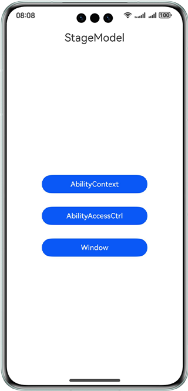

# Stage Model

### Overview

This sample demonstrates the ability management capabilities of the stage model based on Ability Kit.

### Preview

| Home Page                                       |
|-------------------------------------------|
|  |

### How to Use

1. Touch **AbilityContext**. The **AbilityContext** page is displayed, where you can test content related to the UIAbilityContext.

2. Touch **AbilityAccessCtrl**. The **AbilityAccessCtrl** page is displayed, where you can test content related to the ability access control.

3. Touch **Window**. The **Window** page is displayed, where you can content related to the window.

### Project Directory

```
├──entry/src/main/ets/
│  ├─Application
│  │  └──MyAbilityStage.ts                   
│  ├─feature
│  │  ├──AbilityAccessCtrlController.ts      // Access control            
│  │  ├──AbilityContextController.ts         // Context control                   
│  │  └──WindowController.ts                 // Window management                 
│  ├─JumpAbility
│  │  └──JumpAbility.ts                      // Redirection ability
│  ├─MainAbility
│  │  └──MainAbility.ts                      
│  ├─pages
│  │  ├──component
│  │  │  ├──IndexTitleBar.ets                // Single page title component
│  │  │  └──PublicTitleBar.ets               // Common title component
│  │  ├──AbilityAccessCtrlPage.ets           // Ability access control
│  │  ├──AbilityContextPage.ets              // Allows access to ability-specific resources
│  │  ├──Index.ets
│  │  ├──TestPage.ets
│  │  └──WindowPage.ets                      // Window              
│  └──util
│     └──Logger.ts    
└──entry/src/main/resources                              
```

### How to Implement

The stage model is designed based on the following considerations:

- **Balance between app capabilities and overall system power consumption**

  On a running device, resources are weighted towards foreground apps, on the prerequisites that the overall power consumption requirements of the system are met. The stage model balances the app capabilities and overall system power consumption through ability and UI separation, strict background control, scenario-based service mechanism, and single-process model.

- **Native support for component continuation and collaboration**

  HarmonyOS natively supports distributed deployment. Therefore, its app framework must be designed for easier component migration and collaboration. The stage model achieves this design objective by providing features such as separation between ability and UI as well as integration of UI display and service capabilities.

- **Support for multiple device types and window forms**

  To support multiple device types and facilitate the implementation of different window forms, the component manager and window manager must be decoupled at the architecture layer for easier tailoring. To achieve this goal, the stage model redefines the ability lifecycle and implements unidirectional dependency for the component manager and window manager.

  This sample shows the differences between the stage model and the FA model in terms of the **AbilityContext**, **Window**, and **AbilityAccessCtrl** modules.

  **AbilityContext**: inherits from **Context** and implements the context for abilities. This module provides APIs for accessing ability-specific resources. You can use the APIs to start and terminate an ability, obtain the caller interface, and request permissions from users by displaying a dialog box. Before using the **AbilityContext** module, you must define a child class that inherits from **Ability**.

  **Window**: provides basic window management capabilities, such as creating, destroying, and configuring a window, and managing and scheduling windows.

  **abilityAccessCtrl**: provides permission management for apps.

### Required Permissions

N/A

### Dependencies

N/A

### Constraints

1. The sample app is supported only on Huawei phones running the standard system.

2. The HarmonyOS version must be HarmonyOS NEXT Developer Beta1 or later.

3. The DevEco Studio version must be DevEco Studio NEXT Developer Beta1 or later.

4. The HarmonyOS SDK version must be HarmonyOS NEXT Developer Beta1 or later.
