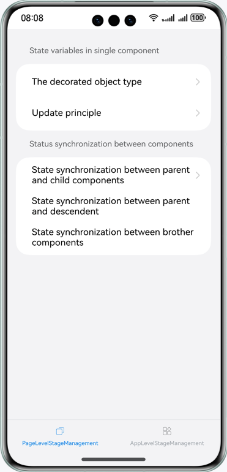
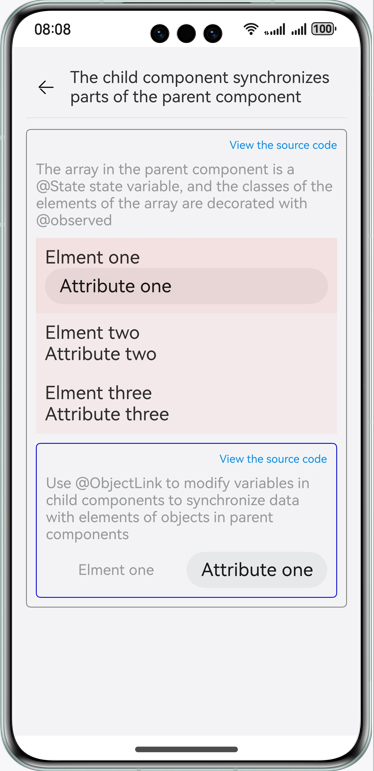
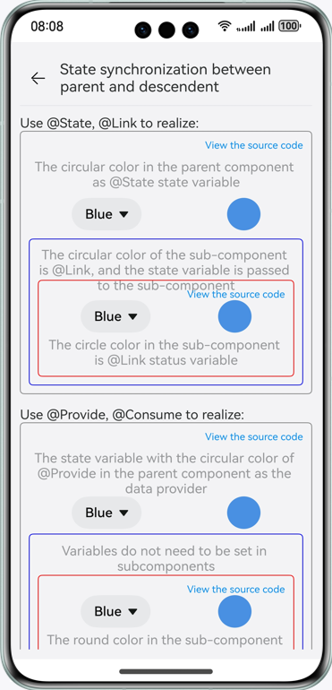
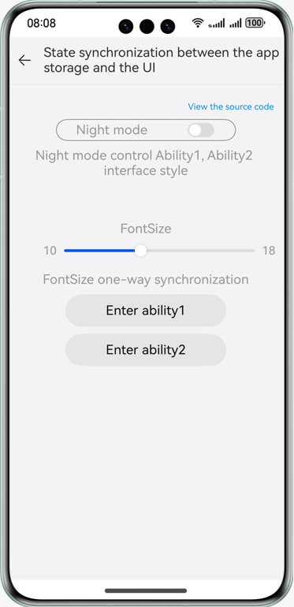

# State Management

### Overview

This sample uses page-level and app-level state variables to manage app status.

### Preview

| Home page                                                | Partial content sync from parent to child component          |
|----------------------------------------------------------|--------------------------------------------------------------|
|                       |  |
| State sync between grandparent and grandchild components | State sync between the app global data and UI                |
|          |            |

### How to Use

1. Tap a basic type on the home page to go to the corresponding page. Tap to change the circle color. Tap **View Source
   Code** to view the source code of the basic type function effect.

2. Tap the array type on the home page to go to the corresponding page. Tap **Add** to add data. Tap **Delete** to
   delete data. If the data is empty, a dialog box is displayed when you tap **Delete**. Tap an element in the array to
   update the **age** attribute of the first data record. If the data record is empty, a dialog box is displayed. Tap *
   *View Source Code** to view the source code of the array type.

3. Tap a class object type on the home page to go to the corresponding page. Tap to update object attributes and their
   sub-attributes. Tap **View Source Code** to view the source code of the mapping function effect.

4. On the home page, tap button of updating only the bound component to go to the corresponding page. Tap to modify the
   title and content. The title data is updated on the page, but the content data is not. Tap **View Source Code** to
   view the source code of the mapping function effect.

5. Tap the unidirectional or bidirectional synchronization button to go to the corresponding page. Tap to set the circle
   color to pink. The circle colors of the parent component and its two subcomponents are updated synchronously. Tap to
   set the circle color to blue. The circle color of subcomponent A is updated, but the circle colors of the parent
   component and subcomponent B are not updated. Tap to set the circle color to red. The circle colors of the parent
   component and child components A and B are all updated synchronously. Tap **View Source Code** to view the source
   code of the unidirectional and bidirectional synchronization functions.

6. Tap a subcomponent to synchronize part of the content of the parent component. On the displayed page, tap attribute 1
   of the parent component to modify data, and the data of attribute 1 of the subcomponent is synchronized. Tap
   attribute 1 of the subcomponent to modify data, and the data of attribute 1 of the parent component is also
   synchronized. Tap **View Source Code** to view the source code of the function that synchronizes some content of the
   parent component to the child component.

7. Tap **Grandparent & Grandchild State Sync** to go to the corresponding page. Tap the drop-down list box of the
   grandparent component to select a color. The text and circle colors in the drop-down list box changes, and the change
   applies to the grandchild component synchronously. Tap the drop-down list box of the grandchild component to select a
   color. The text and circle colors in the drop-down list box are changed, and the change applies to the grandparent
   component synchronously. Tap **View Source Code** to view the source code of the state synchronization function
   between grandparent and grandchild components.

7. Tap **Sibling State Sync** to go to the corresponding page. Tap the drop-down list box of sibling component A to
   select a color. The text and circle colors in the drop-down list box changes, and the change applies to sibling
   component B synchronously. Tap the drop-down list box of sibling component B to select a color. The text and circle
   colors in the drop-down list box are changed, and the change applies to sibling component A synchronously. Tap **View
   Source Code** to view the source code of the state synchronization function between sibling components.

9. Tap **State sync between the app global data and UI** to access the corresponding page. Tap to change the night mode
   state and font size. If the current night mode state and font size change, the changes apply to the pages of Ability1
   and Ability2 synchronously. On the Ability1 page, change the night mode state and font size. On the home page and
   Ability2 page, you will find that the night mode state is updated synchronously, and the font size remains unchanged.
   Then, modify the night mode state on the Ability2 page. The change applies to the home page and Ability1 page
   synchronously. Tap **View Source Code** to view the source code of the function of synchronizing the state between
   the global data in the application and the UI.

10. Tap **State sync between the ability global data and UI** to access the corresponding page. Tap to change the night
    mode state and font size. If the current night mode state and font size change, the changes apply to page 1 and page
    2 synchronously rather than the cross-ability non-sync page. If you change the night mode state and font size on
    page 1, the night mode state changes synchronously but the font size remains unchanged on page 2 and the home page,
    and neither the night mode state or font change is synchronized to the cross-ability non-sync page. If you change
    the night mode state on page 2, the change applies to the home page and page 1 synchronously rather than the
    cross-ability non-sync page. If you change the night mode state on the cross-ability non-sync page, the change is
    not synchronized to the home page, page 1, or page 2. Tap **View Source Code** to view the source code of the
    function of synchronizing the state between the ability global data and the UI.

### Project Directory

```
├──entry/src/main/ets                                          // Code area
│  ├──commoncomponents
│  │  ├──CodeView.ets                                          // Code display component
│  │  ├──TitleBar.ets                                          // Title component
│  │  ├──TitleBarDark.ets                                      // Title component in night mode
│  │  └──ViewCodeText.ets                                      // View the source code text component.
│  ├──entryability
│  │  └──EntryAbility.ets     
│  ├──outofsyncability                           
│  │  └──OutOfSyncAbility.ets              
│  ├──pages
│  │  ├──applylevelstagemanagement                             // Application-level state management
│  │  │  ├──abilityglobaldatasync                              // State synchronization between the global data and the UI of an ability            
│  │  │  │  ├──AbilityGlobalDataSync.ets                    
│  │  │  │  ├──AbilityGlobalDataSyncCode.ets                   // State synchronization between the global data and the UI of an ability and the home page
│  │  │  │  ├──AbilityOutOfSyncPage.ets                        // Cross-ability page
│  │  │  │  ├──LocalStorageLinkPage.ets                        // Display the LocalStorageLink effect page.
│  │  │  │  └──LocalStoragePropPage.ets                        // Display the LocalStorageProp effect page.
│  │  │  ├──applyglobaldatasync                                // State synchronization between the global data and the UI of an app
│  │  │  │  ├──ApplyGlobalDataSync.ets
│  │  │  │  ├──ApplyGlobalDataSyncCode.ets                     // State synchronization between the global data and the UI of an app and the home page
│  │  │  │  ├──StorageLinkAbilityPage.ets                      // Display the StorageLinkAbility page.
│  │  │  │  └──StoragePropAbilityPage.ets                      // Display the StoragePropAbility page.
│  │  │  └──model             
│  │  │     └──AbilityConfigType.ets                           // Ability parameter type
│  │  ├──home             
│  │  │  ├──data             
│  │  │  │  └──HomeData.ets                                    // Home page data
│  │  │  ├──model             
│  │  │  │  └──CategoricalDataType.ets                         // Categorical data type
│  │  │  ├──Home.ets                                           // Home page
│  │  │  └──TabContentNavigation.ets                           // Tab content area component
│  │  └──pagelevelstagemanagement                              // Page-level state management
│  │     ├──multicompomentssync                                // State synchronization between custom components
│  │     │  ├──brothercomponentssync                           // State synchronization between sibling components
│  │     │  │  ├──BrotherComponentSync.ets                 
│  │     │  │  ├──BrotherComponentSyncCode.ets                 // State synchronization between sibling components and home page
│  │     │  │  ├──ConsumeBrotherOneComponent.ets               // @Consume state variable component
│  │     │  │  ├──ConsumeBrotherTwoComponent.ets               // @Consume state variable component
│  │     │  │  ├──LinkBrotherOneComponent.ets                  // @Link state variable component
│  │     │  │  ├──LinkBrotherTwoComponent.ets                  // @Link state variable component
│  │     │  │  ├──ProvideFatherComponent.ets                   // @Provide state variable component
│  │     │  │  └──StateFatherComponent.ets                     // @State state variable component
│  │     │  ├──data     
│  │     │  │  └──ColorData.ets                                // Color data
│  │     │  ├──deepnestcomponentssync                          // Deep-nested component
│  │     │  │  ├──ConsumeDescendentComponent.ets               // @Consume grandchild component
│  │     │  │  ├──DeepNestComponentsSync.ets                    
│  │     │  │  ├──DeepNestComponentsSyncCode.ets               // Deep-nested component home page      
│  │     │  │  ├──LinkDescendentComponent.ets                  // @Link grandchild component
│  │     │  │  ├──ProvideGrandfatherComponent.ets              // @Provide grandparent component
│  │     │  │  └──StateGrandfatherComponent.ets                // @State grandparent component
│  │     │  ├──model                                
│  │     │  │  └──ColorType.ets                                // Color data type
│  │     │  └──parentchildcomponentsync                        // State synchronization between parent and child components
│  │     │     ├──parentchildpartialcontentsync                // Synchronize partial content of the parent component to the child component.
│  │     │     │  ├──ObjectLinkComponent.ets                   // @ObjectLink subcomponent
│  │     │     │  ├──ParentChildPartialContentSync.ets     
│  │     │     │  └──ParentChildPartialContentSyncCode.ets     // @Observer parent component
│  │     │     └──uniandbidirectionsync                        // Unidirectional or bidirectional synchronization
│  │     │        ├──ComponentLink.ets                         // Link component
│  │     │        ├──ComponentProp.ets                         // Prop component
│  │     │        ├──UniAndBidirectionSync.ets    
│  │     │        └──UniAndBidirectionSyncCode.ets             // @State parent component
│  │     └──singlecomponentstatevariables                      // Synchronize the state of a single component.
│  │        ├──decoratedobjecttype                             // Decorated object type
│  │        │  ├──arraytype                                    // Array type
│  │        │  │  ├──ArrayType.ets
│  │        │  │  └──ArrayTypeCode.ets                         // Source code page of the array type
│  │        │  ├──basetype                                     // Base type
│  │        │  │  ├──BaseType.ets
│  │        │  │  └──BaseTypeCode.ets                          // Source code page of the base type
│  │        │  └──classobjecttype                              // Object type
│  │        │     ├──ClassObjectType.ets
│  │        │     └──ClassObjectTypeCode.ets                   // Source code page of the object type
│  │        └──updatetactics                                   // Update principles
│  │           └──updateboundcomponent                         // Update only bound components.
│  │              ├──UpdateBoundComponent.ets               
│  │              └──UpdateBoundComponentCode.ets              // Update only the source code of bound components.
│  ├──storagelinkability              
│  │  └──StorageLinkAbility.ets
│  ├──storagepropability
│  │  └──StoragePropAbility.ets
│  └──utils
│     ├──Logger.ets                                            // Log file
│     ├──ResourceUtils.ets                                     // Resource conversion method
│     └──StartAbilityUtils.ets                                 // Method for starting an ability
└──entry/src/main/resources                                    // Resource folder

```

### How to Implement

* View the source code: Call **private controller: webView.WebviewController = new webView.WebviewController()** to
  declare a state variable and **this.controller.loadUrl(url)** to open the web page to view the corresponding source
  code.
* Base type: Call **@State** to declare a **circleColor** state variable of the **Resource** type, and then change the
  circle color based on the **circleColor** ID through the tap event.
* Array type: Call **@State** to declare the array state variable **arrayTypeData**. The data element is **new
  ArrayDataType()**. Call **arrayTypeData.push()** to add an element, **arrayTypeData.splice()** method to delete an
  element, **new ArrayDataType()** to update an element.
* Class object type: Call **@Observed** to declare an attribute class **ChildClass**, declare an object class *
  *ParentClass**, and set one property type of the object to the **attribute** class. Call **@State** to declare a class
  object data state variable **classObjectData**. To update an object, call **new ParentClass()** to generate an object
  and assign a value to it. To update object attributes, call **this.classObjectData.attribute++**. To update their
  sub-attributes, call **@ObjectLink** to declare a state variable and update its object attribute.
* Update only bound components: Call **@State** and **Private** to declare the **titleName** and **content** state
  variables, and modify the two state variables through the tap event.
* Unidirectional and bidirectional synchronization: The parent component uses **@State** to declare a state variable *
  *circleColor** and passes it to child components A and B. Child component A receives the parameter through **@Prop**,
  and child component B receives the parameter through **@Link**. **this.circleColor = COLOR_DATA.PINK** in the tap
  event is used to change the color.
* Synchronize partial content of the parent component to the child component: In the parent component, **@State** is
  used to declare an array state variable **parentData**, and **@Observed** is used to declare the class of array
  elements. The parent component transfers data of an element in **parentData** to the child component, and the child
  component receives the data through** @ObjectLink**. The parent component uses **this.childObject.attributeType =
  value** to modify element data, and the modified data is updated to the child component synchronously. The child
  component also uses **this.childObjectData.attributeType = value** to modify the data of the child component, and the
  modified data is updated to the parent component synchronously.
* State synchronization between grandparent and grandchild components: The grandparent component calls **@State** to
  declare a state variable **circleColor** that controls the circle color and a state variable **currentSelectIndex**
  that controls the index of the current **Select** component. The state variables are transferred to the child
  component layer by layer and received by **@Link**. Both grandparent and grandchild components use the **onSelect**
  event to modify **circleColor** and **currentSelectIndex**. The grandparent component uses **@Provide** to declare *
  *consumeCircleColor** that controls the circle color and **currentSelectIndex** that controls the index of the current
  **Select** component. The grandchild component calls **@Consume** to receive the state variables. Both grandparent and
  grandchild components call the **onSelect** event to modify **circleColor** and **currentSelectIndex**.
* State synchronization between sibling components: The parent component calls **@State** to declare a state variable *
  *circleColor** that controls the circle color and a state variable **currentSelectIndex** that controls the index of
  the current **Select** component. The state variables are transferred to sibling components A and B layer by layer and
  received by **@Link**. Both components A and B use the **onSelect** event to modify **circleColor** and *
  *currentSelectIndex**. The grandparent component uses **@Provide** to declare **consumeCircleColor** that controls the
  circle color and **currentSelectIndex** that controls the index of the current **Select** component. Components A and
  B call **@Consume** to receive the state variables. Both grandparent and grandchild components call the **onSelect**
  event to modify **circleColor** and **currentSelectIndex**.
* State synchronization between the global data and the UI of an app: On the home page, Ability1 page, and Ability2
  page, call **@StorageLink** to declare **currentModelStatus** that controls the night mode. On the home page, *
  *AppStorage.SetOrCreate<boolean>('currentModelStatus', this.currentModelStatus)** in the **onChange** event is used to
  change the night mode state. On the Ability1 and Ability2 pages, set **this.currentModelStatus = !
  this.currentModelStatus** in the **onClick** event to achieve so. On the home page and Ability2 page, call *
  *@StorageLink** to declare **contentFontSize** that controls the font size. On the Ability1 page, call **@StorageProp
  ** to achieve so. The home page uses **this.contentFontSize = value** and **AppStorage.SetOrCreate<number>('
  contentFontSize', this.contentFontSize)** in the **onChange** event to change the font size, while the Ability1 page
  uses **this.contentFontSize = value** in the **onChange** event to achieve this.
* State synchronization between the global data and the UI of an ability: Declare a storage in **Entry**, and set the
  night mode state variable **currentModelStatus** using **this.storage.setOrCreate<boolean>('currentModelStatus', true)
  ** and the font size state variable **contentFontSize** using **this.storage.setOrCreate<number>('contentFontSize',
  18)**. The home page, page 1, page 2, and cross-ability pages call **@LocalStorageLink** to declare a state variable *
  *currentModelStatus** that controls the night mode. On the home page, set **this.currentModelStatus** in the *
  *onChange event** to **isOn** to change the night mode state. As for page 1, page 2, and cross-ability pages, set *
  *this.currentModelStatus to!** in the **onClick** event to change the night mode state. The home page, page 1, and
  cross-ability pages call **@LocalStorageLink** to declare a state variable **contentFontSize** that controls the font
  size,while page 2 calls **@LocalStorageProp** to declare **contentFontSize**. The home page uses *
  *this.contentFontSize = value** and **AppStorage.SetOrCreate<number>('contentFontSize', this.contentFontSize)** in the
  **onChange** event to change the font size, while page 2 uses **this.contentFontSize = value** in the **onChange**
  event to achieve so.

### Required Permissions

N/A

### Dependencies

N/A

### Constraints

1. The sample app is supported only on Huawei phones running the standard system.

2. The HarmonyOS version must be HarmonyOS 5.0.4 Release or later.

3. The DevEco Studio version must be DevEco Studio HarmonyOS 5.0.4 Release or later.

4. The HarmonyOS SDK version must be HarmonyOS 5.0.4 Release SDK or later.
