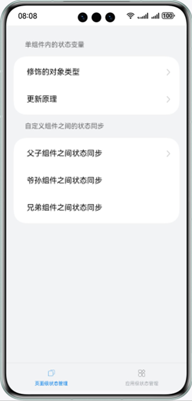
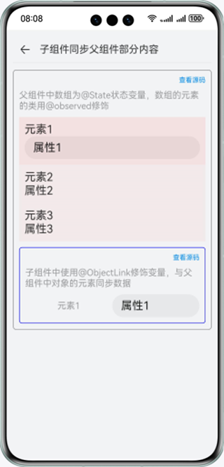
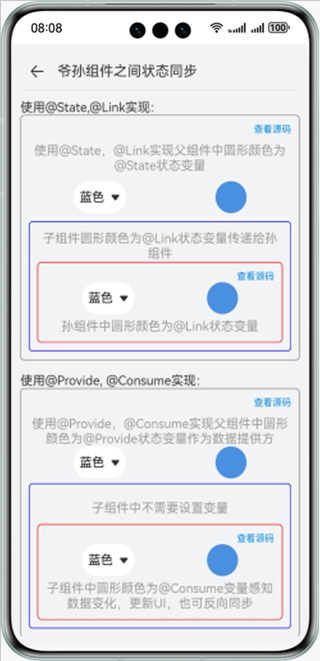
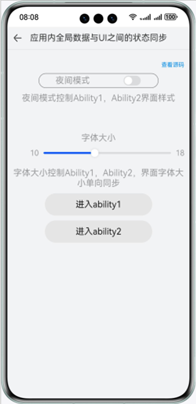

# 实现应用的状态管理功能

### 介绍

本示例通过ArkUI状态管理@State、@Prop、@Link、@Observed等装饰器，实现不同页面之间状态同步情景和应用的数据状态管理情景。帮助开发者掌握应用的数据状态同步处理。

### 效果预览

| 主页                               | 子组件同步父组件部分内容                                              | 爷孙组件之间状态同步                                    | 应用内全局数据与UI之间的状态同步                               |
|----------------------------------|-----------------------------------------------------------|-----------------------------------------------|-------------------------------------------------|
|  |  |  |  |

使用说明

1.点击首页中的基本类型进入对应页面，点击按钮可以更改圆形的颜色；点击查看源码可以展示基本类型功能效果的源码。

2.点击首页中的数组类型进入对应页面，点击新增元素可以添加数据；点击删除元素可以删除数据，当数据为空时，点击删除会弹出一个提示窗；点击更新数组中的某个元素，可以更改第一条数据的age属性，当数据为空时，同样会弹出一个提示窗；点击查看源码可以展示数组类型功能效果的源码。

3.点击首页中的类对象类型进入对应页面，点击更新对象可以更改对象属性和对象属性中的属性；点击更新对象属性，对象属性数据发生变化；点击更新属性中的属性，对象属性的属性数据发生变化；点击查看源码可以展示类对象类型功能效果的源码。

4.点击首页中的只更新所绑定的组件进入对应页面，点击修改标题和内容，标题和内容数据都发生变化，页面更新标题数据，内容数据不刷新；点击查看源码可以展示类对象类型功能效果的源码。

5.点击单、双向同步进入对应页面，点击设置为粉色按钮，父组件圆形颜色更新，两个子组件颜色同步更新；点击设置为蓝色按钮，子组件A圆形颜色更新，父组件和子组件B颜色不更新；点击设置为红色按钮，子组件B圆形颜色更新，父组件和子组件A圆形颜色同步更新，点击查看源码可以展示单、双向同步功能效果的源码。

6.点击子组件同步父组件的部分内容进入对应页面，点击父组件中的属性1修改数据，子组件中的属性1数据同步，点击子组件的属性1修改数据，父组件中的属性1数据同步，点击查看源码可以展示子组件同步父组件的部分内容功能效果的源码。

7.点击爷孙组件之间状态同步进入对应页面，点击爷组件下拉框组件选择颜色，下拉框文本和圆形颜色改变，孙组件下拉框文本和圆形颜色同步刷新；点击孙组件下拉框选择颜色，下拉框文本和圆形颜色改变，爷组件下拉框文本和圆形颜色同步刷新，点击查看源码可以展示爷孙组件之间状态同步功能效果的源码。

8.点击兄弟组件之间状态同步进入对应页面，点击兄弟A组件下拉框选择颜色，下拉框文本和圆形颜色改变，兄弟B组件下拉框文本和圆形颜色同步刷新，点击兄弟B组件下拉框选择颜色，下拉框文本和圆形颜色改变，兄弟A组件下拉框文本和圆形颜色同步刷新，点击查看源码可以展示爷孙组件之间状态同步功能效果的源码。

9.点击应用内全局数据与UI之间的状态同步进入对应页面，点击修改夜间模式状态和字体大小，当前夜间模式状态以及字体大小发生变化，进入Ability1和Ability2页面，夜间模式状态以及字体大小同步更新；在Ability1界面中改变夜间模式状态和字体大小，夜间模式状态和字体大小发生变化，进入到主页面和Ability2页面，夜间模式状态同步更新，字体大小不变；在Ability2界面中修改夜间模式状态，夜间模式状态发生改变，进入到主页面和Ability1页面，夜间模式状态同步，点击查看源码可以展示应用内全局数据与UI之间的状态同步功能效果的源码。

10.点击Ability内全局数据与UI之间的状态同步进入对应页面，点击修改夜间模式状态和字体大小，当前夜间模式状态以及字体大小发生变化时，进入Page1和Page2以及跨Ability不同步页面，Page1和Page2夜间模式状态以及字体大小同步更新,跨Ability页面不同步更新；在Page1界面中改变夜间模式状态和字体大小，夜间模式状态和字体大小发生变化，进入到主页面、Page2和跨Ability不同步页面，主页面和Page2夜间模式状态同步更新，但是字体不发生变化，跨Ability页面夜间模式状态和字体都不同步更新；在Page2界面中修改夜间模式状态，夜间模式状态发生改变，进入到主页面、Page1页面和跨Ability不同步页面，主页和Page1夜间模式状态同步，跨Ability页面都不同步更新；在跨Ability界面中修改夜间模式状态，夜间模式状态发生改变，进入主页、Page1和Page2页面，夜间模式状态不同步，点击查看源码可以展示Ability内全局数据与UI之间的状态同步功能效果的源码。

### 工程目录

```
├──entry/src/main/ets                                          // 代码区
│  ├──commoncomponents
│  │  ├──CodeView.ets                                          // 代码展示组件
│  │  ├──TitleBar.ets                                          // 标题组件
│  │  ├──TitleBarDark.ets                                      // 夜间模式下标题组件
│  │  └──ViewCodeText.ets                                      // 查看源码文本组件
│  ├──entryability
│  │  └──EntryAbility.ets     
│  ├──outofsyncability                           
│  │  └──OutOfSyncAbility.ets              
│  ├──pages
│  │  ├──applylevelstagemanagement                             // 应用级状态管理
│  │  │  ├──abilityglobaldatasync                              // Ability内全局数据与UI之间的状态同步             
│  │  │  │  ├──AbilityGlobalDataSync.ets                    
│  │  │  │  ├──AbilityGlobalDataSyncCode.ets                   // Ability内全局数据与UI之间的状态同步主页
│  │  │  │  ├──AbilityOutOfSyncPage.ets                        // 跨Ability页面
│  │  │  │  ├──LocalStorageLinkPage.ets                        // 展示LocalStorageLink效果页面
│  │  │  │  └──LocalStoragePropPage.ets                        // 展示LocalStorageProp效果页面
│  │  │  ├──applyglobaldatasync                                // 应用内全局数据与UI之间的状态同步
│  │  │  │  ├──ApplyGlobalDataSync.ets
│  │  │  │  ├──ApplyGlobalDataSyncCode.ets                     // 应用内全局数据与UI之间的状态同步主页
│  │  │  │  ├──StorageLinkAbilityPage.ets                      // 展示StorageLinkAbility页面
│  │  │  │  └──StoragePropAbilityPage.ets                      // 展示StoragePropAbility页面
│  │  │  └──model             
│  │  │     └──AbilityConfigType.ets                           // Ability参数类型
│  │  ├──home             
│  │  │  ├──data             
│  │  │  │  └──HomeData.ets                                    // 首页数据
│  │  │  ├──model             
│  │  │  │  └──CategoricalDataType.ets                         // 层级类型
│  │  │  ├──Home.ets                                           // 首页
│  │  │  └──TabContentNavigation.ets                           // Tab内容区组件
│  │  └──pagelevelstagemanagement                              // 页面级状态管理
│  │     ├──multicompomentssync                                // 自定义组件之间的状态同步
│  │     │  ├──brothercomponentssync                           // 兄弟组件之间状态同步 
│  │     │  │  ├──BrotherComponentSync.ets                 
│  │     │  │  ├──BrotherComponentSyncCode.ets                 // 兄弟组件之间状态同步首页
│  │     │  │  ├──ConsumeBrotherOneComponent.ets               // @Consume状态变量组件
│  │     │  │  ├──ConsumeBrotherTwoComponent.ets               // @Consume状态变量组件
│  │     │  │  ├──LinkBrotherOneComponent.ets                  // @Link状态变量组件
│  │     │  │  ├──LinkBrotherTwoComponent.ets                  // @Link状态变量组件
│  │     │  │  ├──ProvideFatherComponent.ets                   // @Provide状态变量组件
│  │     │  │  └──StateFatherComponent.ets                     // @State状态变量组件
│  │     │  ├──data     
│  │     │  │  └──ColorData.ets                                // 颜色数据
│  │     │  ├──deepnestcomponentssync                          // 爷孙组件嵌套
│  │     │  │  ├──ConsumeDescendentComponent.ets               // @Consume孙组件
│  │     │  │  ├──DeepNestComponentsSync.ets                    
│  │     │  │  ├──DeepNestComponentsSyncCode.ets               // 爷孙组件首页       
│  │     │  │  ├──LinkDescendentComponent.ets                  // @Link孙组件
│  │     │  │  ├──ProvideGrandfatherComponent.ets              // @Provide爷组件
│  │     │  │  └──StateGrandfatherComponent.ets                // @State爷组件
│  │     │  ├──model                                
│  │     │  │  └──ColorType.ets                                // 颜色数据类型
│  │     │  └──parentchildcomponentsync                        // 父子组件之间状态同步
│  │     │     ├──parentchildpartialcontentsync                // 子组件同步父组件部分内容
│  │     │     │  ├──ObjectLinkComponent.ets                   // @ObjectLink子组件
│  │     │     │  ├──ParentChildPartialContentSync.ets     
│  │     │     │  └──ParentChildPartialContentSyncCode.ets     // @Observer父组件
│  │     │     └──uniandbidirectionsync                        // 单、双向同步
│  │     │        ├──ComponentLink.ets                         // Link组件
│  │     │        ├──ComponentProp.ets                         // Prop组件
│  │     │        ├──UniAndBidirectionSync.ets    
│  │     │        └──UniAndBidirectionSyncCode.ets             // @State父组件
│  │     └──singlecomponentstatevariables                      // 单组件的状态同步
│  │        ├──decoratedobjecttype                             // 修饰的对象类型
│  │        │  ├──arraytype                                    // 数组类型
│  │        │  │  ├──ArrayType.ets
│  │        │  │  └──ArrayTypeCode.ets                         // 数组类型源码页
│  │        │  ├──basetype                                     // 基本类型
│  │        │  │  ├──BaseType.ets
│  │        │  │  └──BaseTypeCode.ets                          // 基本类型源码页
│  │        │  └──classobjecttype                              // 对象类型
│  │        │     ├──ClassObjectType.ets
│  │        │     └──ClassObjectTypeCode.ets                   // 对象类型源码页
│  │        └──updatetactics                                   // 更新原理
│  │           └──updateboundcomponent                         // 只更新所绑定的组件
│  │              ├──UpdateBoundComponent.ets               
│  │              └──UpdateBoundComponentCode.ets              // 只更新所绑定的组件源码
│  ├──storagelinkability              
│  │  └──StorageLinkAbility.ets
│  ├──storagepropability
│  │  └──StoragePropAbility.ets
│  └──utils
│     ├──Logger.ets                                            // 日志文件
│     ├──ResourceUtils.ets                                     // 资源转换方法
│     └──StartAbilityUtils.ets                                 // 启动Ability方法
└──entry/src/main/resources                                    // 资源文件夹

```

### 具体实现

* 查看源码：通过private controller: webView.WebviewController = new webView.WebviewController()
  声明一个状态变量，使用this.controller.loadUrl(url)来打开web页面，查看对应的源码。
* 基本类型：使用@State声明一个Resource类型的circleColor状态变量，然后通过点击事件根据circleColor的id来改变圆形颜色。
* 数组类型：使用@State声明一个数组arrayTypeData状态变量，数据元素为new ArrayDataType()，通过arrayTypeData.push()
  方法来新增元素数据，arrayTypeData.splice()方法删除元素，更新指定new ArrayDataType()来实现更新某一个元素数据。
*
类对象类型：使用@Observed声明一个属性类ChildClass，然后声明一个对象类ParentClass，并将对象的其中一个属性类型设置为属性类，使用@State声明一个类对象数据状态变量classObjectData，更新对象可以通过new
ParentClass()
生成一个对象并赋值来实现，更新对象属性可以通过this.classObjectData.attribute++来实现，更新对象属性的属性可以通过@ObjectLink声明一个状态变量并更新此状态变量的对象属性来实现。
* 只更新所绑定的组件：使用@State和Private声明一个titleName和content状态变量，通过点击事件修改这两个状态变量。
*
单、双向同步：父组件使用@State声明一个状态变量circleColor并作为参数给子组件A和子组件B，子组件A通过@Prop接收，子组件B通过@Link来接收，通过点击事件中的this.circleColor =
COLOR_DATA.PINK来更改颜色。
*
子组件同步父组件部分内容：父组件中使用@State声明一个数组状态变量parentData，@Observed声明数组元素的类，父组件向子组件传递parentData的某一个元素数据，子组件通过@ObjectLink来接收，父组件通过this.childObject.attributeType =
value来修改元素数据，子组件同步更新，子组件同样通过this.childObjectData.attributeType = value来修改子组件的数据，父组件同步更新。
*
爷孙组件之间状态同步：爷组件通过@State声明一个控制圆形颜色的状态变量circleColor和控制当前Select组件Index的状态变量currentSelectIndex，逐层传递给子组件给孙组件，通过@Link接收，爷组件通过onSelect事件来修改circleColor和currentSelectIndex，孙组件同样通过onSelect事件来修改circleColor和currentSelectIndex，然后爷组件通过@Provide声明一个控制圆形颜色的状态变量consumeCircleColor和控制当前Select组件Index的状态变量currentSelectIndex，孙组件通过@Consume来接收，爷组件通过onSelect事件来修改circleColor和currentSelectIndex，孙组件同样通过onSelect事件来修改circleColor和currentSelectIndex。
*
兄弟组件之间状态同步：父组件通过@State声明一个控制圆形颜色的状态变量circleColor和控制当前Select组件Index的状态变量currentSelectIndex，传递给子组件A和子组件B，两者通过@Link接收，子组件A通过onSelect事件来修改circleColor和currentSelectIndex，子组件B同样通过onSelect事件来修改circleColor和currentSelectIndex；然后父组件通过@Provide声明一个控制圆形颜色的状态变量consumeCircleColor和控制当前Select组件Index的状态变量currentSelectIndex，子组件A和子组件B通过@Consume来接收，子组件A通过onSelect事件来修改circleColor和currentSelectIndex，子组件B同样通过onSelect事件来修改circleColor和currentSelectIndex。
*
应用内全局数据与UI之间的状态同步：主页、Ability1页面和Ability2页面通过@StorageLink声明一个控制夜间模式的状态变量currentModelStatus，在主页面通过onChange事件中的AppStorage.SetOrCreate<boolean>('
currentModelStatus', this.currentModelStatus)
来更改夜间模式的状态，，在Ability1页面和Ability页面通过onClick事件中的this.currentModelStatus = !
this.currentModelStatus，主页和Ability2页面通过@StorageLink声明一个控制字体大小的状态变量contentFontSize，Ability1页面通过@StorageProp声明一个控制字体大小的状态变量contentFontSize，主页使用onChange事件中的this.contentFontSize =
value和AppStorage.SetOrCreate<number>('contentFontSize', this.contentFontSize)
来更改内容字体的大小，Ability1通过onChange事件中的this.contentFontSize = value来修改内容字体大小。
* Ability内全局数据与UI之间的状态同步：在Entry当中声明一个storage，并通过this.storage.setOrCreate<boolean>('
  currentModelStatus', true)和this.storage.setOrCreate<number>('contentFontSize', 18)
  来设置夜间模式状态变量currentModelStatus和字体大小状态变量contentFontSize，然后主页、Page1页面、Page2页面和跨Ability页面通过@LocalStorageLink声明一个控制夜间模式的状态变量currentModelStatus，在主页面通过onChange事件中的this.currentModelStatus =
  isOn来更改夜间模式的状态，Page1页面、Page2页面和跨Ability页面通过onClick事件中的this.currentModelStatus = !
  this.currentModelStatus来更改夜间模式的状态，主页、Page1页面和跨Ability页面通过@LocalStorageLink声明一个控制字体大小的状态变量contentFontSize，Page1页面通过@LocalStorageProp声明一个控制字体大小的状态变量contentFontSize，主页使用onChange事件中的this.contentFontSize =
  value和AppStorage.SetOrCreate<number>('contentFontSize', this.contentFontSize)
  来更改内容字体的大小，Page2通过onChange事件中的this.contentFontSize = value来修改内容字体大小。

### 相关权限

不涉及。

### 依赖

不涉及。

### 约束与限制

1.本示例仅支持标准系统上运行，支持设备：华为手机。

2.HarmonyOS系统：HarmonyOS NEXT Developer Beta1及以上。

3.DevEco Studio版本：DevEco Studio NEXT Developer Beta1及以上。

4.HarmonyOS SDK版本：HarmonyOS NEXT Developer Beta1 SDK及以上。