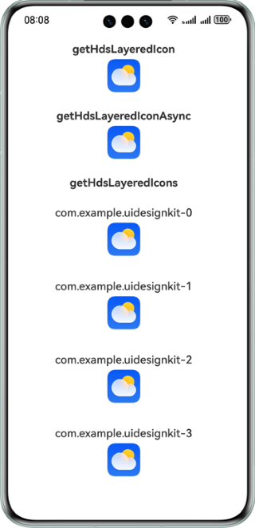

# UI Design Kit（UI设计套件）

### 介绍
本示例主要展示了UI Design Kit（UI设计套件）相关的功能。
使用ArkUI、Localization Kit、Image Kit等接口，实现了图标合成、剪切、缩放、描边等功能。

### 相关概念
UI Design Kit是华为提供的符合华为HarmonyOS Design System定义的UI界面开发套件集合，包含HarmonyOS Design System设计定义的扩展UI组件及其多样化的组件样式、丰富多样的UI界面场景下的光影效果，支撑应用实现跟随HarmonyOS Design System高端精致设计效果UI界面，达成应用界面与华为HarmonyOS多设备UI设计风格完美融合。

### 相关权限
不涉及

### 使用说明
本示例展示了分层图标和单层图标的处理效果。

### 效果预览

<span style="border: 3px solid #ddd; padding: 10px; margin: 10px 0;">
&emsp;&emsp;&emsp;&emsp;&emsp;&nbsp;&nbsp;分层图标&emsp;&emsp;&emsp;&emsp;&emsp;&nbsp;&nbsp;&nbsp;
</span>

<span style="border: 3px solid #ddd; padding: 10px; margin: 10px 0;">
&emsp;&emsp;&emsp;&emsp;&emsp;&nbsp;单层图标&emsp;&emsp;&emsp;&emsp;&emsp;&nbsp;&nbsp;
</span>



### 工程目录
├─entry/src/main/ets &emsp;&emsp;&emsp;&emsp;&emsp;&emsp;&emsp;&emsp;&emsp;&emsp;// 代码区

│&emsp;├─entryability

│&emsp;│&emsp;├─EntryAbility.ets &emsp;&emsp;&emsp;&emsp;&emsp;&emsp;&emsp;&nbsp;&nbsp;&nbsp;  // 程序入口类

│&emsp;└─pages &emsp;&emsp;&emsp;&emsp;&emsp;&emsp;&emsp;&emsp;&emsp;&emsp;&emsp;&emsp;&emsp;&nbsp; // 存放页面文件的目录

│&emsp;&emsp;&emsp;├─GetHdsIcon.ets &emsp;&emsp;&emsp;&emsp;&emsp;&emsp;&emsp;  // 单层应用图标处理页面

│&emsp;&emsp;&emsp;├─GetHdsLayeredIcon.ets &emsp;&emsp;&emsp;&nbsp;  // 分层应用图标处理页面

│&emsp;&emsp;&emsp;└─Index.ets &emsp;&emsp;&emsp;&emsp;&emsp;&emsp;&emsp;&emsp;&emsp;&nbsp;&nbsp;  // 主页界面

└─entry/src/main/resources &emsp;&emsp;&emsp;&emsp;&emsp;&emsp;&nbsp; // 应用资源目录

### 具体实现
在@kit.UIDesignKit中定义了图标处理接口API，示例接口如下：

```
  /**
   * Returns processed layered icon.
   *
   * @param { string } bundleName - Indicates the bundle name of the application.
   * @param { LayeredDrawableDescriptor } layeredDrawableDescriptor - Icon drawable descriptor.
   * @param { number } size - Icon size. The unit is vp.
   * @param { boolean } hasBorder - Icon set border or not. The default value is false.
   * @returns { image.PixelMap } The processed layered icon returned by the function.
   * @throws { BusinessError } 401 - Parameter error.
   * @syscap SystemCapability.UIDesign.Core
   * @atomicservice
   * @since 5.0.0(12)
   */
  function getHdsLayeredIcon(bundleName: string, layeredDrawableDescriptor: LayeredDrawableDescriptor, size: number, hasBorder?: boolean): image.PixelMap;

  /**
   * Returns processed icon.
   *
   * @param { string } bundleName - Indicates the bundle name of the application.
   * @param { image.PixelMap } pixelMap - Icon pixelMap.
   * @param { number } size - Icon size. The unit is vp.
   * @param { image.PixelMap } mask - Mask pixelMap.
   * @param { boolean } hasBorder - Icon set border or not. The default value is false.
   * @returns { image.PixelMap } The processed icon returned by the function.
   * @throws { BusinessError } 401 - Parameter error.
   * @syscap SystemCapability.UIDesign.Core
   * @atomicservice
   * @since 5.0.0(12)
   */
  function getHdsIcon(bundleName: string, pixelMap: image.PixelMap, size: number, mask: image.PixelMap, hasBorder?: boolean): image.PixelMap;

  /**
   * Returns processed icons.
   *
   * @param { Array<Icon> } icons - The icons pixelMap array. The maximum length of array is 500.
   * @param { image.PixelMap } mask - Mask pixelMap.
   * @param { Options } options - Icon options.
   * @returns { Promise<Array<ProcessedIcon>> } The promise of processed icons returned by the function.
   * @throws { BusinessError } 401 - Parameter error.
   * @throws { BusinessError } 1012600001 - Task is busy.
   * @syscap SystemCapability.UIDesign.Core
   * @atomicservice
   * @since 5.0.0(12)
   */
  function getHdsIcons(icons: Array<Icon>, mask: image.PixelMap, options: Options): Promise<Array<ProcessedIcon>>;

  /**
   * Returns processed layered icons.
   *
   * @param { Array<LayeredIcon> } icons - The layered icons pixelMap array. The maximum length of array is 500.
   * @param { Options } options - Icon options.
   * @returns { Promise<Array<ProcessedIcon>> } The promise of processed icons returned by the function.
   * @throws { BusinessError } 401 - Parameter error.
   * @throws { BusinessError } 1012600001 - Task is busy.
   * @syscap SystemCapability.UIDesign.Core
   * @atomicservice
   * @since 5.0.0(12)
   */
  function getHdsLayeredIcons(icons: Array<LayeredIcon>, options: Options): Promise<Array<ProcessedIcon>>;
```

### 约束与限制
1. HarmonyOS系统：HarmonyOS NEXT Developer Beta2及以上。
2. DevEco Studio版本：DevEco Studio NEXT Developer Beta2及以上。
3. HarmonyOS SDK版本：HarmonyOS NEXT Developer Beta2 SDK及以上。