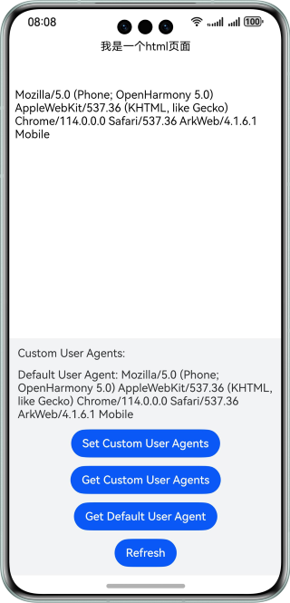

## Web User Agent

### Overview

This sample shows how to set and obtain the user agent using ArkTS and the **Web** component.

### Preview



### Project Directory

```
├──entry/src/main/ets                              
│  ├──entryability  
│  │  └──EntryAbility.ets          // Entry point class
│  ├──pages                                     
│  │  └──Index.ets                 // Home page
│  └──utils
│     └──Logger.ets                // Logger       
└──entry/src/main/resources        // Static resources
   └──rawfile                     
      └──Index.html                // HTML page
```

### How to Use

1. Tap the **Set custom user agent** to set the agent.
2. Tap the **Obtain custom user agent** button to display the information about the custom user agent.
3. Tap the **Obtain default user agent** button to display the information about the default user agent.
4. Tap the **Refresh** button to refresh the web page and display the latest user agent information.

### Available APIs

- getUserAgent: obtains the current default user agent.
- setCustomUserAgent: sets a custom user agent, which will overwrite the default user agent.
- getCustomUserAgent: obtains the custom user agent.

### Required Permissions

Network permission: ohos.permission.INTERNET.

### Dependencies

N/A

### Constraints

1. The sample is only supported on Huawei phones with standard systems.

2. The HarmonyOS version must be HarmonyOS 5.0.0 Release or later.

3. The DevEco Studio version must be DevEco Studio 5.0.0 Release or later.

4. The HarmonyOS SDK version must be HarmonyOS 5.0.0 Release SDK or later.
