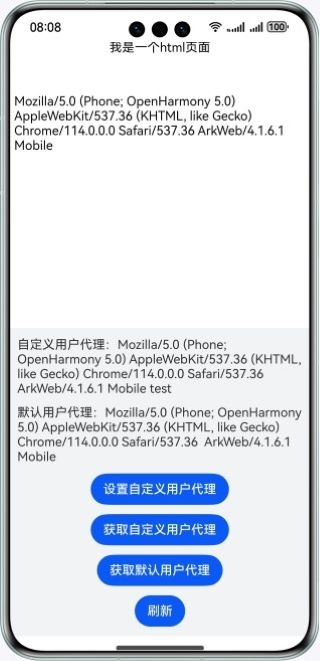

## Web用户代理

### 介绍

本示例基于ArkTS和Web组件实现了User Agent的设置和获取功能。

### 效果预览


### 工程目录
```

├──entry/src/main/ets                              
│  ├──entryability  
│  │  └──EntryAbility.ets          // 程序入口
│  ├──pages                                     
│  │  └──Index.ets                 // 首页
│  └──utils
│     └──Logger.ets                // 日志        
└──entry/src/main/resources        // 应用资源目录
   └──rawfile                     
      └──Index.html                // html页面
```

### 使用说明
1. 点击设置用户代理按钮，可以进行设置代理操作。
2. 点击获取用户代理按钮，“自定义用户代理：”位置将会显示之前设置的信息。
3. 点击获取默认用户代理按钮，可以获取默认用户代理信息。
4. 点击刷新按钮，上部的web页面将会刷新重新展示最新的用户代理信息。

### 相关概念
- getUserAgent: 获取当前默认用户代理。
- setCustomUserAgent: 设置自定义用户代理，会覆盖系统的用户代理。。
- getCustomUserAgent: 获取自定义用户代理。

### 相关权限

网络使用权限：ohos.permission.INTERNET

### 依赖

不涉及

### 约束与限制

1. 本示例仅支持标准系统上运行，支持设备：华为手机。

2. HarmonyOS系统：HarmonyOS NEXT Developer Beta1及以上。

3. DevEco Studio版本：DevEco Studio NEXT Developer Beta1及以上。

4. HarmonyOS SDK版本：HarmonyOS NEXT Developer Beta1 SDK及以上。