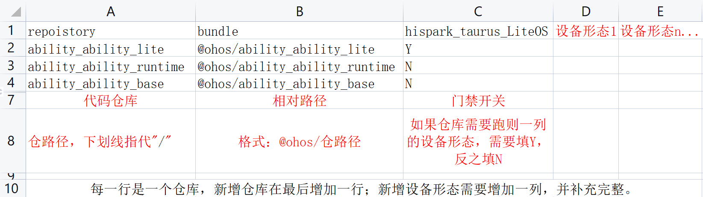

# 厂商新增openharmony门禁指导

## 注意:
###    1、三方开发板的门禁周期为1个月上线门禁工程，1个月后则移到每日构建。
###    2、每日构建上线成功后设置自动触发，每日两次，稳定后每日一次。如果编译失败后三天内没有解决，则暂时关闭自动触发。

## 步骤1：
厂商发邮件给张亚雷/王少峰（OH南向设备厂商接口人，邮箱：zhangyalei8@h-partners.com/wangshaofeng5@huawei.com）申请上线流水线。

## 步骤2：
开发厂商提PR修改配置文件：

(1)manifest仓default.xml文件，在OH分支上链入新设备仓。

(2)修改精准构建文件 https://gitee.com/openharmony/manifest/blob/master/matrix_product.csv

### 注意： 

#####    1. 如果default.xml 新加的单个仓大小超过 100M，需要通知OH CMO 马明帅 （邮箱：mamingshuai1@huawei.com），对新链入仓 进行预热，避免上线后，后台流水线编译服务器同时下载新仓，带宽不够，导致流水线大规模下载失败。

#####    2.之前南向设备上门禁纪要对齐：后续新设备上线，matrix_product.csv只监控设备仓的提交构建。 公共仓不监控，精准构建文件由 李兵 （邮箱：libing3@huawei.com） 审查合入。

## 步骤3：
王少峰上研发效率例会评审，通过后通知 张凡凡 安排人实施。

注意：编译命令中不要添加下载编译工具等命令，如有需要，联系王意明（邮箱：youthdragon.wangyiming@huawei.com）将工具集成到docker中，编译只构建产物！！

## 步骤1  新加设备门禁形态模板

##### 配资仓json文件（仅参考）
    {
        "name": "bearpi_hm_nano",
        "manifestFile": "default.xml",
        "hardwareBoard": "BearPi-HM Nano",
        "deviceLevel": "L0",
        "preCompile": "bash build/prebuilts_download.sh",
        "compileCMD": "./test/xts/tools/lite/build.sh product=bearpi_hm_nano platform=bearpi xts=acts",
        "afterCompile": "",
        "resultList": "out/bearpi_hm_nano/bearpi_hm_nano/*",
        "dockerImage": "swr.cn-north-4.myhuaweicloud.com/harmonyos_ci/harmony-build-env:1.0.1",
        "imgList": "",
        "testList": []
    }

##### 申请邮件模板
    申请名称: 小熊派开发板门禁项目
    申请单位：南京小熊派智能科技有限公司
    工程名称：openharmony
    代码分支名：master
    编译形态名（必填，字符串中不带空格）: bearpi_hm_nano
    manifest仓配置文件：default.xml
    开发板：BearPi-HM Nano
    设备层级（必填，L0、L1或L2）：L0
    预编译命令: bash build/prebuilts_download.sh
    编译命令（必填，包含xts）:./test/xts/tools/lite/build.sh product=bearpi_hm_nano platform=bearpi xts=acts 
    后编译命令：无
    产物路径（必填，小于5GB）: out/bearpi_hm_nano/bearpi_hm_nano/*

## 步骤2  csv文件填写方法

1.	找到对应工程的manifest仓，点击【克隆/下载】，将仓库文件下载到本地；

2.	解压并用Excel等表格软件打开matrix_product.csv文件，组成如下：

 

3.	增加仓库，需要添加一行，同时修改default.xml文件；增加编译形态，需要增加一列，并将这一列补充完整；

4.	填写完成后保存并上传；

5.	检查无误后，在提交信息中填入签名信息: Signed-off-by: 【码云名称】<【邮箱】>，点击提交，私仓合入后合入主仓；

6.	评论 start build 触发门禁，待编译测试都通过后，找 李兵（邮箱：libing3@huawei.com） 审查合入；

7.	default.xml文件的修改方法及详情，查看manifest仓下README.md

Manifest仓：https://gitee.com/openharmony/manifest

### 参考样例:

加仓：https://gitee.com/openharmony/manifest/pulls/588/files

加编译形态：https://gitee.com/openharmony/manifest/pulls/586/files
