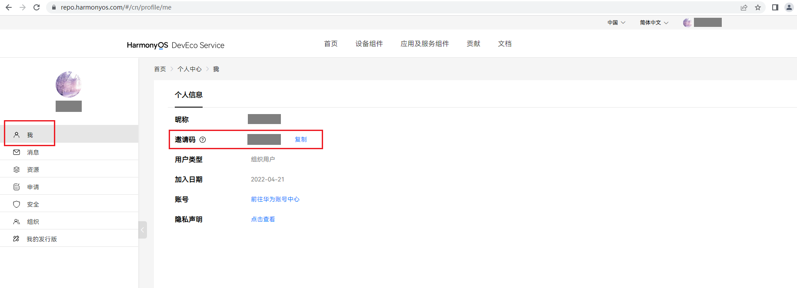
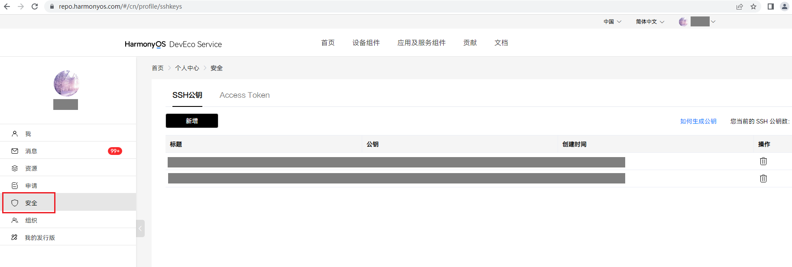
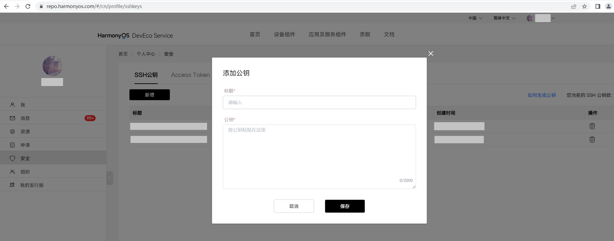

# HPM基础发行版制作与发布流程说明

## 准备

- 编译环境：Linux | Ubuntu

- [hpm-cli安装与使用](https://repo.harmonyos.com/#/cn/help/command)

  本工具脚本只支持node.js 16.16.x及以上版本的hpm-cli。
- HPM注册及权限获取[官网]([DevEco Marketplace (harmonyos.com)](https://hpm.harmonyos.com/#/cn/help/introduction))

  1.注册账号实名认证后登录，进行[个人设置](https://hpm.harmonyos.com/#/cn/help/personalset)
  
  2.进入个人中心
  

  3.左侧菜单栏选择组织(组织创建请参考[组织管理](https://repo.harmonyos.com/#/cn/help/orgmanage))，右侧列表中选择您所在的组织，点击“操作”下图标进入详情页
  
  
  4.左侧菜单栏选择我，查看邀请码（即为hpm发布组件时需要的账号信息）
  

- hpm设置账号
```
账号设置命令： hpm config set loginUser <邀请码>
查看配置命令： hpm config list
设置密钥：hpm gen-keys
```

将~/.hpm/key/publicKey_XXXX.pem的公钥内容复制粘贴到账号后台。





- 下载工具脚本
```
git clone https://gitee.com/yisifor/hpm_publish_tools.git
```

## HPM基础发行版制作流程

#### 1、openharmony源码下载与hpm包本地制作
```
#-b openharmony源码分支或者标签名
#-t true--标签，false--分支
#-v 需要制作的组件包版本
#-s 需要制作的组件包os版本(openharmony源码分支简称)
#-r 需要制作的组件包的组织名
#-g 可选项。指定repo下载时，manifest.xml的分组。例如 -g ohos:mini 或 -g ohos:mini,ohos:small
#-m 可选项。 指定repo下载时的manifest.xml文件名。
例如：./ons.sh -b OpenHarmony-v1.1.1-LTS -t true -v 1.1.1 -s 1.1.1 -r ohos -g ohos:mini,ohos:small -m default.xml
运行结果： 在当前目录下生成三个目录
	code: 生成一份源码与repo下载的一致，可以进行全量编译验证。编译前需执行./code_link.sh创建必要的软连接。
	bundle: 按各仓名存放openharmony各个仓的源码，可在此发布组件。
	packages:所有仓的组件打包成功的都会放置在该目录下，发行版调试时可从中下载安装本地包。
```

#### 2、准备发行版组件清单文件、模板文件、编译脚本等。
- 发行版组件清单文件以发行版名称为名，以.txt后缀结尾，内容为发行版依赖的组件名称，放置在distributions目录下
	例如
```
cat  distributions/hispark_pegasus.txt
blackbox
bootstrap_lite
build_framework
...
```
模板文件放在以发行版名称为名的目录下，并统一放在template目录下管理。

​	1.发行版发布必要的文件bundle.json,LICENSE,README.md。其中LICENSE根据自己的开源协议进行描写，并将协议全称或协议ID写入bundle.json中的license字段。[协议参考](https://spdx.org/licenses/)

​	2.发行版编译，测试，烧录等相关脚本，配置文件等。脚本默认统一放在scripts目录下。通过bundle.json中scripts字段来触发脚本。
​	例如

```
tree template/hispark_pegasus
template/hispark_pegasus
|---bundle.json
|---LICENSE
|---README.md
|---scripts
		|---dist.sh
		|---pre_dist.sh

cat bundle.json
{
	...
	"scripts":{
		"pre_dist":"./scripts/pre_dist.sh",
		"dist":"./scripts/dist.sh"
	}
	...
}
```

#### 3、调试验证发行版
- 1.初始化发行版工程。
```
$1 发行版名称
$2 发行版依赖的组件版本号
$3 发行版自身版本号
$4 发行版依赖的组件对应的ohos版本号
$5 发行版依赖的组件包归属的组织名
例如：./gen_dist.sh hispark_pegasus 3.2.2 1.0.0 3.2-Beta3 ohos
运行结果：
	1.初始化工程。生成发行版名称命名的目录，包含以下三部分内容。
		1)基于template模板里的内容，初始化发行版相关的bundle.json,scripts等内容。
		2)按照distributions目录下的发行版组件清单文件hispark_pegasus.txt安装线上已发布的组件。
		3)若组件未发布，安装本地packages目录下的组件包。
	2.进入发行版工程目录并执行编译命令hpm dist。完成发行版的编译，产物生成在out目录下。
```

- 2.初始化发行版工程（debug调试）。
	当发行版组件清单不明确，需要不断调整组件清单内容，来满足发行版编译成功时，可以用gen_dist_debug.sh来反复初始化发行版工程。
	操作步骤：
	1)编辑发行版组件清单文件，添加或移除组件
	2)运行gen_dist_debug.sh脚本初始化工程
```
$1 发行版名称
$2 发行版依赖的组件版本号
$3 发行版自身版本号
$4 发行版依赖的组件对应的ohos版本号
$5 发行版依赖的组件包归属的组织名
例如：./gen_dist_debug.sh hispark_pegasus 3.2.2 1.0.0 3.2-Beta3 ohos
运行结果：
	1.初始化工程。生成发行版名称拼接“_debug”命名的目录，包含以下三部分内容。
		1)基于template模板里的内容，初始化发行版相关的bundle.json,scripts等内容。
		2)按照distributions目录下的发行版组件清单文件hispark_pegasus.txt安装线上已发布的组件。
		3)若组件未发布，安装本地packages目录下的组件包。
	2.进入发行版工程目录并执行编译命令hpm dist。完成发行版的编译，产物生成在out目录下。
特点：debug模式不会全部重新初始化工程，仅针对增减的组件进行代码内容的调整。提高调试效率。
```
	3)若编译验证不通过，则重复上述步骤。直至裁剪出发行版正确的组件清单。

#### 4、贡献组件包
- 将发行版依赖的未发布的组件包发布到HPM。
```
$1 发行版工程目录
例如：
	./publish_dist_bundle.sh hispark_pegasus
运行结果：
	将发行版工程中未发布的组件发布到HPM，等待审核通过。发布日志记录在发行版工程目录下的publish.log文件中。
```

#### 5、贡献发行版
- 将发行版发布到HPM。
```
$1 发行版工程目录
例如：
	./publish_dist.sh hispark_pegasus
运行结果：
	1.初始化发行版发布工程。生产发行版名称拼接“_publish”命名的目录，包含以下两部分内容。
		1)template模板里除bundle.json的内容，发行版相关的LICENSE,README.md,scripts等内容。
		2)发行版工程里面的bundle.json,dependencies字段包含了发行版直接依赖的组件信息。
	2.将上述内容打包发布到HPM，等待审核通过。
```

#### 6、生成开源发行版

- 选择“包”Tab，过滤下拉框选择“distribution”选项，查询当前已通过的发行版组件包


- 点击“操作”下图标按钮后弹出输入框，填写相关信息(图片支持png、jpg、gif 格式)，点击“提交”按钮[生成开源发行版]([DevEco Marketplace (harmonyos.com)](https://repo.harmonyos.com/#/cn/help/contributedistribution))申请，待管理员审核通过即可发布至HPM开源发行版页面

## FAQ
账号和网络配置问题
```
问题一：hpm-cli无法访问到hpm后台
回答：使用hpm config命令或修改配置文件进行网络设置。

问题二：hpm-cli因网络问题无法发布部件。
回答：在hpm个人中心配置密钥。

问题三：hpm-cli因组织权限问题无法发布部件。
回答：企业组织的管理员通过邀请码将其加入组织；个人组织只适用个人账号，并且创建的个人组织需要审核通过才能发布部件。

问题四: 批量发布部件时，后续部件发布失败。
回答：个人账号同时发布部件数量受限。可等审核通过后再进行发布。
```
工具脚本使用问题
```
问题一：部件的内容需要调整。
回答：在bundle目录下找到部件所在仓，进行内容修改。再通过bundle.sh脚本单独重新做包，再重新进行调试。

问题二：源码分组下载导致发行版部分关联部件未下载。
回答：在bundle目录下通过git clone单独下载。并按仓的还原路径，复制一份代码到code工程目录下。再通过bundle.sh脚本单独做包。
```
部件数据不规范问题
```
问题一：部件元数据bundle.json缺少hpm包制作的相关字段，导致做包和发布失败。
回答：根据错误提示和hpm关于bundle.json的字段说明文档,修改正确bundle目录下各部件所在代码仓的bundle.json，重新做包和发布。常见易出问题字段有name字段部件名错误，version字段格式错误，license字段的协议名不在spdx license清单。

问题二：缺少README.md和LICENSE文件导致做包失败。
回答：bundle.json文件同目录下补充README.md和LICENSE；若存在还导致失败，查看bundle.json中描述README.md和LICENSE文件路径的字段是否表述准确。
```
