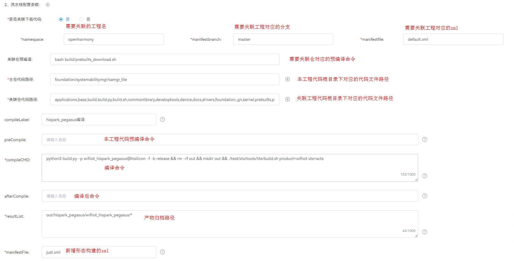

# sig孵化编译门禁邮件申请信息

本指导用于指导**已进入孵化阶段**的各SIG的编译门禁申请，待申请的各SIG需要通过[OpenHarmony数字化协作平台](http://ci.openharmony.cn)SIG管理申请门禁

已孵化厂商发邮件给张亚雷/王少峰（OH南向设备厂商接口人，邮箱：zhangyalei8@h-partners.com/wangshaofeng5@huawei.com）申请上线流水线

### 编译门禁申请关键字段：

 **openharmony代码仓管理使用的git工具，多仓管理使用的repo工具[代码下载方式及下载命令](https://gitee.com/openharmony/manifest/tree/master)，repo其他命令参考repo --help** 

**namespace：** 需要关联的工程名称，openharmony-sig联合主线的仓一起编译，那么关联的工程就是openharmony，例如：openharmony

**manifestbranch：** 需要关联的工程所对应的分支名称，例如：master

**manifestfile：** 需要关联的工程所对应的xml文件，例如：default.xml

**主仓代码路径：** 当前工程代码根目录下对应的代码文件路径

**关联仓代码路径：** 关联工程代码根目录下对应的代码文件路径

**关联仓预编译：** 关联工程代码的预编译命令

**其他字段参考：** [01 厂商新增openharmony门禁指导V1.0.md](https://gitee.com/openharmony-sig/cicd/blob/master/%E5%BC%80%E5%8F%91%E6%9D%BF%E8%BF%9B%E5%9C%BA/01%20%E5%8E%82%E5%95%86%E6%96%B0%E5%A2%9Eopenharmony%E9%97%A8%E7%A6%81%E6%8C%87%E5%AF%BCV1.0.md)

 