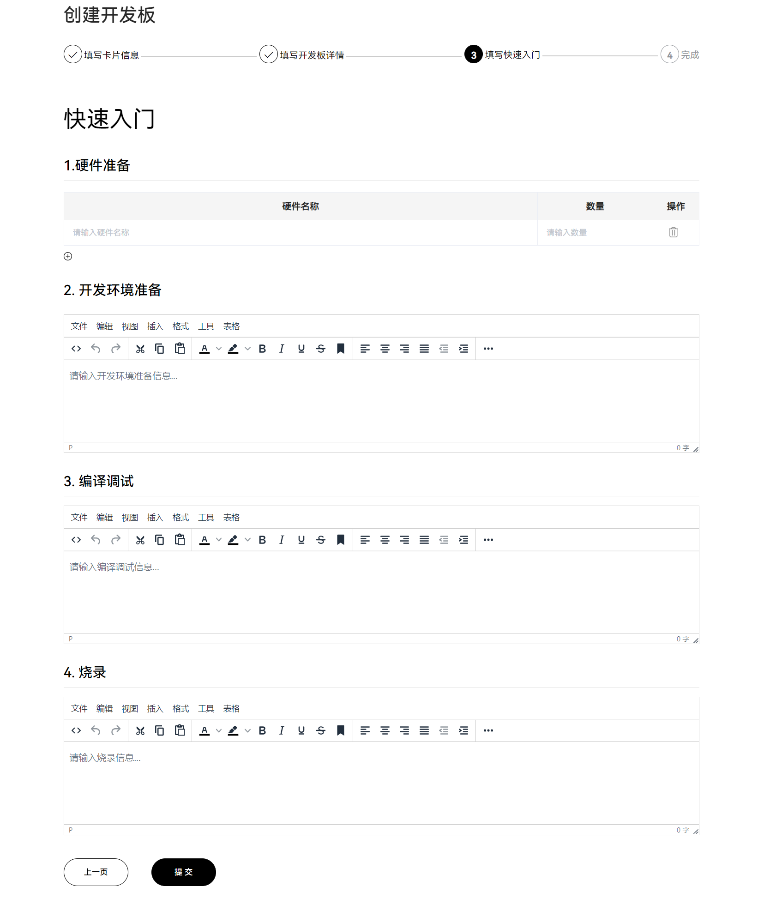
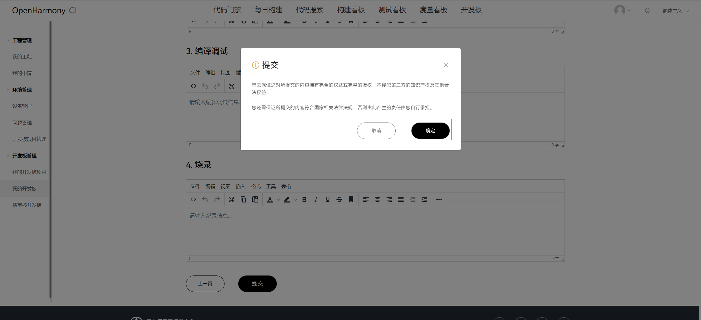

## 开发板信息填写操作指导 V1.0
	注：指导内输入框提示可键入创建的项目均可直接输入内容后回车创建选择
#### 1. 新增开发板
- 进入 **我的开发板** 界面，点击创建开发板按钮进入新增开发板编辑界面
> 管理中心 > 开发板管理 > 我的开发板 > 创建开发板

- 填写卡片信息

##### 	配置项说明

	- 开发板企业级LOGO：必填，只允许上传一张照片
	- 开发板图片：必填，只允许上传一张照片
	- 芯片企业授权LOGO：无芯片企业授权时选择'否'允许不上传，选择'是'则可上传芯片企业LOGO
	- 开发板名称：开发板名称不允为空
	- 开发板规格：输入至少1条规格信息，包含主芯片介绍、RAM、ROM/flash/emmc、主要外设或接口； 例如：**2*A53@1.8GHz+4*A73@2.2GHz；LPDDR4x4GB+高速eMMC5.1 32G；WIFI模块-双频**
	- 场景分类：单选，根据开发板案例功能进行分类，例如：智能家居、媒体娱乐、移动办公...
	- OS分类：单选，根据开发板案例复杂度分为轻量系统，小型系统，标准系统
	- OS support：多选或键入选择，根据开发板支持的系统版本进行选择，如：1.0.1 LTS、1.1.0 LTS...
	- 通信模组：多选或键入选择，选择开发板所使用的通信协议
	- 使用工具：单选，选择开发工具，如：HUAWEI DevEco Studio、HUAWEI DevEco Device Tool
	- 存储模组：多选或键入选择，选择开发板所用存储模块，如：DataFlash、eMARM...
	- 硬件接口：多选或键入选择，选择开发板所支持的外接接口，如：E53、JLink、JTAG...
	- 芯片：多选或键入选择，选择开发板所使用的芯片，如：Cortex-A9、HI3568、RK3568...
	- 芯片供应商：多选或键入选择，选择开发板所用芯片的供应商，如：海思、STM意法半导体、瑞芯微...
	- 安全保障：键入选择，开发板的安全保障，如安全芯片所支持的TRNG

------------

#### 2.开发板详情编辑

##### 配置项说明
	- 开发板名称与开发板图片为上一步填写卡片信息时获取的信息
	- 描述信息：添加不超过200字的开发板描述信息
	- 概述：必填，开发板概述信息
	- 功能特性：添加至少1条特性，介绍各个相关组件的功能，可以进行添加或删除
	- 逻辑框图：添加至少1张关于开发板的逻辑框图，可以进行添加或删除
	- 正面视图：必填，开发板的正面视角图
	- 反面视图：补充展示存在于开发板背面的元器件或其他固件
	- 管脚介绍：进一步对开发板相关引脚进行介绍
	- 接口介绍：添加开发板的相关硬件接入介绍
	- 参考资料(技术参考、已知限制)：开发板技术资料补充/提供、开发板所存在的使用限制说明
	- 开源发行版名称：选择开发板的发行版名称，开发板详情页将提供发行版各历史版本的下载
	- 是否通过兼容性认证：必选，是/否，可在OpenHarmony官网中申请测评并查看测评结果
	- board仓名称：必填，开发板仓库名称
	- 样例名称：选择添加开发板的样例，相同样例名称将显示相关关联开发板，开发板详情页将展示样例卡片(样例描述信息，点击跳转样例详情)。
注：[OpenHarmony官网](https://www.openharmony.cn)
- 开源发行版、开发板样例信息详情页展示

------------

##### 开源发行版名称查找

进入[HPM官网](https://repo.harmonyos.com/#/cn/solution)，通过左侧的过滤器的OS版本、内核、开发板字段查找开发板的开源发行版名称

------------

#### 3.开发板快速入门

##### 	配置项说明
	- 硬件准备：开发所需要准备的硬件工具以及数量，通过+号可以添加多条数据
	- 开发环境准备：代码拉取、编译、烧录等所需软件环境描述，如：Linux编译服务器、Windows工作台、开发工具、驱动等
	- 编译调试：基础编译环境的搭建安装描述，如：环境变量配置，python安装等
	- 烧录：开发板镜像程序烧录指导

#### 4.开发板审核

- 在创建成功后发起审批

- 未在创建后发起审批的开发板，可在对开发板卡片内容确定后在 **我的开发板** 界面通过状态筛选或搜索开发板名称查看已提交待审核的开发板卡片，鼠标悬浮至卡片后显示发起审核、编辑、删除按钮。

- 审核中的开发板将不允进行修改编辑

- 审核中的开发板可点击开发板卡片左下角审核状态的 **‘审核中’** 查看审核的进度

- 审核通过，将在开发板面板展示该开发板信息

- 审核未通过的开发板可点击开发板卡片左下角审核状态的 **‘不通过’** ，查看审核未通过的原因以及审核人员所提供的修改意见

