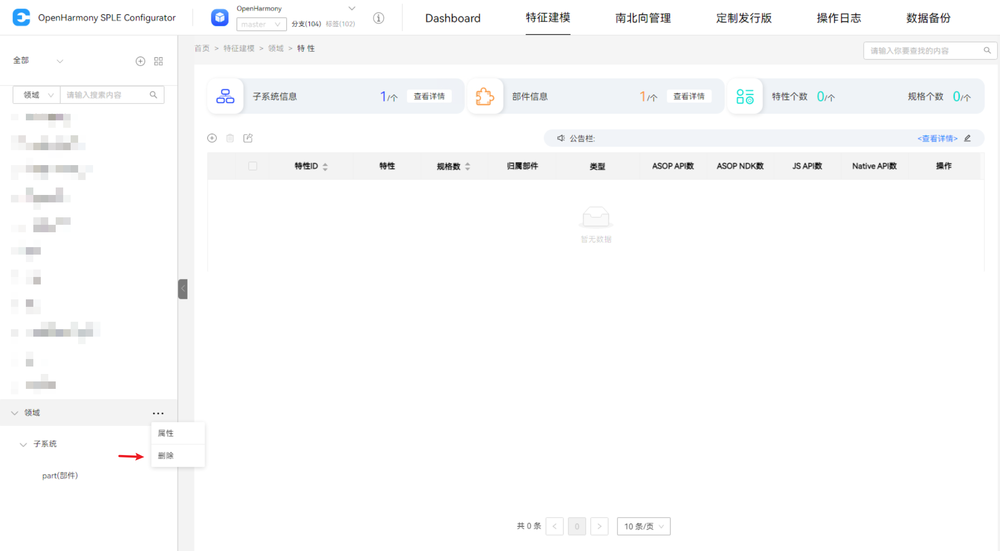

## SPLE特征建模

### 步骤
	特征建模层级关系：领域->子系统->部件->特性；
	因存在层级关系因此在进行部分操作时需注意下层级是否存在内容，如：删除、添加特性
#### 1、添加领域
- 点击左侧菜单栏的添加按钮，在展开的内容中选择添加领域，弹出框填写领域中英文名称(***必填***)，添加完左侧菜单栏可见新增领域

#### 2、添加子系统
- 点击左侧菜单栏的添加按钮，在展开的内容中选择添加子系统，弹出框选择将所添加的子系统的所属领域(***必填***)、编号(如：01，长度不小于2且编号唯一不可重复)(***必填***)、中英文名称(***必填***)以及其余选填内容，添加完成后在其所属领域下可见新增子系统

#### 3、添加部件
- 点击左侧菜单栏的添加按钮，在展开的内容中选择添加部件，弹出框选择将所添加的部件的所属子系统(***必填***)、编号(选择所属子系统后生成：**所属子系统编号-1** 依次递增的编号，或输入以：**所属子系统编号-XX** 格式的编号，XX号段只能包含数字、大小写字母和下划线)(***必填***)、中英文名称(***必填***)以及其余选填内容，添加完成后在其所属子系统可见新增部件

#### 4、领域、子系统及部件的其他操作
##### 1. 属性修改
- 领域属性修改

- 子系统属性修改及人员管理

- 成员添加(按姓名或工号)、查找，成员职务、所属部件、角色更改

- 部件属性修改

- 部件可配置特性编辑

选择型：

	布尔(ture/false，选项除编码外可编辑)
	单选/多选(选项内容自定义)

录入型：

	文本(默认值、单位)
	整数(最小值、最大值、默认值、单位)
	小数(最小值、最大值、小数位数、默认值、单位)

##### 2. 删除
- 删除领域(子系统、部件同操作)

##### 3. 子系统、部件清单导入/导出
- 点击左侧菜单栏右上角按钮，点击子系统清单(部件清单)进入清单界面，该界面同样可进行添加、编辑修改、删除的操作

- 点击导入按钮，在所弹出弹窗点击下载相关模板(文件类型：***xlsx***)，按模板内容将相关信息填入后点击导入并上传文件(一次限制导入***5000***条数据，最大***10M***)

- 点击左侧菜单栏右上角按钮，点击导入，在所弹出弹窗也可下载相关模板或按模板对数据进行导入

- 子系统、部件清单页面点击导出按钮后将直接下载相应清单文件(文件类型：xlsx)至本地

#### 5、添加特性
- 点击菜单栏已建部件进入该路径：
>首页>特征建模>领域>子系统>部件>特性

- 点击添加按钮，弹出框填写中文名称(必填)、编号(以：所属子系统编号-XX 格式的编号，XX号段只能包含数字)(必填)、以及其余选填内容，添加完成后在其所属子系统可见新增部件

