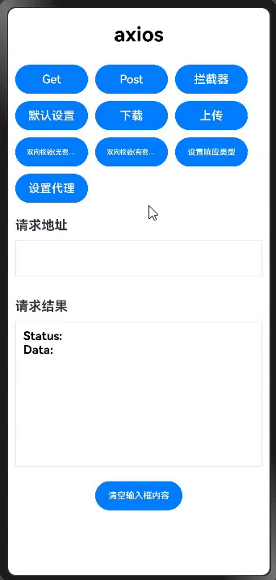

# 🚨 **重要提示 | IMPORTANT**
>
> **⚠️ 此代码仓已归档。新地址请访问 [ohos_axios](https://gitcode.com/openharmony-sig/ohos_axios)。| ⚠️ This repository has been archived. For the new address, please visit [ohos_axios](https://gitcode.com/openharmony-sig/ohos_axios).**
>
---
>
# axios

## 简介

[Axios](https://github.com/axios/axios) ，是一个基于 promise 的网络请求库，可以运行 node.js 和浏览器中。本库基于[Axios](https://github.com/axios/axios) 原库v1.3.4版本进行适配，使其可以运行在 OpenHarmony，并沿用其现有用法和特性。

- http 请求
- Promise API
- request 和 response 拦截器
- 转换 request 和 response 的 data 数据
- 自动转换 JSON data 数据



## 下载安装

```javascript
ohpm install @ohos/axios
```

OpenHarmony ohpm 环境配置等更多内容，请参考[如何安装 OpenHarmony ohpm 包](https://gitee.com/openharmony-tpc/docs/blob/master/OpenHarmony_har_usage.md)

## 需要权限
```
ohos.permission.INTERNET
```

## 接口和属性列表
接口列表

| **接口**                            | 参数                                     | 功能         |
|-----------------------------------|----------------------------------------|------------|
| axios(config)                     | [config](#请求配置)：请求配置                   | 发送请求       |
| axios.create(config)              | [config](#请求配置)：请求配置                   | 创建实例       |
| axios.request(config)             | [config](#请求配置)：请求配置                   | 发送请求       |
| axios.get(url[, config])          | url：请求地址<br/>[config](#请求配置)：请求配置      | 发送get请求    |
| axios.delete(url[, config])       | url：请求地址<br/>[config](#请求配置)：请求配置      | 发送delete请求 |
| axios.post(url[, data[, config]]) | url：请求地址<br/>data：发送请求体数据<br/>[config](#请求配置)：请求配置 | 发送post请求   |
| axios.put(url[, data[, config]])  | url：请求地址<br/>data：发送请求体数据<br/>[config](#请求配置)：请求配置      | 发送put请求    |

属性列表

| **属性**                           | 描述                                                                        |
|----------------------------------|---------------------------------------------------------------------------|
| axios.defaults['xxx']            | 默认设置 。值为请求配置 [config](#请求配置) 中的配置项 <br/>例如 axios.defaults.headers 获取头部信息 |
| axios.interceptors              | 拦截器。参考 [拦截器](#拦截器)  的使用                                                  |

## 使用示例

使用前在demo中entry-->src-->main-->ets-->common-->Common.ets文件中改为正确的服务器地址，在entry-->src-->main-->resources-->rawfile目录下添加正确的证书，才可正常的使用demo。

发起一个 GET 请求

axios支持泛型参数，由于ArkTS不再支持any类型，需指定参数的具体类型。
如：axios.get<T = any, R = AxiosResponse<T>, D = any>(url)
- T: 是响应数据类型。当发送一个 POST 请求时，客户端可能会收到一个 JSON 对象。T 就是这个 JSON 对象的类型。默认情况下，T 是 any，这意味着可以接收任何类型的数据。
- R: 是响应体的类型。当服务器返回一个响应时，响应体通常是一个 JSON 对象。R 就是这个 JSON 对象的类型。默认情况下，R 是 AxiosResponse<T>，这意味着响应体是一个 AxiosResponse 对象，它的 data 属性是 T 类型的
- D: 是请求参数的类型。当发送一个 GET 请求时，可能会在 URL 中添加一些查询参数。D 就是这些查询参数的类型。参数为空情况下，D 是 null类型。
```javascript
import axios from '@ohos/axios'
interface userInfo{
  id: number
  name: string,
  phone: number
}

// 向给定ID的用户发起请求
axios.get<userInfo, AxiosResponse<userInfo>, null>('/user?ID=12345')
.then((response: AxiosResponse<userInfo>)=> {
  // 处理成功情况
  console.info("id" + response.data.id)
  console.info(JSON.stringify(response));
})
.catch((error: AxiosError)=> {
  // 处理错误情况
  console.info(JSON.stringify(error));
})
.then(()=> {
  // 总是会执行
});

// 上述请求也可以按以下方式完成（可选）
axios.get<userInfo, AxiosResponse<userInfo>, null>('/user', {
  params: {
    ID: 12345
  }
})
.then((response:AxiosResponse<userInfo>) => {
  console.info("id" + response.data.id)
  console.info(JSON.stringify(response));
})
.catch((error:AxiosError) => {
  console.info(JSON.stringify(error));
})
.then(() => {
  // 总是会执行
});

// 支持async/await用法
async function getUser() {
  try {
        const response:AxiosResponse = await axios.get<string, AxiosResponse<string>, null>(this.getUrl);
        console.log(JSON.stringify(response));
      } catch (error) {
    console.error(JSON.stringify(error));
  }
}
```

发送一个 POST 请求
```javascript
interface user {
  firstName: string,
  lastName: string
}
   axios.post<string, AxiosResponse<string>, user>('/user', {
     firstName: 'Fred',
     lastName: 'Flintstone'
   })
   .then((response: AxiosResponse<string>) => {
     console.info(JSON.stringify(response));
   })
   .catch((error) => {
  console.info(JSON.stringify(error));
});
```

发起多个并发请求

```javascript
 const getUserAccount = ():Promise<AxiosResponse> => {
      return axios.get<string, AxiosResponse<string>, null>('/user/12345');
    }

 const getUserPermissions = ():Promise<AxiosResponse> => {
      return axios.get<string, AxiosResponse<string>, null>('/user/12345/permissions');
    }

 Promise.all<AxiosResponse>([getUserAccount(), getUserPermissions()])
 .then((results:AxiosResponse[]) => {
        const acct = results[0].data as string;
        const perm = results[1].data as string;
      });
```

## 使用说明

### axios API

#### 通过向 axios 传递相关配置来创建请求

##### axios(config)
```javascript
// 发送一个get请求
axios<string, AxiosResponse<string>, null>({
  method: "get",
  url: 'https://www.xxx.com/info'
}).then((res: AxiosResponse) => {
  console.info('result:' + JSON.stringify(res.data));
}).catch((error: AxiosError) => {
  console.error(error.message);
})
```

##### axios(url[, config])
```javascript
// 发送一个get请求（默认请求方式）
axios.get<string, AxiosResponse<string>, null>('https://www.xxx.com/info', { params: { key: "value" } })
.then((response: AxiosResponse) => {
  console.info("result:" + JSON.stringify(response.data));
})
.catch((error: AxiosError) => {
  console.error("result:" + error.message);
});
```

#### 请求方法的 别名方式 来创建请求
为方便起见，为所有支持的请求方法提供了别名。

- axios.request(config)
- axios.get(url[, config])
- axios.delete(url[, config])
- axios.post(url[, data[, config]])
- axios.put(url[, data[, config]])

> 注意:
在使用别名方法时， url、method、data 这些属性都不必在配置中指定。

```javascript
// 发送get请求
axios.get<string, AxiosResponse<string>, null>('https://www.xxx.com/info', { params: { key: "value" } })
.then((response: AxiosResponse) => {
  console.info("result:" + JSON.stringify(response.data));
})
.catch((error: AxiosError) => {
  console.error("result:" + error.message);
});
```

### axios 实例

#### 创建一个实例
您可以使用自定义配置新建一个实例。<br/>
axios.create([config])
```javascript
const instance = axios.create({
  baseURL: 'https://www.xxx.com/info',
  timeout: 1000,
  headers: {'X-Custom-Header': 'foobar'}
});
```

#### 实例方法
- axios#request(config)
- axios#get(url[, config])
- axios#delete(url[, config])
- axios#post(url[, data[, config]])
- axios#put(url[, data[, config]])

### 请求配置<span id=config></span>
这些是创建请求时可以用的配置选项。只有 url 是必需的。如果没有指定 method，请求将默认使用 get 方法。

  ```javascript
{
    // `url` 是用于请求的服务器 URL
    url: '/user',
    
    // `method` 是创建请求时使用的方法 支持post/get/put/delete方法，不区分大小写，默认为get方法
    method: 'get', // default
    
    // `baseURL` 将自动加在 `url` 前面，除非 `url` 是一个完整的 URL。
    // 它可以通过设置一个 `baseURL` 便于为 axios 实例的方法传递相对 URL
    baseURL: 'https://www.xxx.com/info',
    
    // `transformRequest` 允许在向服务器发送前，修改请求数据
    // 它只能用于 'PUT', 'POST' 和 'PATCH' 这几个请求方法
    // 数组中最后一个函数必须返回一个字符串， 一个Buffer实例，ArrayBuffer，FormData，或 Stream
    // 修改请求头。
    transformRequest: [(data: ESObject, headers: AxiosRequestHeaders) => {
       // 对发送的 data 进行任意转换处理
       return data;
     }],

    // `transformResponse` 在传递给 then/catch 前，允许修改响应数据
    transformResponse: [ (data: ESObject, headers: AxiosResponseHeaders, status?: number)=> {
      // 对接收的 data 进行任意转换处理
      return data;
    }],
    
    // `headers` 是即将被发送的自定义请求头
    headers: {'Content-Type': 'application/json'},
    
    // `params` 是即将与请求一起发送的 URL 参数
    // 必须是一个无格式对象(plain object)，其它对象如 URLSearchParams ，必须使用 paramsSerializer 进行序列化
    params: {
      ID: 12345
    },
    
    // `paramsSerializer` 是一个负责 `params` 序列化的函数
    paramsSerializer: function(params) {
      return params
    },
    
    // `data` 是作为请求主体被发送的数据
    // 只适用于这些请求方法 'PUT', 'POST', 和 'PATCH'
    // 在没有设置 `transformRequest` 时，必须是以下类型之一，其它类型使用 transformRequest 转换处理
    // - string, plain object, ArrayBuffer
    data: {
      firstName: 'Fred'
    },
    
    // 发送请求体数据的可选语法
    // 请求方式 post
    // 只有 value 会被发送，key 则不会
    data: 'Country=Brasil&City=Belo Horizonte',
    
    // `timeout` 指定请求超时的毫秒数(0 表示无超时时间)
    // 如果请求超过 `timeout` 的时间，请求将被中断
    timeout: 1000,
    // `readTimeout` 指定请求超时的毫秒数(0 表示无超时时间)
    // 如果请求超过 `readTimeout` 的时间，请求将被中断
    readTimeout: 1000,
    // `connectTimeout` 指定请求连接服务器超时的毫秒数(0 表示无超时时间)
    // 如果请求连接服务器超过 `connectTimeout` 的时间，请求将被中断
    connectTimeout: 60000,
    // `maxBodyLength`，指定网络请求内容的最大字节数(-1 表示无最大限制)
    // 如果请求内容的字节数超过 `maxBodyLength`，请求将被中断并抛出异常
    maxBodyLength: 5*1024*1024,
    // `maxContentLength`，指定HTTP响应的最大字节数(-1 表示放开axios层限制),默认值为5*1024*1024，以字节为单位。最大值为100*1024*1024，以字节为单位
    // 如果响应的最大字节数超过 `maxContentLength`，请求将被中断并抛出异常
    maxContentLength: 5*1024*1024,
    // `adapter` 允许自定义处理请求，这使测试更加容易。
    // 返回一个 promise 并提供一个有效的响应 （参见 lib/adapters/README.md）。
    adapter: function (config) {
      /* ... */
    },
    // 如果设置了此参数，系统将使用用户指定路径的CA证书，(开发者需保证该路径下CA证书的可访问性)，否则将使用系统预设CA证书，系统预设CA证书位置：/etc/ssl/certs/cacert.pem。证书路径为沙箱映射路径（开发者可通过Global.getContext().filesDir获取应用沙箱路径）。
    caPath: '',

    // 客户端证书的clientCert字段，包括4个属性：
    // 客户端证书（cert）、客户端证书类型（certType）、证书私钥（key）和密码短语（keyPasswd）。certPath和keyPath为证书沙箱映射路径
    clientCert:{
        certPath: '',  // 客户端证书路径
        certType: '',  // 客户端证书类型，包括pem、der、p12三种
        keyPath: '',   // 证书私钥路径
        keyPasswd: ''  // 密码短语
    }

    // 优先级，范围[1,1000]，默认是1，值越大，优先级越高；
    priority: 1,

    //  `responseType` 指定返回数据的类型，默认无此字段。如果设置了此参数，系统将优先返回指定的类型。
    // 选项包括: string:字符串类型; object:对象类型; array_buffer:二进制数组类型。
    responseType: 'string', 

    //  `proxy`
    // 是否使用HTTP代理，默认为false，不使用代理。
    // 当proxy为AxiosProxyConfig类型时，使用指定网络代理。
    proxy: {
        host: 'xx', // Host port
        port: xx, // Host port
        exclusionList: [] // Do not use a blocking list for proxy servers
    }
    
    // `onUploadProgress` 允许为上传处理进度事件
    onUploadProgress: function (progressEvent) {
      // 对原生进度事件的处理
    },
    
    // `onDownloadProgress` 允许为下载处理进度事件，下载文件必须设置该事件
    onDownloadProgress: function (progressEvent) {
      // 对原生进度事件的处理
    },
    
    // 基于应用程序的上下文，只适用于上传/下载请求
    context: context,
    
    // 下载路径。此参数，只适用于下载请求，
    // Stage模型下使用AbilityContext 类获取文件路径，比如：'${getContext(this).cacheDir}/test.txt’并将文件存储在此路径下
    filePath: context,
    }


```

### 响应结构
一个请求的响应包含以下信息。

```javascript
{
  // `data` 由服务器提供的响应
  data: {},

  // `status` 来自服务器响应的 HTTP 状态码
  status: 200,

  // `statusText` 来自服务器响应的 HTTP 状态信息
  statusText: 'OK',

  // `headers` 是服务器响应头
  // 所有的 header 名称都是小写，而且可以使用方括号语法访问
  // 例如: `response.headers['content-type']`
  headers: {},

  // `config` 是 `axios` 请求的配置信息
  config: {},
  
  // `request` 是生成此响应的请求
  request: {}

  // `performanceTiming` 计算HTTP请求的各个阶段所花费的时间
  performanceTiming: http.PerformanceTiming
}
```
PerformanceTiming[属性介绍](https://gitee.com/openharmony/docs/blob/master/zh-cn/application-dev/reference/apis-network-kit/js-apis-http.md#performancetiming11)

当使用 then 时，您将接收如下响应:

```javascript
axios.get<string, AxiosResponse<string>, null>(this.getUrl)
 .then( (response:AxiosResponse<string>)=> {
   console.log("result data: " + response.data);
   console.log("result status: " + response.status);
   console.log("result statusText: " + response.statusText);
   console.log("result headers: " + response.headers);
   console.log("result config: " + response.config);
 });

```

### 默认配置
您可以指定默认配置，它将作用于每个请求。

#### 全局 axios 默认值
```javascript
axios.defaults.baseURL = 'https://www.xxx.com';
axios.defaults.headers.common['Authorization'] = AUTH_TOKEN;
axios.defaults.headers.post['Content-Type'] = 'application/x-www-form-urlencoded';
```

#### 自定义实例默认值
```javascript
// 创建实例时配置默认值
const instance = axios.create({
  baseURL: 'https://www.xxx.com'
});

// 创建实例后修改默认值
instance.defaults.headers.common['Authorization'] = AUTH_TOKEN;
```
配置的优先级
配置将会按优先级进行合并。它的顺序是：在lib/defaults.js中找到的库默认值，然后是实例的 defaults 属性，最后是请求的 config 参数。后面的优先级要高于前面的。下面有一个例子。

```javascript
// 使用库提供的默认配置创建实例
// 此时超时配置的默认值是 `0`
const instance = axios.create();

// 重写库的超时默认值
// 现在，所有使用此实例的请求都将等待2.5秒，然后才会超时
instance.defaults.timeout = 2500;

// 重写此请求的超时时间，因为该请求需要很长时间
instance.get<string, AxiosResponse<string>, null>(this.getUrl, {
  timeout: 5000
})
```

### 拦截器<span id=interceptors><span>
在请求或响应被 then 或 catch 处理前拦截它们。

```javascript
// 添加请求拦截器
axios.interceptors.request.use((config:InternalAxiosRequestConfig) => {
  // 对请求数据做点什么
  return config;
}, (error:AxiosError) => {
  // 对请求错误做些什么
  return Promise.reject(error);
});


// 添加响应拦截器
axios.interceptors.response.use((response:AxiosResponse)=> {
  // 对响应数据做点什么
  return response;
}, (error:AxiosError)=> {
  // 对响应错误做点什么
  return Promise.reject(error);
});

```

移除拦截器
```javascript
const myInterceptor = axios.interceptors.request.use((response: AxiosResponse)=> {/*...*/});
axios.interceptors.request.eject(myInterceptor);
```
可以给自定义的 axios 实例添加拦截器
```javascript
const instance = axios.create();
instance.interceptors.request.use((config:InternalAxiosRequestConfig)=> {/*...*/});
```

### 指定返回数据的类型
`responseType` 指定返回数据的类型，默认无此字段。如果设置了此参数，系统将优先返回指定的类型。
选项包括: string:字符串类型; object:对象类型; array_buffer:二进制数组类型。
设置responseType后，response.data中的数据将为指定类型
```javascript
 axios<string, AxiosResponse<string>, null>({
    url: 'https://www.xxx.com/info',
    method: 'get',
    responseType: 'array_buffer', 
  }).then((res: AxiosResponse) => {
   // 处理请求成功的逻辑
  })
```

> 注意：也可以通过重写transformResponse方法，修改返回数据；
```javascript
 axios<string, AxiosResponse<string>, null>({
    url: 'https://www.xxx.com/info',
    method: 'get',
    responseType: 'array_buffer', 
    transformResponse:(data)=>{
      return data
    }
  }).then((res: AxiosResponse) => {
   // 处理请求成功的逻辑
  })
```

### 自定义ca证书

```javascript
  axios<infoModel, AxiosResponse<infoModel>, null>({
    url: 'https://www.xxx.com/xx',
    method: 'get',
    caPath: '', //ca证书路径
  }).then((res: AxiosResponse) => {
    // 
  }).catch((err: AxiosError) => {
    //
  })
```

### 自定义客户端证书

```javascript
  axios<infoModel, AxiosResponse<infoModel>, null>({
    url: 'https://www.xxx.com/xx',
    method: 'get',
    caPath: '', //ca证书路径
    clientCert: {
        certPath: '', //客户端证书路径
        certType: 'p12', // 客户端证书类型，包括pem、der、p12三种
        keyPath: '', //客户端私钥路径
        keyPasswd: '' // 密码
      }
  }).then((res: AxiosResponse) => {
    // 
  }).catch((err: AxiosError) => {
    //
  })
```

### 设置代理
```javascript
    axios<string, AxiosResponse<string>, null>({
      url: 'xxx',
      method: 'get',
      proxy:{
        host: 'xxx',
        port: xx,
        exclusionList: []
      }
    }).then((res: AxiosResponse) => {
      // 
    }).catch((err: AxiosError) => {
      //
    })
```
### 证书锁定

证书锁定的用法如下：

需要在配置文件中对证书进行相关信息的配置：配置文件路径为：entry/src/main/resources/base/profile/network_config.json

配置文件：network_config
```javascript
{
  "network-security-config": {
    "domain-config": [
      {
        "domains": [
          {
            "include-subdomains": true,
            "name": "x.x.x.x"  // ip地址或域名
          }
        ],
        "pin-set": {
          "expiration": "2024-8-6", //证书锁定的有效期
          "pin": [
            {
              "digest-algorithm": "sha256", //消息摘要的哈希算法，支持格式是sha256 
              "digest": "WAFcHG6pAINrztx343ccddfzLOdfoDS9pPgMv2XHk=" //消息摘要
            }
          ]
        }
      }
    ]
  }
}
```

#### digest字段消息摘要获取

使用openssl从服务器获取证书，并提取出消息摘要
```javascript
openssl s_client -connect host:port 2>&1 < /dev/null \
                    | sed -n '/-----BEGIN/,/-----END/p' \
                    | openssl x509 -noout -pubkey \
                    | openssl pkey -pubin -outform der \
                    | openssl dgst -sha256 -binary \
                    | openssl enc -base64
```


### 上传下载文件
#### 上传文件示例
- 上传文件需要单独导入FormData模块
- 当前版本只支持 Stage 模型
- 上传类型支持uri和ArrayBuffer，uri支持“internal”协议类型和沙箱路径。"internal://cache/"为必填字段，示例： internal://cache/path/to/file.txt；沙箱路径示例：cacheDir + '/hello.txt'
- 请求的表单数据值为string类型
- 支持设置多部分表单数据的数据名称和数据类型
- 上传参数context:当uri为沙箱路径，无需传参context；若uri为“internal”协议类型，必须传参context
- v2.2.1-rc.1及以下版本上传必须传context参数，v2.2.1-rc.1以上版本上传参数可去掉context参数

##### 当上传的内容为ArrayBuffer时，用法如下

```javascript
import axios from '@ohos/axios'
import { FormData } from '@ohos/axios'
import fs from '@ohos.file.fs';

// ArrayBuffer
let formData = new FormData()
let cacheDir = getContext(this).cacheDir
try {
  // 写入
  let path = cacheDir + '/hello.txt';
  let file = fs.openSync(path, fs.OpenMode.CREATE | fs.OpenMode.READ_WRITE)
  fs.writeSync(file.fd, "hello, world"); // 以同步方法将数据写入文件
  fs.fsyncSync(file.fd); // 以同步方法同步文件数据。
  fs.closeSync(file.fd);

  // 读取
  let file2 = fs.openSync(path, 0o2);
  let stat = fs.lstatSync(path);
  let buf2 = new ArrayBuffer(stat.size);
  fs.readSync(file2.fd, buf2); // 以同步方法从流文件读取数据。
  fs.fsyncSync(file2.fd);
  fs.closeSync(file2.fd);

  formData.append('file', buf2);
  // formData.append('file', buf2, { filename: 'text.txt', type: 'text/plain'}); 设置多部分表单数据的数据名称和数据类型类型
} catch (err) {
  console.info('err:' + JSON.stringify(err));
}
// 发送请求
axios.post<string, AxiosResponse<string>, FormData>(this.uploadUrl, formData, {
  headers: { 'Content-Type': 'multipart/form-data' },
  context: getContext(this),
  onUploadProgress: (progressEvent: AxiosProgressEvent): void => {
  console.info(progressEvent && progressEvent.loaded && progressEvent.total ? Math.ceil(progressEvent.loaded / progressEvent.total * 100) + '%' : '0%');
},
}).then((res: AxiosResponse) => {
  console.info("result" + JSON.stringify(res.data));
}).catch((error: AxiosError) => {
  console.error("error:" + JSON.stringify(error));
})
```

##### 当上传的uri时，用法如下

```javascript
import axios from '@ohos/axios'
import { FormData } from '@ohos/axios'

let formData = new FormData()
formData.append('file', 'internal://cache/blue.jpg')
// formData.append('file', cacheDir + '/hello.txt'); uri支持传入沙箱路径

// 发送请求
axios.post<string, AxiosResponse<string>, FormData>('https://www.xxx.com/upload', formData, {
  headers: { 'Content-Type': 'multipart/form-data' },
  context: getContext(this),
  onUploadProgress: (progressEvent: AxiosProgressEvent): void => {
    console.info(progressEvent && progressEvent.loaded && progressEvent.total ? Math.ceil(progressEvent.loaded / progressEvent.total * 100) + '%' : '0%');
  },
}).then((res: AxiosResponse<string>) => {
  console.info("result" + JSON.stringify(res.data));
}).catch((err: AxiosError) => {
  console.error("error:" + JSON.stringify(err));
})
```

##### FormData介绍
FormData对象是axios内部自定义的类型，用以将数据编译成键值对，以便用来发送数据。其主要用于发送表单数据，但亦可用于发送带键数据 (keyed data)。
```
import { FormData } from '@ohos/axios'

let formData: FormData = new FormData();

formData.append("username", "Groucho");
formData.append("accountnum", "123456");
formData.append("accountnum", "123456");
formData.append("file", "internal://cache/xx/file.txt", { filename: "text.txt", type: "text/plain"}); 
```
上面的示例创建了一个 FormData 实例，包含"username"、"accountnum"字段。使用 append() 方法时，可以通过第三个可选参数设置多部分表单数据的数据名称和数据类型


#### 下载文件示例
设置下载路径filePath（默认在'internal://cache/'路径下）。<br/>
- 当前版本只支持 Stage 模型，使用[AbilityContext](https://docs.openharmony.cn/pages/v4.1/zh-cn/application-dev/reference/apis-ability-kit/js-apis-inner-application-context.md) 类获取文件路径。
- 下载文件时，如果filePath已存在该文件则下载失败，下载之前需要先删除文件
- 不支持自动创建目录，若下载路径中的目录不存在，则下载失败
- v2.2.1-rc.1及以下版本下载必须传context参数，v2.2.1-rc.1以上版本下载参数可去掉context参数

```javascript
let filePath = getContext(this).cacheDir + '/blue.jpg'
// 下载。如果文件已存在，则先删除文件。
try {
  fs.accessSync(filePath);
  fs.unlinkSync(filePath);
} catch(err) {}

axios({
  url: 'https://www.xxx.com/blue.jpg',
  method: 'get',
  // context: getContext(this),
  filePath: filePath ,
  onDownloadProgress: (progressEvent: AxiosProgressEvent): void => {
    console.info("progress: " + progressEvent && progressEvent.loaded && progressEvent.total ? Math.ceil(progressEvent.loaded / progressEvent.total * 100) : 0)
  }
}).then((res)=>{
  console.info("result: " + JSON.stringify(res.data));
}).catch((error)=>{
  console.error("error:" + JSON.stringify(error));
})
```

### 错误处理

####  错误处理示例代码
```javascript
axios.get<string, AxiosResponse<string>, null>('/user/12345')
  .catch((error:AxiosError)=> {
    console.log(JSON.stringify(error.message));
    console.log(JSON.stringify(error.code));
    console.log(JSON.stringify(error.config));
  });
```

#### 错误码
- 以下错误码的详细介绍参见 [HTTP错误码](https://docs.openharmony.cn/pages/v5.0/zh-cn/application-dev/reference/apis-network-kit/errorcode-net-http.md)
- HTTP 错误关系映射：2300000 + curl错误码。 更多错误码，可参考：[curl错误码](https://curl.se/libcurl/c/libcurl-errors.html)

| 名称 | 参数类型 | 可读 | 可写 | 说明 |
| -------- | -------- | -------- | -------- | -------- |
| NETWORK_MOBILE | number | 是 | 否 | 使用蜂窝网络时允许下载的位标志。 |
| NETWORK_WIFI | number | 是 | 否 | 使用WLAN时允许下载的位标志。 |
| ERROR_CANNOT_RESUME<sup>7+</sup> | number | 是 | 否 | 某些临时错误导致的恢复下载失败。 |
| ERROR_DEVICE_NOT_FOUND<sup>7+</sup> | number | 是 | 否 | 找不到SD卡等存储设备。 |
| ERROR_FILE_ALREADY_EXISTS<sup>7+</sup> | number | 是 | 否 | 要下载的文件已存在，下载会话不能覆盖现有文件。 |
| ERROR_FILE_ERROR<sup>7+</sup> | number | 是 | 否 | 文件操作失败。 |
| ERROR_HTTP_DATA_ERROR<sup>7+</sup> | number | 是 | 否 | HTTP传输失败。 |
| ERROR_INSUFFICIENT_SPACE<sup>7+</sup> | number | 是 | 否 | 存储空间不足。 |
| ERROR_TOO_MANY_REDIRECTS<sup>7+</sup> | number | 是 | 否 | 网络重定向过多导致的错误。 |
| ERROR_UNHANDLED_HTTP_CODE<sup>7+</sup> | number | 是 | 否 | 无法识别的HTTP代码。 |
| ERROR_UNKNOWN<sup>7+</sup> | number | 是 | 否 | 未知错误。 |
| PAUSED_QUEUED_FOR_WIFI<sup>7+</sup> | number | 是 | 否 | 下载被暂停并等待WLAN连接，因为文件大小超过了使用蜂窝网络的会话允许的最大值。 |
| PAUSED_UNKNOWN<sup>7+</sup> | number | 是 | 否 | 未知原因导致暂停下载。 |
| PAUSED_WAITING_FOR_NETWORK<sup>7+</sup> | number | 是 | 否 | 由于网络问题（例如网络断开）而暂停下载。 |
| PAUSED_WAITING_TO_RETRY<sup>7+</sup> | number | 是 | 否 | 发生网络错误，将重试下载会话。 |
| SESSION_FAILED<sup>7+</sup> | number | 是 | 否 | 下载会话已失败，将不会重试。 |
| SESSION_PAUSED<sup>7+</sup> | number | 是 | 否 | 下载会话已暂停。 |
| SESSION_PENDING<sup>7+</sup> | number | 是 | 否 | 正在调度下载会话。 |
| SESSION_RUNNING<sup>7+</sup> | number | 是 | 否 | 下载会话正在进行中。 |
| SESSION_SUCCESSFUL<sup>7+</sup> | number | 是 | 否 | 下载会话已完成。 |

## 关于混淆
- 代码混淆，请查看[代码混淆简介](https://docs.openharmony.cn/pages/v5.0/zh-cn/application-dev/arkts-utils/source-obfuscation.md)
- 如果希望axios库在代码混淆过程中不会被混淆，需要在混淆规则配置文件obfuscation-rules.txt中添加相应的排除规则：
```
-keep
./oh_modules/@ohos/axios
```

## 约束与限制

在下述版本验证通过：
DevEco Studio: NEXT Developer Beta1(5.0.3.122), SDK: API12(5.0.0.18)

> 注意：除双向证书验证及证书锁定功能必须使用API11外，其余功能支持API10

## FAQ
- 服务器返回多个cookie，response.header中只能读取首个cookie。<br>
由于该库底层依赖ohos.net.http模块，ohos.net.http也存在此问题，204.1.0.33 镜像版本已修复此问题。
- 下载文件不会自动创建目录，若下载路径中的目录不存在，则下载失败。如filePath为getContext(this).cacheDir/download/test.txt，download目录不存在则下载失败。

## 目录结构
```javascript
|---- axios
|     |---- AppScope  # 示例代码文件夹
|     |---- entry  # 示例代码文件夹
|     |---- screenshots #截图
|     |---- library  # axios库文件夹
|           |---- build  # axios模块打包后的文件
|           |---- src  # 模块代码
|                |---- ets/components   # 模块代码
|                     |---- lib         # axios 网络请求核心代码
|            |---- index.js        # 入口文件
|            |---- index.d.ts      # 声明文件
|            |---- *.json5      # 配置文件
|     |---- README.md     # 安装使用方法
|     |---- README_zh.md  # 安装使用方法
|     |---- README.OpenSource  # 开源说明
|     |---- CHANGELOG.md  # 更新日志
```

## 贡献代码

使用过程中发现任何问题都可以提交[Issue](https://gitee.com/openharmony-sig/axios/issues)，当然，也非常欢迎提交[PR](https://gitee.com/openharmony-sig/axios/pulls) 。

## 开源协议

本项目遵循 [MIT License](https://gitee.com/openharmony-sig/axios/blob/master/LICENSE)。
