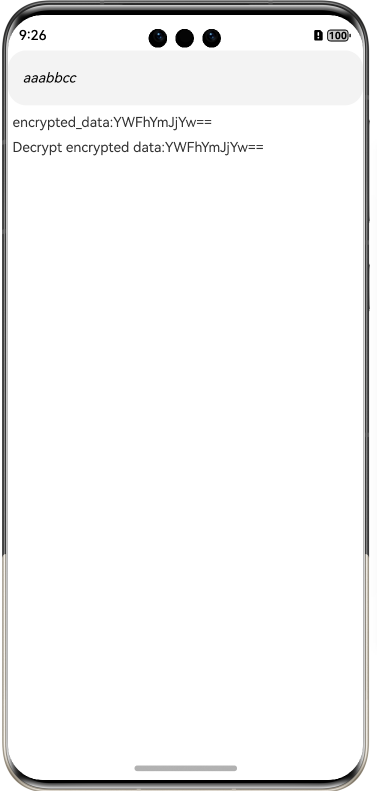

# base64

##  Overview

base64 is a third-party library used to provide a data encryption and decryption tool for OpenHarmony.



## How to Install
```shell
ohpm install @ohos/base64
```
For details, see [Installing an OpenHarmony HAR](https://gitee.com/openharmony-tpc/docs/blob/master/OpenHarmony_har_usage.en.md).

## How to Use

### Generating Base64

   ```  
    import {Base64} from '@ohos/base64'
    
    let test: number[] = [1,2,3,4,5,6,7,8,9]
    let encode = Base64.encode(new Uint8Array(test));
    console.info("base64  encode:"+Base64.bytesToString(encode));
    console.info("base64  decode:"+Base64.bytesToString(Base64.decode(encode)));
    
    let input='AABDCDHFAGA23'
    let encodeString = Base64.encodeToString(Base64.stringToBytes(input)
    let decodeString =  Base64.bytesToString(Base64.decode(encodeString))
   ```

## Available APIs

1. Encryption
   ```
   Base64.encode(input:Uint8Array)
   Base64.encodeBytesToBytes(source: Uint8Array)
   Base64.encodeToString(input:Uint8Array)
   Base64.encodeBytes(bytes: Uint8Array)
   Base64.encodeToFile(filePath: string, data: Uint8Array)
   Base64.encodeFromFile(filePath: string)
   ```
2. Decryption
   ```
   Base64.decode(input:Uint8Array|string)
   Base64.decodeToFile(filePath: string, data: Uint8Array | string)
   Base64.decodeFromFile(filePath: string)
   ```
3. Others
   ```
   Base64.bytesToString(bytes:Uint8Array)
   Base64.stringToBytes(str: string)
   ```
   
## Constraints

base64 has been verified in the following version:

- DevEco Studio Version: 4.0 (4.0.3.614), OpenHarmony SDK: API10 (4.0.10.15)
- DevEco Studio Version: 3.1 Beta1 (3.1.0.200), OpenHarmony SDK: API9 (3.2.10.6)

## Directory Structure
```
|----base64 
|     |---- entry  # Sample code
|     |---- base64       # base64 library
|          |----src
|              |----main
|                  |----ets
|                      |---- Base64.ets  # Core code for data encryption and decryption 
|     |---- README.md  # Readme 
|     |---- README_zh.md  # Readme 
```

## How to Contribute
If you find any problem when using base64, submit an [Issue](https://gitee.com/openharmony-sig/base64/issues) or a [PR](https://gitee.com/openharmony-sig/base64/pulls).

## License
This project is licensed under [Apache License 2.0](https://gitee.com/openharmony-sig/base64/blob/master/LICENSE).

  
