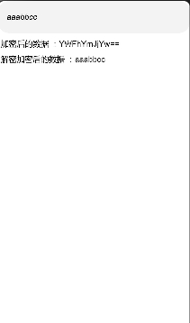

# base64

##  简介
  数据加解密工具



## 下载安装
```shell
ohpm install @ohos/base64
```
OpenHarmony ohpm 环境配置等更多内容，请参考 [如何安装 OpenHarmony ohpm包](https://gitee.com/openharmony-tpc/docs/blob/master/OpenHarmony_har_usage.md) 。

## 使用说明

### 生成Base64

   ```  
    import {Base64} from '@ohos/base64'
    
    let test: number[] = [1,2,3,4,5,6,7,8,9]
    let encode = Base64.encode(new Uint8Array(test));
    console.info("base64  encode:"+Base64.bytesToString(encode));
    console.info("base64  decode:"+Base64.bytesToString(Base64.decode(encode)));
    
    let input='AABDCDHFAGA23'
    let encodeString = Base64.encodeToString(Base64.stringToBytes(input)
    let decodeString =  Base64.bytesToString(Base64.decode(encodeString))
   ```

## 接口说明

1. 加密
   ```
   Base64.encode(input:Uint8Array)
   Base64.encodeBytesToBytes(source: Uint8Array)
   Base64.encodeToString(input:Uint8Array)
   Base64.encodeBytes(bytes: Uint8Array)
   Base64.encodeToFile(filePath: string, data: Uint8Array)
   Base64.encodeFromFile(filePath: string)
   ```
2. 解密
   ```
   Base64.decode(input:Uint8Array|string)
   Base64.decodeToFile(filePath: string, data: Uint8Array | string)
   Base64.decodeFromFile(filePath: string)
   ```
3. 其它
   ```
   Base64.bytesToString(bytes:Uint8Array)
   Base64.stringToBytes(str: string)
   ```
   
## 约束与限制

在下述版本验证通过：

- DevEco Studio: NEXT Beta1-5.0.3.806, SDK: API12 Release (5.0.0.66)
- DevEco Studio 版本：4.0（4.0.3.614），OpenHarmony SDK:API10（4.0.10.15）
- DevEco Studio 版本：3.1 Beta1（3.1.0.200），OpenHarmony SDK:API9（3.2.10.6）

## 目录结构
```
|----base64 
|     |---- entry # 示例代码文件夹
|     |---- base64       # 库文件 夹
|          |----src
|              |----main
|                  |----ets
|                      |---- Base64.ets  # 数据加解密功能的核心实现 
|     |---- README.md  # 安装使用方法 
|     |---- README_zh.md  # 安装使用方法 
```

## 贡献代码
使用过程中发现任何问题都可以提 [Issue](https://gitee.com/openharmony-sig/base64/issues) ，当然也非常欢迎直接发 [PR](https://gitee.com/openharmony-sig/base64/pulls) 。

## 开源协议
本项目基于 [Apache License 2.0](https://gitee.com/openharmony-sig/base64/blob/master/LICENSE) ，请自由地享受和参与开源。

  
